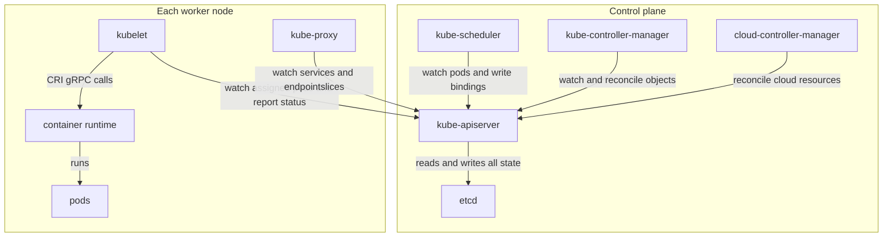
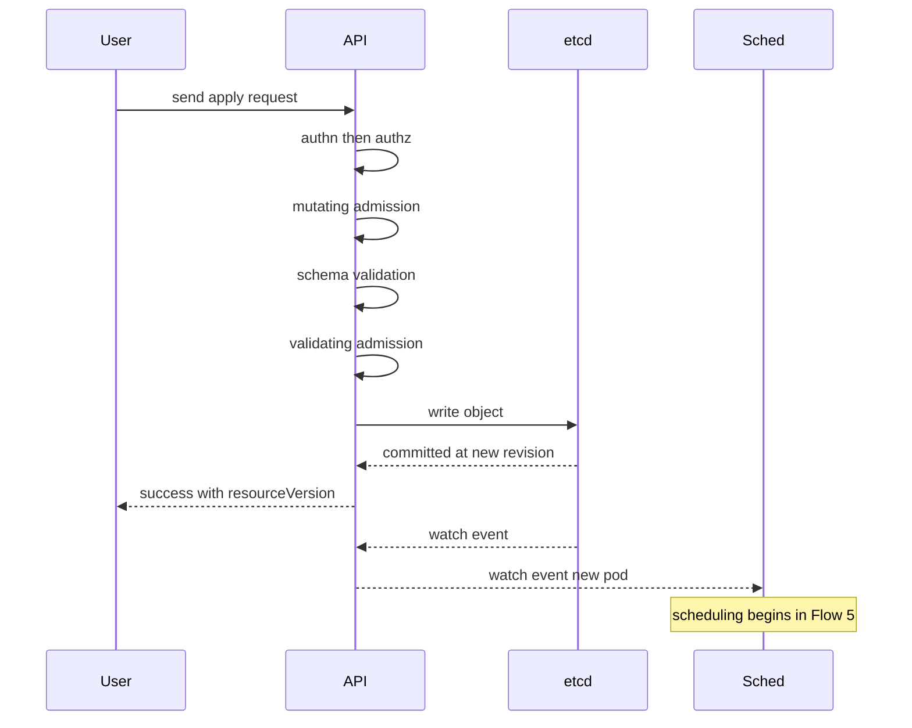

# Chapter 1 — Architecture Big Picture

## Why this chapter

Interviewers open with architecture to check your mental model, because every deeper question builds on it. The model: a cluster is desired state stored in etcd, plus independent reconcile loops that continuously drive actual state toward it. No component commands another; everything coordinates by reading and writing objects through the API server. If you can narrate Flow 1 and Flow 8 (Chapter 4) end to end, most architecture questions become easy.

## Concepts

**Control plane vs data plane.** The control plane decides what should run: kube-apiserver (the only component that talks to etcd), etcd (the strongly consistent key-value store holding all cluster state), kube-scheduler (assigns pods to nodes), kube-controller-manager or KCM (one binary bundling dozens of controllers: ReplicaSet, node lifecycle, EndpointSlice, garbage collection), and cloud-controller-manager (load balancers, node instances). The data plane runs it, on every node: kubelet (the node agent that makes pods real), a container runtime such as containerd (driven over CRI, a gRPC contract), and kube-proxy (programs Service routing rules).

**Hub-and-spoke.** Components never call each other directly. The scheduler does not call the kubelet; it writes a binding, and the kubelet notices via a watch (a streaming subscription to object changes). This makes the API server the scaling and security choke point, and it is why a dead control plane leaves running workloads untouched (Chapter 10).

**Everything reconciles.** Controllers are level-triggered: they act on observed state, not individual events, so a missed event is corrected on the next look. A Deployment is just a record in etcd; controllers make it real through a chain of desired-state handoffs: Deployment → ReplicaSet → Pod → binding → container.

**What runs where.** Control plane components usually run as static pods (pods defined by manifest files on disk, managed directly by the kubelet — Chapter 4) on dedicated nodes. Kubelet and the runtime run on every node, control plane nodes included.

*Figure 1.1 — every arrow that carries cluster state points at the API server; only the API server touches etcd.*

## Flows

### Flow 1: What happens when you run kubectl apply

You run `kubectl apply -f pod.yaml` against a healthy cluster.

1. **kubectl** loads kubeconfig for the server address and credentials, maps the manifest's kind to a REST path via API discovery, and sends the change — a client-side-apply PATCH with a last-applied-configuration annotation by default, or a Server-Side Apply patch with `--server-side` (Chapter 2).
2. **API server** authenticates the request (client certificate, bearer token, or OIDC); failure returns 401.
3. **API server** authorizes it via RBAC: is this user allowed this verb on this resource in this namespace? Failure returns 403.
4. **API server** runs mutating admission: built-in plugins and mutating webhooks that may edit the object (fill defaults, inject sidecars).
5. **API server** validates the (possibly mutated) object against its schema.
6. **API server** runs validating admission: CEL ValidatingAdmissionPolicies and validating webhooks. Any veto rejects the request; nothing is persisted.
7. **API server** writes the object to etcd, which commits it through raft consensus (a quorum of members must agree) and assigns a new revision.
   - The object's `resourceVersion` comes from this etcd revision — the basis of optimistic concurrency (Chapter 2).
8. **etcd** confirms; the API server returns success with the stored object, including UID and resourceVersion.
9. **API server** receives the change on its own etcd watch and fans it out from its watch cache to every subscriber: scheduler, controllers, kubelet.
10. **Watchers** react independently — for a Pod with no node assigned, the scheduler begins Flow 5; the full path to Running is Flow 8. The request is done; everything after is asynchronous reconciliation.

*Figure 1.2 — the anchor diagram: a write is synchronous only up to etcd; all cluster behavior after it is watch-driven.*

**Where this can fail**

- **Symptom:** 403 Forbidden. **Cause:** RBAC denies the verb/resource pair. **Where to look:** `kubectl auth can-i`, audit log.
- **Symptom:** create hangs, fails after ~10–30s. **Cause:** a matching webhook is down with `failurePolicy: Fail` (Flow 4). **Where to look:** API server logs, webhook configurations.
- **Symptom:** all writes fail cluster-wide; reads may still work. **Cause:** etcd lost quorum — no raft leader, no commits. **Where to look:** etcd member health.
- **Symptom:** object persisted but nothing happens. **Cause:** the write succeeded; a downstream controller is broken — the API cannot tell you that. **Where to look:** object events and status, controller logs.

## Questions

### Tier 1 — Explain

**Q 1.1 — What is the difference between the control plane and the data plane, and what runs where?**

**Answer.** The control plane stores and decides desired state: API server, etcd, scheduler, controller-manager, cloud-controller-manager, typically as static pods on dedicated nodes. The data plane executes it: kubelet, container runtime, and kube-proxy on every node. The split matters operationally: control plane loss stops new decisions (scheduling, healing, rollouts), but running pods and their traffic continue, because nodes only depend on the API server for *changes*.

*Strong answers also mention:* only the API server talks to etcd, and kubelet runs on control plane nodes too, hosting the control plane's static pods.

**Q 1.2 — Walk me through what happens between `kubectl apply` and the object existing in the cluster.**

**Answer.** Flow 1: kubectl resolves the resource via discovery and sends the request; the API server authenticates, authorizes (RBAC), runs mutating admission, validates the schema, runs validating admission (CEL policies and webhooks), then writes to etcd, which commits via raft and assigns the resourceVersion. The API server returns success and fans out watch events. "Existing in the cluster" means exactly one thing: persisted in etcd. Nothing is running yet.

*Strong answers also mention:* mutating runs before validation so defaults get validated too; rejection at any stage means nothing was stored.

**Q 1.3 — What does "declarative, desired-state" actually mean mechanically?**

**Answer.** Users write records describing what should exist; they never command components. Every record lives in etcd behind the API server. Independent controllers watch the objects they care about, compare desired state (spec) to observed state (status plus the real world), and act to converge them — the reconcile loop. Loops self-heal: whatever the current state is, the next reconcile moves it toward spec. Delete a pod out from under a ReplicaSet and the loop just creates a new one.

*Strong answers also mention:* spec vs status as the contract between user intent and controller observation.

### Tier 2 — Reason

**Q 1.4 — Why do components communicate only through the API server instead of calling each other?**

**Answer.** Hub-and-spoke buys decoupling, security, and recoverability. Decoupling: components only understand objects, so each can be replaced independently (custom schedulers, virtual kubelets). Security: one place enforces authn, RBAC, admission, and audit for every state change. Recoverability: state lives in etcd, not in transit — a restarting component relists and catches up; a partitioned one reconciles late. The cost: the API server becomes the throughput bottleneck, which is why the watch cache and API Priority and Fairness exist (Chapter 2).

*Strong answers also mention:* this design makes "control plane down" non-fatal for running workloads.

**Q 1.5 — Why is Kubernetes level-triggered rather than edge-triggered?**

**Answer.** Edge-triggered systems act on events; a missed or duplicated event corrupts them. Level-triggered controllers act on observed state: each reconcile reads the current object and world and computes the diff, so missed events are harmless — the next observation covers them. Essential in a system where watches disconnect and clients relist (Flow 3). The price: reconciles must be idempotent, and controllers periodically resync to catch anything dropped (Chapter 5).

*Strong answers also mention:* events (watches) are only an optimization telling the loop *when* to look, never *what* happened.

**Q 1.6 — Why is etcd the only stateful component, and what does that buy?**

**Answer.** Concentrating state in one strongly consistent store means every other component is a stateless cache that can crash and rebuild by relisting. That gives crash-tolerance and horizontally scaled API servers for free, plus a single ordered history of changes — etcd revisions — which powers resourceVersion, optimistic concurrency, and resumable watches (Chapter 2). Trade-off: etcd's write throughput, storage size, and watch fan-out become the cluster's scalability ceiling (Chapter 10).

*Strong answers also mention:* controllers keep in-memory caches (informers), but those are disposable projections of etcd, never sources of truth.

### Tier 3 — Design & Debug

**Q 1.7 — The whole control plane goes down for 20 minutes. What still works, what breaks, and what happens on recovery?**

**Answer.** Still works: running containers, pod-to-pod networking, Services (kube-proxy rules already programmed), DNS if CoreDNS pods are up, kubelet restarting crashed containers. Breaks: anything needing a decision — no `kubectl`, no scheduling, no scaling or rollouts, no healing of failed *nodes*, no endpoint updates. On recovery, level-triggering shines: everything relists, computes the drift accumulated during the outage, and converges — expect a burst of list/watch load (Chapter 10, Flow 26). Reason component by component: does it need to *read or write state* to keep doing its current job?

*Strong answers also mention:* HPA and node-failure eviction pause too; kubelet leases expire but nothing can act on that until KCM returns.

**Q 1.8 — You must enforce an org-wide rule on every object write. Where do you hook in, and what are the risks?**

**Answer.** Admission is the only correct interception point: it sees every write after authn/authz and before persistence, regardless of sender. Prefer a CEL ValidatingAdmissionPolicy (in-process, no availability risk); fall back to a webhook only if the logic needs external data. The design conversation is blast radius: a broad webhook with `failurePolicy: Fail` is a cluster-wide single point of failure — it can even block its own redeployment (Flow 4). Mitigate with narrow rules, namespace exclusions for kube-system and the webhook itself, short timeouts, and an HA backend.

*Strong answers also mention:* admission never covers reads or already-persisted objects — those need a scanning controller.

## Common mistakes & red flags

- **"The scheduler starts pods."** It only writes a binding; the kubelet notices and starts containers — Flow 8.
- **"kubectl talks to the nodes."** kubectl only talks to the API server; even `logs` and `exec` are proxied through it to the kubelet.
- **"etcd stores configuration."** etcd stores *everything* — spec, status, events, leases. There is no other database.
- **"The API server pushes work to components."** Nothing is pushed; every component pulls via list/watch and decides for itself.
- **"When the control plane dies, workloads die."** They keep running; only change and healing stop. Interviewers use this one to separate memorized answers from real models.
- **"Controllers talk to each other to coordinate."** They coordinate only through objects — Deployment and ReplicaSet controllers never communicate directly.
