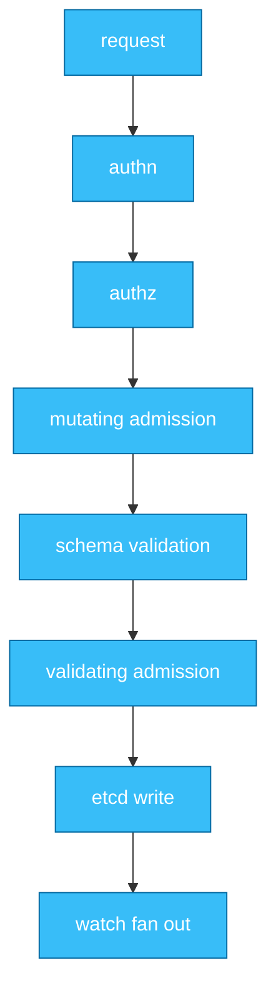
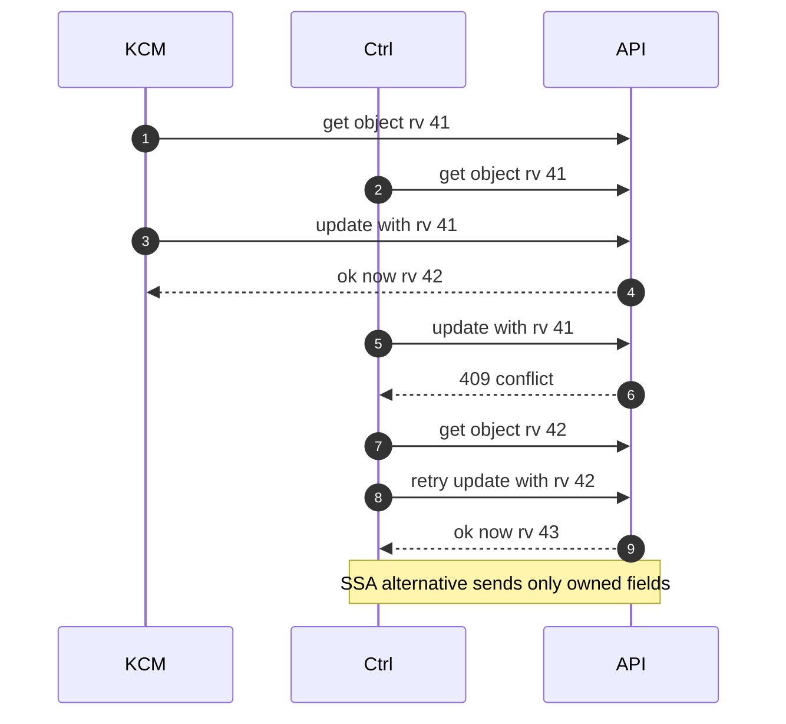
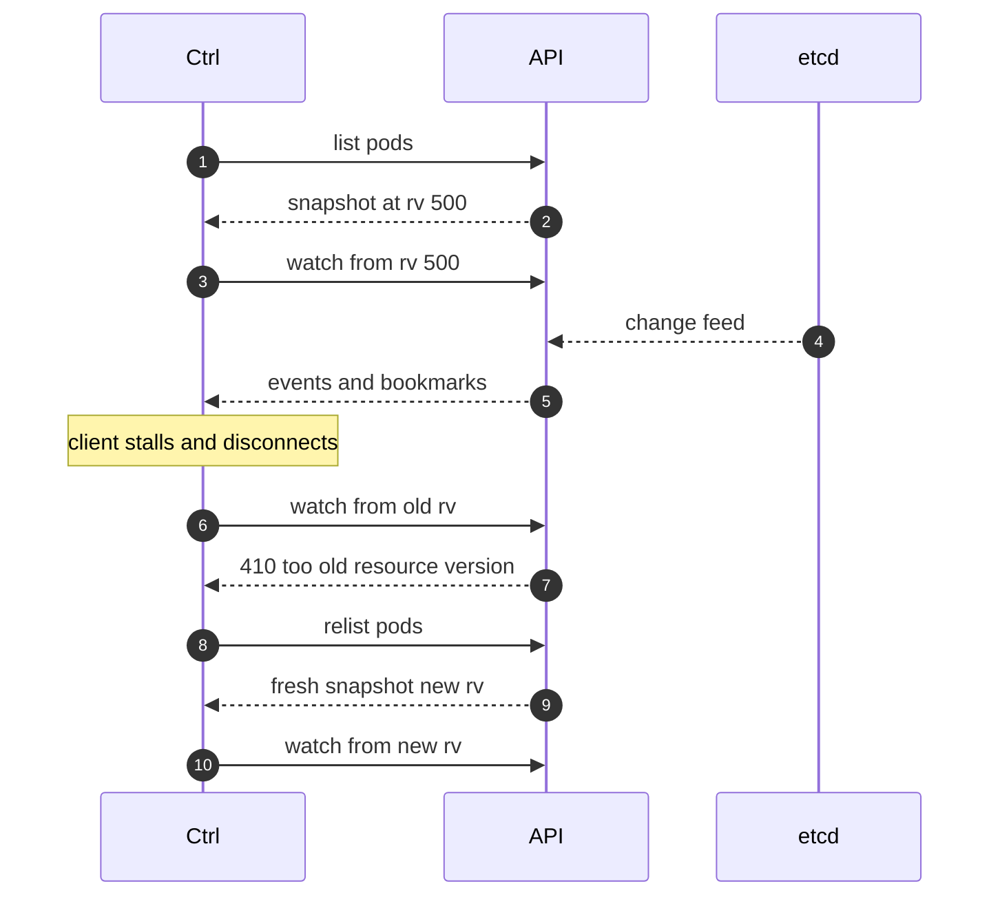
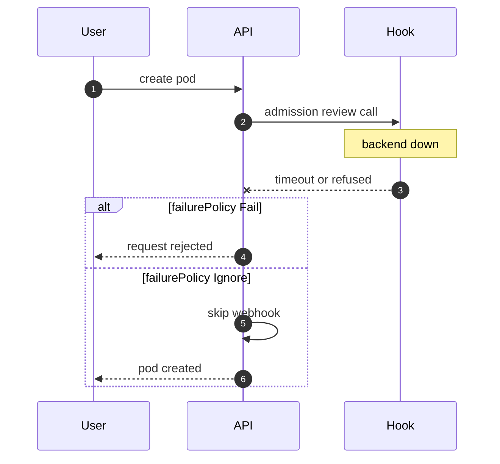

# Chapter 2 — API Server & etcd Internals

## Why this chapter

The API server is the only door to cluster state, so interviewers probe it to see whether you understand Kubernetes as a distributed system rather than a YAML runner. The mental model: the API server is a validating, extensible REST front-end over etcd, and etcd's revision history is what makes concurrency control and watches work. Hold onto one value — resourceVersion — and most of this chapter falls into place. It zooms into steps 2–9 of Flow 1.

## Concepts

**The request pipeline.** Every write passes: authentication → authorization → mutating admission → schema validation → validating admission → etcd. Mutating runs before validation so that defaults and injected fields are themselves validated. Admission applies only to writes; reads skip it.

*Figure 2.1 — the admission chain sits between authorization and storage; a veto anywhere means nothing is persisted.*

**Admission: webhooks and CEL policies.** Webhooks are HTTPS callbacks to services you run; the API server blocks the request on them, governed by `timeoutSeconds` (max 30s) and `failurePolicy` (Flow 4). ValidatingAdmissionPolicy (GA since v1.30) instead evaluates CEL expressions *inside* the API server: no network hop, no availability risk. MutatingAdmissionPolicy followed (GA in v1.36). Rule of thumb: use CEL unless you need external data or complex mutation.

**etcd essentials.** etcd is a raft-replicated key-value store: one elected leader orders all writes; a quorum (majority) must acknowledge each. Every write increments a global, monotonic **revision**, and etcd keeps multi-version history, so it can answer "what changed since revision X" — the watch primitive. History is finite: **compaction** (triggered periodically by the API server) discards old revisions; a watcher asking for a compacted revision gets the error clients see as "too old resource version" (Flow 3).

**resourceVersion and optimistic concurrency.** An object's resourceVersion is the etcd revision of its last modification — an opaque string, never to be parsed or compared arithmetically. Updates carry the resourceVersion the client last read; if the object changed meanwhile, the API server returns 409 Conflict and the client must re-read and retry (Flow 2). On list/watch, resourceVersion selects consistency: unset means a fresh quorum-consistent read, `0` means any cached state. An exact value means "start after this point" for a watch, but "at least this fresh" for a list — the server may return newer data.

**Server-Side Apply (SSA).** GA since v1.22. The *server* merges changes and tracks, per field, which **field manager** (a named client) owns it — recorded in `managedFields`. Applying means: "make the fields I mention match, and I own them." A field you stop mentioning is removed from the object if you were its sole owner; if it is co-owned, only your claim is released and the value stays. Two managers claiming the same field produce an explicit conflict, resolved deliberately (`force=true` takes ownership). This replaces fragile client-side merges and makes multi-controller ownership of one object safe.

**The watch cache.** The API server keeps one etcd watch per resource type and an in-memory cache of recent versions. Nearly all client watches and many lists are served from this cache — this is what lets thousands of kubelets and controllers watch pods without melting etcd. The cache holds a bounded history window; clients that fall behind must relist (Flow 3). Periodic **bookmark** events keep idle watchers' resume points fresh.

**API Priority and Fairness (APF).** GA since v1.29. Requests are classified by FlowSchemas into priority levels, each with concurrency shares ("seats") and fair queuing across distinct flows — so a misbehaving controller cannot starve kubelet heartbeats. Throttled requests get 429; the `apiserver_flowcontrol_*` metrics show what is queued or rejected.

**CRDs vs aggregation.** CRDs declare new resource types the API server itself serves and stores in etcd — no code to run; behavior comes from your controller. An aggregated API (APIService) proxies a URL prefix to your own server, which may use custom storage and semantics (metrics server is the classic example). Default to CRDs; aggregate only when you need semantics CRDs cannot express.

## Flows

### Flow 2: What happens when two controllers write the same object

The HPA (in the KCM) updates `replicas` on a Deployment while a custom controller updates a label on it.

1. **KCM** reads the Deployment at resourceVersion 41.
2. **Ctrl** reads the same Deployment, also at 41.
3. **KCM** sends an UPDATE carrying 41. It matches the stored version, so the write commits; the object is now at 42.
4. **Ctrl** sends its UPDATE, still carrying 41. The API server compares 41 to 42 and rejects with 409 Conflict — nothing merges implicitly.
5. **Ctrl** handles it the standard way (client-go's RetryOnConflict): re-GET at 42, re-apply its change to the fresh copy, UPDATE again → 43.
   - The change must be recomputed from the new object — resending the old body would silently revert KCM's replicas change.
6. **Ctrl** (better path) instead uses Server-Side Apply with its own field manager, sending only the label. KCM owns `replicas`, Ctrl owns the label — no overlap, no conflict, no retry loop.
7. **API server** returns an SSA conflict only if both managers claim the *same field*; then Ctrl chooses: back off, or `force=true` to seize ownership — an explicit, auditable decision.

*Figure 2.2 — optimistic concurrency: the stale writer loses and must re-read; SSA avoids the race by scoping ownership to fields.*

**Where this can fail**

- **Symptom:** endless stream of 409s in controller logs. **Cause:** hot object plus retry without jitter, or retrying from a stale cache. **Where to look:** controller logs; `managedFields` for who else writes.
- **Symptom:** a field flips between two values. **Cause:** two controllers each believe they own it and "correct" the other. **Where to look:** `managedFields` managers and timestamps.
- **Symptom:** SSA apply fails naming another manager. **Cause:** genuine shared-field ownership. **Where to look:** decide the rightful owner; only then consider `force`.
- **Symptom:** update succeeds but changes vanish. **Cause:** a writer sent a full-object UPDATE with no resourceVersion — last-write-wins over changes it never saw. **Where to look:** audit log for the overwriting request.

### Flow 3: What happens when a watch is established — and falls behind

A controller's informer (client-side cache fed by list/watch) starts against the pods resource.

1. **Ctrl** LISTs pods. The response carries a list-level resourceVersion, say 500 — a consistent snapshot marker.
2. **Ctrl** opens a WATCH from 500: "send every change after this point."
3. **API server** serves it from the watch cache — one etcd watch per resource feeds all subscribers; no per-client etcd watch.
4. **API server** streams ADDED/MODIFIED/DELETED events, each carrying the object at a new resourceVersion, plus periodic BOOKMARK events advancing the client's known revision even when nothing matched its filter.
5. **Ctrl** stalls (GC pause, network hiccup, slow handler); the connection drops. It reconnects, resuming from its last seen version.
6. **API server** no longer has that revision — it slid out of the cache window (or was compacted in etcd) — and returns 410 Gone: "too old resource version."
7. **Ctrl** — its reflector, the list/watch driver inside the informer — recovers by relisting: full LIST, replace cache contents, compute deltas, emit synthetic add/update/delete events, re-watch from the new version.
   - Handlers cannot tell replayed events from real ones — this is why reconciles must be idempotent; the level-triggered guarantee in action.
8. **Ctrl** at scale makes this expensive: a big relist from thousands of clients at once is a "list storm" (Chapter 10). Sharded list/watch (beta in v1.36) targets exactly this.

*Figure 2.3 — a watch is resumable only within the cached history window; beyond it, the answer is always relist.*

**Where this can fail**

- **Symptom:** logs full of "too old resource version" and relists. **Cause:** handlers too slow for the event rate, or churn exceeding the cache window. **Where to look:** handler latency, object churn rate.
- **Symptom:** controller acts on stale objects — 409s on every write. **Cause:** normal cache lag, or a wedged reflector. **Where to look:** informer HasSynced, reflector logs.
- **Symptom:** API server memory spikes when a controller restarts. **Cause:** full relist of a huge resource, amplified across replicas. **Where to look:** APF metrics, list sizes; mitigate with pagination and scoped watches.
- **Symptom:** events seemingly "missed". **Cause:** compacted away during disconnect; only final state is recoverable — by design. **Where to look:** nothing to recover; the controller must reconcile from current state.

### Flow 4: What happens when an admission webhook is down

A namespace-scoped platform webhook validates all pod creates; its backing pods just crashed.

1. **User** creates a pod in a matched namespace.
2. **API server** passes authn, authz, and mutating plugins, then must call the webhook: an HTTPS POST of an AdmissionReview to the webhook's Service.
3. **API server** gets connection refused, or hangs until `timeoutSeconds` expires (default 10s, capped at 30s).
4. **API server** consults `failurePolicy`. `Fail`: request rejected — safe for policy guarantees, dangerous for availability. `Ignore`: webhook skipped, request proceeds — available, but policy silently unenforced.
5. **Blast radius:** rules matching all pods in all namespaces with `Fail` means no pod can be created anywhere — kube-system included; node failures become permanent capacity loss because replacements are rejected too.
   - Worst case is self-deadlock: the webhook blocks creation of its *own* replacement pods.
6. **Mitigations:** scope rules tightly; exclude kube-system and the webhook's own namespace via `namespaceSelector`; add `matchConditions` (CEL pre-filters); keep timeouts short; run the backend HA.
7. **Alternative:** ValidatingAdmissionPolicy evaluates CEL in-process — it cannot be "down," the strongest argument for preferring it wherever expressive enough.

*Figure 2.4 — failurePolicy chooses which failure mode you accept: lost availability or lost enforcement.*

**Where this can fail**

- **Symptom:** every deploy errors "failed calling webhook". **Cause:** dead backend, bad CA bundle, or Service/port mismatch, with `failurePolicy: Fail`. **Where to look:** webhook configuration, its Service endpoints, API server logs.
- **Symptom:** all writes ~10s slower but succeeding. **Cause:** webhook timing out with `Ignore` — a silent latency and policy hole. **Where to look:** `apiserver_admission_webhook_*` metrics.
- **Symptom:** cluster cannot recover after a full outage. **Cause:** webhook pods and the workloads they gate deadlock on startup. **Where to look:** namespace exclusions; break the loop by deleting the webhook configuration temporarily.
- **Symptom:** policy violations exist despite the webhook. **Cause:** `Ignore` fired during an incident, or objects predate the webhook. **Where to look:** audit logs; add a scanning controller for existing objects.

## Questions

### Tier 1 — Explain

**Q 2.1 — What is resourceVersion, where does it come from, and what rules apply to it?**

**Answer.** The object's last-modification revision from etcd, exposed as an opaque string: never parse, compare, or do arithmetic on it. In updates it drives optimistic concurrency — a stale version yields 409 Conflict. In list/watch it selects consistency: unset means fresh quorum read, `0` means any cached state, an exact version means resume from that point (watch) or at-least-that-fresh (list). A version older than retained history yields 410 Gone and forces a relist (Flow 3).

*Strong answers also mention:* list vs object resourceVersion, and that revisions are global to etcd, so versions jump by more than one.

**Q 2.2 — Walk me through the admission phases. Why does mutating run before validating?**

**Answer.** After authn and authz: mutating admission (built-in plugins, then mutating webhooks) may modify the object; then schema validation; then validating admission (CEL policies and validating webhooks), which may only accept or reject. Mutating runs first so that what mutations produced is what gets validated — otherwise a webhook could inject fields that were never checked. Any rejection aborts the request before storage (Figure 2.1).

*Strong answers also mention:* mutating webhooks may be re-run when later mutations change the object, so mutations must be idempotent.

**Q 2.3 — What is Server-Side Apply and what problem does managedFields solve?**

**Answer.** SSA (GA v1.22) moves merge logic to the server: a client applies the fields it cares about under a named field manager; the server merges per-field, recording ownership in `managedFields`. It solves shared custody: multiple actors (user, HPA, controllers) each own different fields of one object without overwriting each other, and removing a field from your applied manifest deletes it when you are its sole owner — ownership makes that intent computable. Overlapping claims surface as explicit conflicts instead of silent last-write-wins.

*Strong answers also mention:* `force=true` semantics for taking ownership, and controllers applying with a stable manager name.

**Q 2.4 — What is the watch cache and why does it exist?**

**Answer.** A per-resource in-memory cache inside the API server, fed by one etcd watch per resource. All client watches — thousands of kubelets, controllers, kube-proxies — fan out from it, and many lists are served from it, so etcd sees O(resources) watches instead of O(clients). It retains a bounded history window; a client resuming from outside the window gets 410 and relists. Bookmarks keep idle watchers' resume points fresh.

*Strong answers also mention:* cache-served reads can lag a fresh quorum read slightly, which is the standard "why did my controller read stale data" answer.

### Tier 2 — Reason

**Q 2.5 — Why optimistic concurrency instead of locks or transactions?**

**Answer.** Distributed locks need lease management and deadlock handling, and fail badly when holders die — and Kubernetes writers are many, uncoordinated, and crash-prone. Optimistic concurrency needs no coordination: writers race, the stale one gets 409 and retries against fresh state. It fits level-triggered controllers perfectly — re-reading and re-reconciling is what they do anyway. The cost, retry loops on hot objects, is mostly removed by SSA's field-level ownership (Flow 2).

*Strong answers also mention:* the write path stays lock-free in etcd too — raft serializes writes through the leader.

**Q 2.6 — When would you choose a CEL ValidatingAdmissionPolicy over a webhook, and vice versa?**

**Answer.** Default to CEL policies: in-process, so no added latency, no cert management, and — decisive — no failurePolicy dilemma, because there is no backend to be down (Flow 4). Choose a webhook for what CEL cannot do: consult external systems, examine arbitrary other objects, heavy mutation, or reuse an existing policy engine. If you must webhook: tight scoping, short timeout, HA backend, and a deliberate failurePolicy per rule — `Fail` for security invariants, `Ignore` for advisory checks.

*Strong answers also mention:* MutatingAdmissionPolicy (GA v1.36) closing the mutation gap, and CEL cost limits preventing runaway expressions.

**Q 2.7 — Why does etcd compact history, and what client behavior does that force?**

**Answer.** etcd is MVCC: every write appends a revision, so history grows without bound; compaction discards old revisions to reclaim space. Consequence: "replay everything since revision X" only works within retained history, so clients must fall back to state transfer — relist, rebuild, resume (Flow 3). That is why informers exist and why controllers must tolerate replayed events; the whole level-triggered architecture is downstream of this storage reality.

*Strong answers also mention:* the API server drives compaction on an interval, and the watch cache window is a second, tighter bound than etcd compaction.

### Tier 3 — Design & Debug

**Q 2.8 — After installing a policy product, every deploy across the cluster intermittently fails or takes 10+ seconds. Walk through your debugging.**

**Answer.** The signature — cluster-wide, write-path, timeout-shaped latency — points at admission webhooks. Confirm: check webhook configurations for broad rules; check `apiserver_admission_webhook_admission_duration_seconds`; correlate failures with webhook pod restarts. Likely causes: under-provisioned backend, `timeoutSeconds` at 10s, `failurePolicy: Fail` on a broad match. Fixes in order: scope rules and add namespace exclusions, raise backend capacity, shorten timeout, move eligible rules to CEL policies. Then verify blast-radius safety: can the webhook's own pods be recreated while it is down?

*Strong answers also mention:* APF 429s as the alternate hypothesis, and audit logs for per-request admission latency.

**Q 2.9 — Two controllers keep flipping the same field on an object, generating write storms. Diagnose and fix.**

**Answer.** Diagnose with `managedFields`: the flapping field will alternate managers with fresh timestamps. Root cause is dual ownership — e.g., a GitOps tool applying a full manifest including `replicas` while HPA scales it. Fix by making ownership explicit: the GitOps side removes the contested field from its manifest (SSA then releases ownership), or the controller adopts SSA and treats conflicts as a signal to back off rather than force. Never "fix" this with faster retries — that *is* the storm.

*Strong answers also mention:* client-side to server-side apply migration nuances, and alerting on per-object write rate as an early-warning signal.

**Q 2.10 — Design the API-access strategy for a controller managing 50k custom objects without hurting the control plane.**

**Answer.** Reads: never GET in a loop — use informers backed by one list/watch; scope with label/field selectors to shrink cache memory and event volume; paginate initial lists. Writes: SSA with a stable field manager, status via the status subresource, and a rate-limited workqueue so bursts don't slam APF. Restart behavior matters most at this scale: relisting 50k objects is the dangerous moment (Flow 3), so keep objects small (no megabyte annotations) and consider sharding by label if one cache cannot hold the set (Chapter 10).

*Strong answers also mention:* an APF FlowSchema for the controller's service account, and APF metrics as the deploy-time safety check.

## Common mistakes & red flags

- **"resourceVersion is a counter you can compare."** It is opaque; ordering or arithmetic on it is undefined behavior. Interviewers listen for exactly this.
- **"A missed watch event means lost state."** Nothing is lost: clients relist and reconcile from current state. Only intermediate history is unrecoverable — and controllers must not depend on it.
- **"409 Conflict means someone denied my request."** Conflict is optimistic concurrency, not policy; admission denial happens before storage and reads differently.
- **"failurePolicy: Ignore is the safe choice."** It trades a visible outage for silent policy bypass — for a security webhook, that is the *unsafe* choice.
- **"Each watcher has its own etcd watch."** The watch cache exists precisely so that isn't true; this mistake wrecks scalability reasoning.
- **"CRDs are for small things; real APIs need aggregation."** Backwards: CRDs are the default and power most of the ecosystem; aggregation is the rare, high-cost path.
- **"SSA force is forbidden."** Force is the designed mechanism for a rightful owner to assert a field; the red flag is forcing without deciding ownership first.
