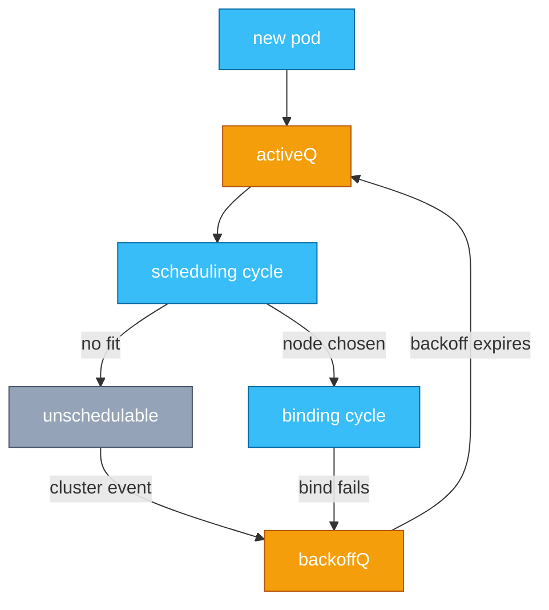
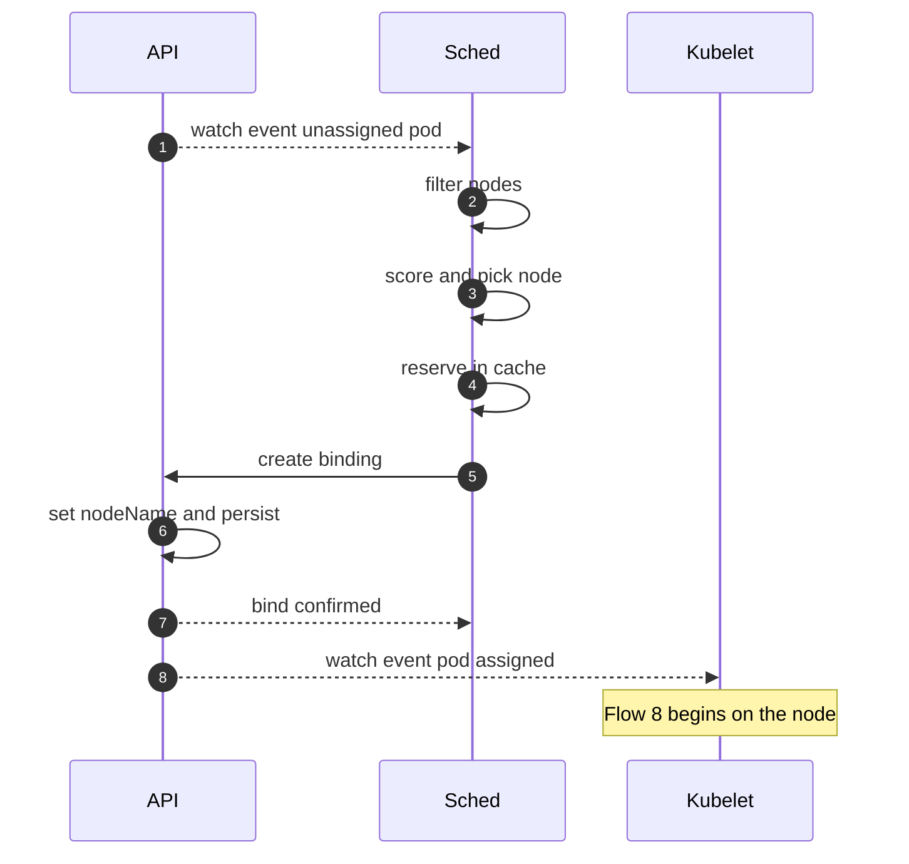
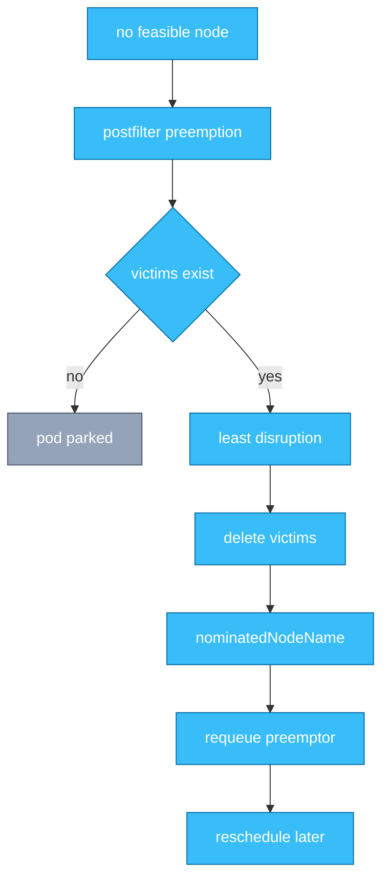
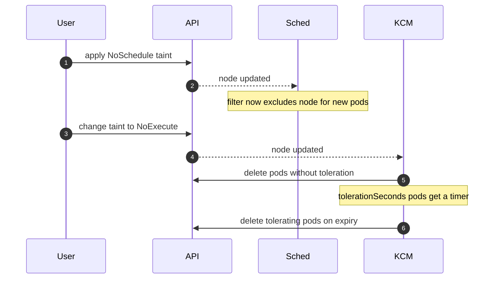

# Chapter 3 — Scheduler Internals

## Why this chapter

Scheduling questions test whether you know what the scheduler actually does — pick a node and write a binding — and what it deliberately does not do: start containers, watch live utilization. The mental model: one more reconcile loop, consuming pods with an empty `spec.nodeName` and producing bindings, built as a plugin pipeline around a set of queues. In Flow 8 terms, this chapter is the segment between "object persisted" (Flow 1) and "kubelet watch fires."

## Concepts

**The scheduling framework.** The scheduler is a plugin pipeline. A **scheduling cycle** runs one pod at a time through: PreFilter (precompute), Filter (which nodes are feasible), PostFilter (runs only when none are — preemption lives here), Score (rank feasible nodes), Reserve (claim resources in the scheduler's cache), Permit (approve, reject, or wait). Then an asynchronous **binding cycle** — PreBind, Bind, PostBind — runs in a goroutine so the next pod's scheduling cycle starts immediately. Default behaviors (resource fit, taints, affinity, spreading) are themselves plugins.

**Queues.** Pods awaiting scheduling live in three structures: **activeQ** (priority-ordered, ready to schedule), **backoffQ** (failed recently; waiting out exponential backoff), and the **unschedulable set** (no fit; parked). Cluster events that could change the answer — node added, pod deleted, taint removed — move parked pods back toward activeQ; the scheduler tracks which event types can help which pod, so it doesn't retry blindly.

**Requests, not usage.** Filtering and scoring use pod *requests* against node *allocatable* — never live metrics. On large clusters the scheduler stops searching for feasible nodes once it finds enough (`percentageOfNodesToScore`), then scores only those, to bound latency.

**Placement constraints.** Node affinity selects nodes by labels (required rules filter, preferred rules score). Pod affinity/anti-affinity constrains placement relative to other pods — powerful but expensive, since it examines existing pods per topology domain. Topology spread constraints (`maxSkew` across a topology key) are the scalable way to spread replicas across zones or nodes.

*Figure 3.1 — pods circulate through queues; only relevant cluster events wake a parked pod, and binding is asynchronous.*

## Flows

### Flow 5: What happens when a pod is created and a node is chosen

A Deployment's new pod is persisted (Flow 1) with no `spec.nodeName`.

1. **API server** emits the watch event; the scheduler's informer enqueues the unassigned pod into activeQ (after PreEnqueue gates), ordered by priority.
2. **Sched** pops the pod and starts a scheduling cycle; PreFilter computes per-pod state (total requests, parsed affinity terms).
3. **Sched** runs Filter plugins against candidate nodes in parallel — NodeResourcesFit, TaintToleration, affinity, ports, volume topology — yielding the feasible set.
   - On very large clusters the search stops once enough feasible nodes are found (`percentageOfNodesToScore`); the rest are never examined.
4. **Sched** runs Score plugins on the feasible nodes found, normalizes and weights, and picks the winner; ties break randomly.
5. **Sched** Reserve: records the pod as "assumed" onto that node in its in-memory cache, so the next pod sees those resources as taken before the bind commits.
6. **Sched** Permit: plugins may approve, reject, or hold the pod (the hook gang scheduling uses to wait for a full group).
7. **Sched** starts the binding cycle asynchronously. PreBind handles prerequisites — notably waiting for volume provisioning when a PVC uses `WaitForFirstConsumer` (Chapter 8).
8. **Sched** Bind: POSTs a Binding to the pod's `binding` subresource — the only output of scheduling.
9. **API server** sets `spec.nodeName` and persists. It is written exactly once, here; the scheduler never runs anything.
10. **Kubelet** on the chosen node sees the pod in its filtered watch — Flow 8 takes over. On any failure after Reserve, Unreserve rolls back the assumed resources and the pod goes to backoffQ.

*Figure 3.2 — scheduling ends with a single API write; the kubelet learns about it the same way everyone learns everything — a watch.*

**Where this can fail**

- **Symptom:** pod Pending with FailedScheduling event. **Cause:** no node passes Filter — resources, taints, affinity, volume topology. **Where to look:** `kubectl describe pod`; events enumerate filter failures per node.
- **Symptom:** pod scheduled but kubelet rejects it with OutOfcpu. **Cause:** scheduler raced kubelet-reported allocatable; kubelet admission is the final check. **Where to look:** pod events, node allocatable vs summed requests.
- **Symptom:** binding fails, pod re-queued. **Cause:** PreBind failure (volume provisioning error) or API conflict. **Where to look:** scheduler logs, PVC events.
- **Symptom:** scheduling latency grows with cluster size. **Cause:** heavy pod affinity rules or scoring too many nodes. **Where to look:** per-plugin scheduler latency metrics.

### Flow 6: What happens when no node fits

A high-priority pod arrives; every node fails Filter on memory.

1. **Sched** completes Filter with zero feasible nodes and records a FitError; Score never runs.
2. **Sched** invokes PostFilter — preemption: is there a node where evicting lower-priority pods would make this pod fit?
3. **Sched** simulates removals per candidate node, honoring PodDisruptionBudgets best-effort (preferred, not guaranteed, during preemption), and picks the node with the fewest, lowest-priority victims.
4. **Sched** writes `status.nominatedNodeName` on the preemptor and issues graceful API deletes for the victims (Flow 9).
5. **Kubelet** on the victim node runs their termination over their grace periods; capacity frees only after that.
6. **Sched** re-queues the preemptor. `nominatedNodeName` makes the scheduler account for it when placing others, but it is a hint, not a reservation — a higher-priority arrival or a freshly freed node elsewhere can change the outcome.
7. **Sched** parks the pod in the unschedulable set if preemption cannot help (no lower-priority victims); it waits for a relevant cluster event — scale-up is the usual rescue, and cluster-autoscaler acts on exactly these pending pods.

*Figure 3.3 — preemption is a controlled eviction plus a soft reservation; the preemptor still re-runs scheduling normally.*

**Where this can fail**

- **Symptom:** preemptor stays Pending after victims die. **Cause:** freed capacity taken by others, or a higher-priority pod claimed the node — nominatedNodeName is not binding. **Where to look:** scheduler logs, competing priorities.
- **Symptom:** unexpected evictions of workload pods. **Cause:** someone deployed a high-priorityClass pod; preemption working as designed. **Where to look:** victim pod events (Preempted), priorityClass audit.
- **Symptom:** no preemption despite a priority difference. **Cause:** `preemptionPolicy: Never` on the class, or victims' PDBs made every candidate worse. **Where to look:** PriorityClass spec, scheduler logs.
- **Symptom:** cascading preemption churn. **Cause:** many similar priorities competing for scarce capacity. **Where to look:** priority distribution; fix with capacity or clearer tiers.

### Flow 7: What happens when a taint is applied to a node

You taint a node: `kubectl taint nodes node-1 dedicated=gpu:NoSchedule`, and later switch it to `NoExecute`.

1. **User** taints the node with effect NoSchedule; the API server persists the update.
2. **Sched** now fails that node in the TaintToleration Filter for any pod lacking a matching toleration. New pods avoid the node; running pods are untouched — NoSchedule is scheduling-time only.
   - PreferNoSchedule is the soft variant: a scoring penalty, not a filter.
3. **User** changes the effect to NoExecute; this now concerns *running* pods.
4. **KCM** — the taint-eviction controller, split from the node lifecycle controller (decoupled taint manager, stable since v1.34) — sees the taint and evaluates every pod on the node.
5. **Taint-eviction controller** API-deletes each pod that does not tolerate the taint — immediately.
6. **Taint-eviction controller** starts a timer for pods tolerating it *with* `tolerationSeconds`, evicting on expiry; unbounded tolerations stay indefinitely.
7. **KCM** uses the same machinery for node health: the node lifecycle controller applies `not-ready` and `unreachable` NoExecute taints automatically, and admission gives every pod 300s tolerations for both — why pods survive a five-minute node blip but evacuate after (Flow 12).

*Figure 3.4 — NoSchedule is enforced by the scheduler at admission time; NoExecute is enforced by a controller against running pods.*

**Where this can fail**

- **Symptom:** DaemonSet pods survive the node-condition NoExecute taints (`node.kubernetes.io/*`). **Cause:** the DaemonSet controller adds tolerations for exactly those taints — intended. A custom NoExecute taint like this flow's *does* evict untolerated DaemonSet pods. **Where to look:** the pod's tolerations.
- **Symptom:** pods evicted five minutes after a network blip that already healed. **Cause:** the 300s toleration expired before the taint was removed. **Where to look:** node lifecycle controller logs, taint history.
- **Symptom:** new pods still land on a tainted node. **Cause:** a broad `operator: Exists` toleration copied from a template. **Where to look:** pod spec tolerations.
- **Symptom:** taint added but evictions trickle slowly. **Cause:** the taint-eviction controller rate-limits to avoid stampedes on wide failures. **Where to look:** KCM eviction rate settings and logs.

## Questions

### Tier 1 — Explain

**Q 3.1 — Walk me through the scheduling framework's extension points for one pod.**

**Answer.** Scheduling cycle, serial per pod: PreEnqueue and QueueSort control queue entry and order; PreFilter precomputes; Filter prunes infeasible nodes; PostFilter runs only on failure (preemption); Score ranks; Reserve claims cache resources; Permit can approve, deny, or hold. Binding cycle, asynchronous: PreBind (volume readiness), Bind, PostBind. Every default behavior is a plugin on these same hooks — extending the scheduler means writing plugins, not forking it.

*Strong answers also mention:* Unreserve as the rollback path, and why binding is async — scheduling throughput continues while binds do I/O.

**Q 3.2 — What does "binding" actually write, and who acts on it?**

**Answer.** The scheduler POSTs a Binding to the pod's `binding` subresource; the API server sets `spec.nodeName` and persists. That single field write is the scheduler's entire output. The kubelet on that node has a watch filtered to its own pods; the update fires it and the kubelet takes over (Flow 8). Nothing pushes to the node.

*Strong answers also mention:* kubelet admission can still reject the pod (OutOfcpu), making the kubelet the final arbiter — scheduling is a proposal.

**Q 3.3 — What are the scheduler's queues and how does a pod move between them?**

**Answer.** activeQ holds pods ready to schedule, priority-ordered. A pod that fails goes to the unschedulable set (no fit) or backoffQ (transient failure), with exponential backoff. Cluster events that could plausibly fix the pod — node added, taint removed, pod deleted — move it from unschedulable to backoffQ; it returns to activeQ when backoff expires (Figure 3.1). The event filtering prevents retry storms of thousands of pending pods on every cluster change.

*Strong answers also mention:* QueueingHints — plugins declaring which events can unblock which pods to make requeueing precise.

### Tier 2 — Reason

**Q 3.4 — Why does the scheduler "assume" pods into its cache at Reserve before the bind commits?**

**Answer.** Because binding is asynchronous: the next scheduling cycle starts before the previous pod's bind returns. Without Reserve, two pods could be granted the same node's last resources — double-booking. Assuming the pod into the cache makes its resources visible to subsequent cycles immediately, with Unreserve rolling back on bind failure. It is optimistic concurrency in scheduler form: local claim first, authoritative write after, compensate on failure.

*Strong answers also mention:* the assumed-pod cache is reconciled against real pod events, so a lost bind response self-corrects.

**Q 3.5 — Why is nominatedNodeName a soft guarantee, and why is that the right design?**

**Answer.** Victims terminate gracefully, which takes time, so the preemptor waits in the queue. nominatedNodeName tells the scheduler "account for this pod on that node" so others don't consume the freed capacity — but final placement re-runs scheduling: a higher-priority pod may take the node, or a better node may appear. Hard reservation would strand capacity if the preemptor dies or the world changes, and priority semantics demand a more important later arrival can still win.

*Strong answers also mention:* PDBs are only best-effort in preemption — priority beats disruption budgets by design.

**Q 3.6 — Pod anti-affinity vs topology spread constraints for spreading replicas — how do you choose?**

**Answer.** Required anti-affinity is binary: one replica per topology domain, and the next replica goes Pending — it cannot express "as even as possible." It is also the scheduler's most expensive constraint. Topology spread constraints express skew directly (`maxSkew` per topology key), choose hard (`DoNotSchedule`) or soft (`ScheduleAnyway`) per constraint, degrade gracefully as replicas exceed domains, and scale better. Use anti-affinity for genuine exclusion (never share a node); use spread constraints for balancing.

*Strong answers also mention:* cluster-level default spread constraints, and spreading's interaction with zonal autoscaling.

### Tier 3 — Design & Debug

**Q 3.7 — Pods sit Pending, but dashboards show the cluster is only 60% utilized. Walk through the diagnosis.**

**Answer.** Read the FailedScheduling event first — it lists per-node filter failures; trust it over dashboards. Then reason about the gap: dashboards show *usage*, the scheduler sees *requests* — a cluster can be request-full at 60% usage. Other causes the event reveals: fragmentation (total free is not free-on-one-node for a large pod), taints without tolerations, required affinity to labels that don't exist, volume topology (PVC bound in zone A, capacity in zone B), hostPort clashes, per-node pod-count limits. Fix follows cause: right-size requests, loosen constraints, or add capacity where constraints point.

*Strong answers also mention:* checking whether cluster-autoscaler declined to act (its events say why), and testing with a pod minus each constraint.

**Q 3.8 — Design gang scheduling — a training job's 8 pods must run all-or-nothing — on the scheduling framework.**

**Answer.** Use Permit as the rendezvous: a plugin tracks the pod group; each member reaching Permit is held waiting rather than bound; when the count reaches gang size, approve all; on timeout, reject and unreserve all. PreEnqueue keeps members out of activeQ until the whole group exists, avoiding wasted cycles. This is how coscheduling plugins and Kueue-style systems work. Discuss the deadlock risk: two half-admitted gangs starving each other argues for queueing admission *above* the scheduler.

*Strong answers also mention:* Reserve holds resources during the wait — the cost of the rendezvous — and preferring an existing project over a bespoke plugin.

## Common mistakes & red flags

- **"The scheduler starts the pod on the node."** It writes one field. Confusing scheduling with running collapses Flows 5 and 8 — a top-tier red flag.
- **"The scheduler balances on actual CPU/memory usage."** Requests vs allocatable, exclusively; live-usage balancing is a descheduler concern.
- **"NoSchedule evicts running pods."** Only NoExecute touches running pods — via the taint-eviction controller, not the scheduler.
- **"Preemption guarantees the pod lands on the freed node."** nominatedNodeName is a soft hint; higher-priority arrivals or new capacity can change the outcome.
- **"If scheduling succeeded, the pod will run there."** Kubelet admission can still reject (OutOfcpu); the controller then replaces the pod.
- **"The scheduler considers every node."** On large clusters it stops the feasibility search once it finds enough nodes (`percentageOfNodesToScore`) and scores only those — no global optimum guaranteed.
- **"PDBs block preemption."** They only bias victim selection; priority can override disruption budgets.
