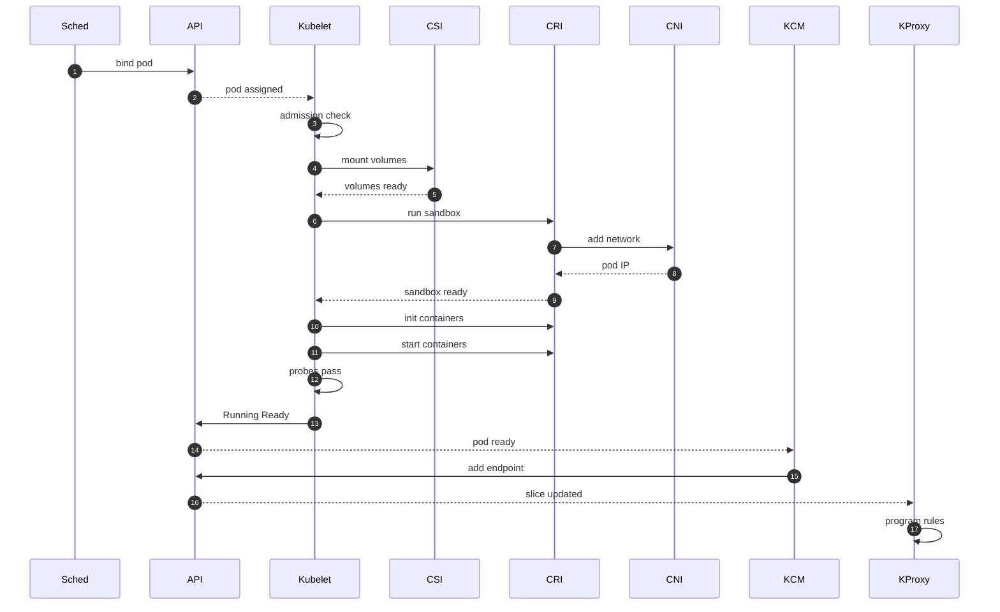
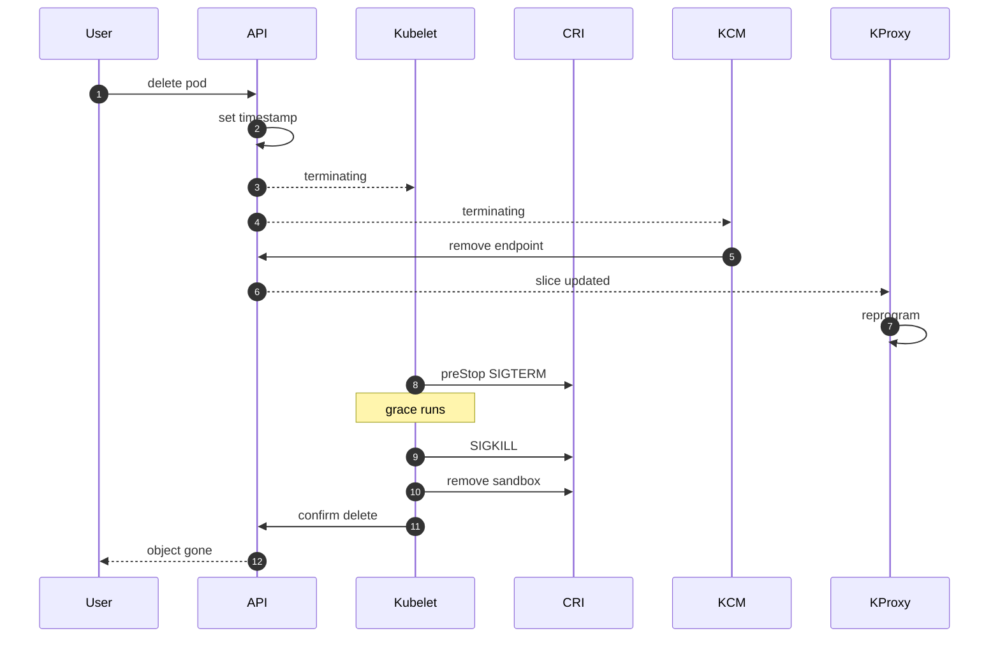
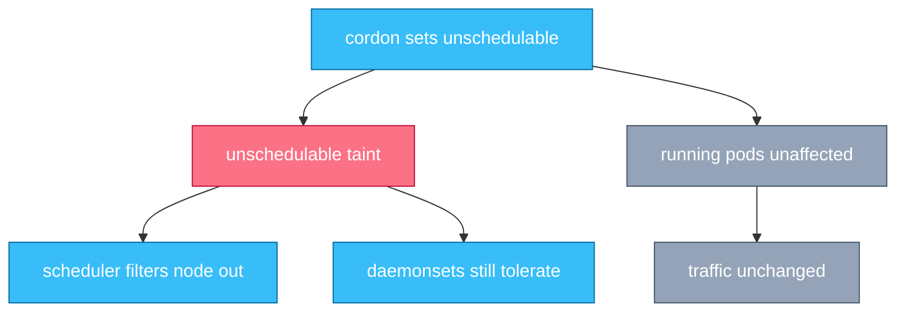
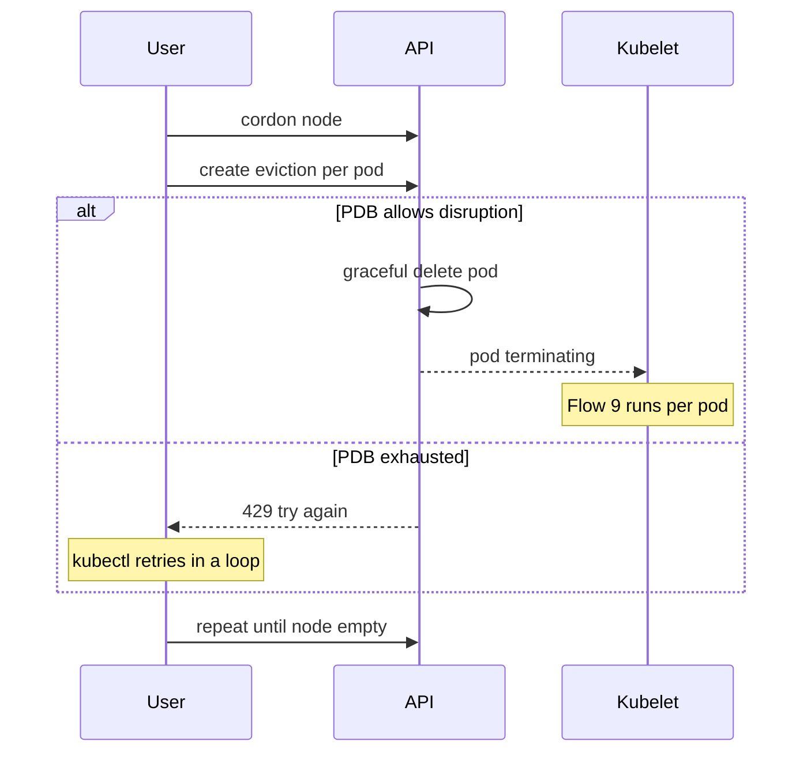
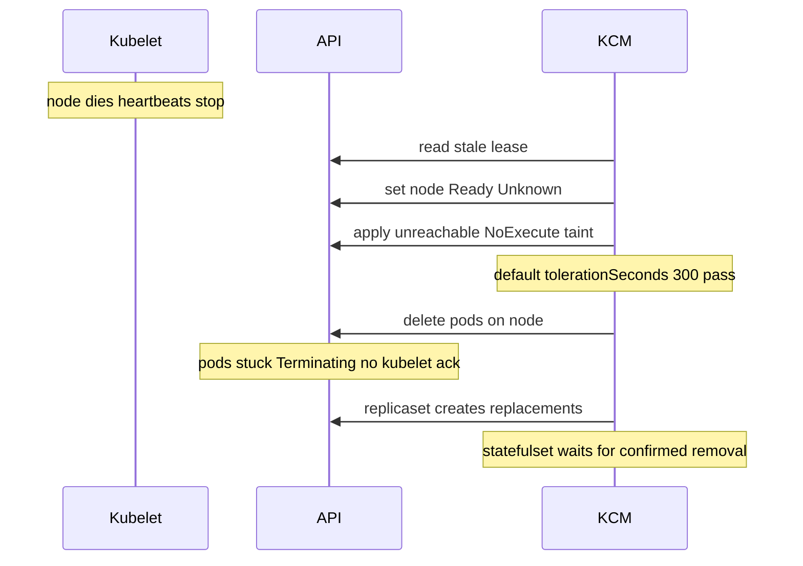
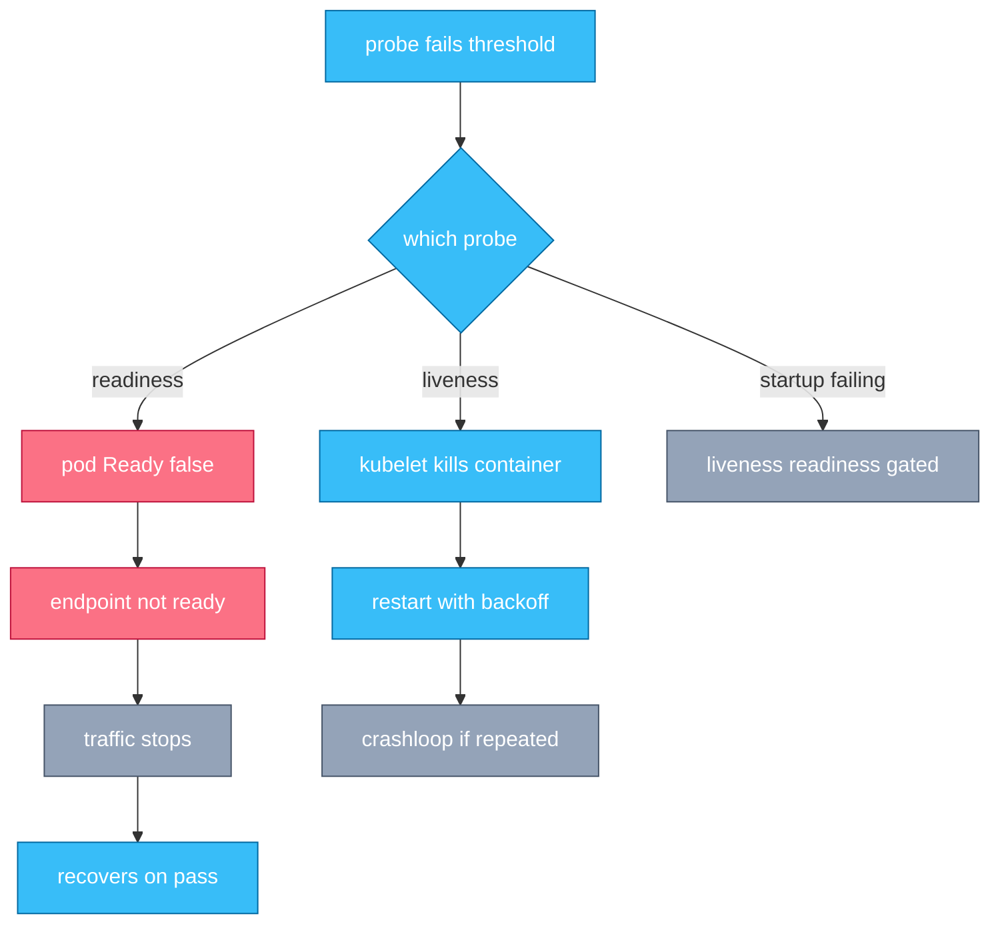
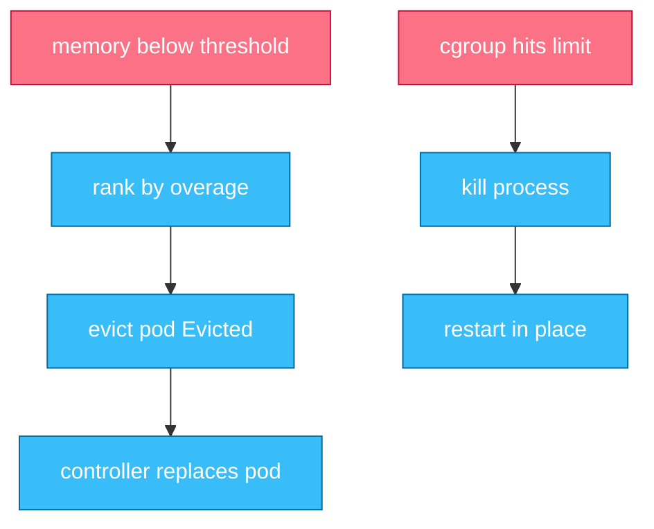

# Chapter 4 — Kubelet, Pods & the Node

## Why this chapter

This is where desired state becomes processes. Interviewers probe the node to see if you know what "Running" physically means, and whether you can reason about the seams — kubelet to runtime, runtime to network, probe to endpoint. The mental model: the kubelet is a reconcile loop like any controller, except its "write" side is CRI calls instead of API objects. This chapter hosts the master flow of the whole worksheet, Flow 8; Chapters 1–3 built up to its first step, and Chapters 7–8 zoom into its CNI and volume segments.

## Concepts

**The kubelet sync loop.** The kubelet merges three pod sources — its API watch (filtered to `spec.nodeName` = this node), static pod manifests on disk, and an optional HTTP source — into one desired set. A per-pod worker reconciles each: compare desired pod against actual containers, compute actions, execute via CRI. The PLEG (pod lifecycle event generator) watches the runtime for container state changes and feeds them back into the loop, so container deaths trigger reconciliation just like API updates.

**CRI and the sandbox.** CRI is the gRPC contract between kubelet and runtime (containerd, CRI-O). The pod **sandbox** is the pod's environment — in practice a paused container holding the network namespace and cgroup parent. Containers are created *into* it, which is why all containers in a pod share one IP.

**Init and sidecar containers.** Init containers run sequentially to completion before app containers. A **native sidecar** is an init container with `restartPolicy: Always` (stable since v1.33): it starts in init order, must become started before the sequence continues, keeps running alongside app containers, restarts if it dies, and terminates *after* app containers — solving the log-agent and proxy lifecycle problem.

**Probes.** Three kinds, all run by the kubelet: **startup** (gates the others until first success), **liveness** (failure → kill and restart the container), **readiness** (failure → pod Ready false → removed from endpoints; container untouched). See Flow 13.

**QoS and cgroups.** Requests/limits determine the QoS class: **Guaranteed** (limits equal requests for every container), **Burstable** (some requests set), **BestEffort** (none). On the cgroup v2 baseline the kubelet builds a cgroup hierarchy per QoS class and per pod, enforcing limits and informing both eviction ranking and kernel OOM scoring (Flow 14).

**Static pods.** Defined by manifest files on the node; the kubelet runs them without the API server and creates a read-only **mirror pod** upstream for visibility. Deleting them works only by removing the file. This is how the control plane bootstraps (Chapter 1).

## Flows

### Flow 8: What happens when a pod goes from created to Running (master flow)

A Deployment pod has just been bound to node-1 (Flow 5).

1. **Sched** has written the binding; the pod now carries `spec.nodeName: node-1` (Flows 1 and 5 cover everything up to here).
2. **Kubelet** on node-1 sees the pod in its filtered watch and runs node-level admission: do allocatable resources, ports, and node conditions still permit it? Rejection sets a terminal OutOfcpu-style status; the controller replaces the pod.
3. **Kubelet** (volume manager, in parallel with the next steps) makes volumes available: the KCM attach-detach controller attaches disks via CSI, then the node CSI plugin stages and mounts them (NodeStage, NodePublish — Chapter 8). Container start blocks until all mounts are ready.
4. **Kubelet** calls RunPodSandbox on the CRI runtime, which creates the sandbox — the pause container — establishing the pod's network namespace and cgroup parent.
5. **CRI runtime** invokes CNI ADD against that namespace (Chapter 7, Flow 20): veth pair, IP from IPAM, routes. The sandbox now has the pod IP.
6. **Kubelet** processes init containers in order: PullImage if needed (per `imagePullPolicy`), CreateContainer, StartContainer, wait for exit 0.
   - Native sidecars (restartPolicy Always) must become *started*, not complete — the sequence continues while they keep running.
7. **Kubelet** creates and starts app containers the same way; postStart hooks run immediately after start.
8. **Kubelet** begins probing: startup probe first if defined, then liveness and readiness. The pod's phase is now Running — meaning only "sandbox up, at least one container running or restarting."
9. **Kubelet** patches pod status upstream: phase, podIP, containerStatuses, conditions. Ready stays false until every readiness probe passes.
10. **Kubelet** sets condition Ready true once readiness passes everywhere (plus any readiness gates).
11. **KCM** — the EndpointSlice controller — sees a Ready pod matching a Service selector and writes its IP into an EndpointSlice as a ready endpoint.
12. **KProxy** on every node (and any other dataplane consumer: mesh, cloud LB, ingress) sees the slice update and programs forwarding rules. Traffic now reaches the pod (Chapter 7, Flow 22). Elapsed: typically seconds, dominated by image pull.

*Figure 4.1 — the worksheet's centerpiece: five independent loops (scheduler, kubelet, runtime, EndpointSlice controller, kube-proxy) hand off through the API server with no direct calls.*

**Where this can fail**

- **Symptom:** ContainerCreating with FailedCreatePodSandBox. **Cause:** CNI ADD failed — plugin misconfigured, IPAM pool exhausted. **Where to look:** pod events, kubelet and CNI plugin logs on the node.
- **Symptom:** ContainerCreating with volume timeouts. **Cause:** attach stuck (often Multi-Attach on a moved pod) or mount failure. **Where to look:** pod events, VolumeAttachment objects, CSI node plugin logs (Chapter 8).
- **Symptom:** ImagePullBackOff. **Cause:** bad image ref, missing pull secret, registry down or throttling. **Where to look:** pod events; test the pull from the node.
- **Symptom:** Running but never Ready; no traffic. **Cause:** readiness probe failing — app broken or probe wrong (port, path, timeout). **Where to look:** `kubectl describe` probe failures, app logs; Flow 13.
- **Symptom:** Ready, but clients still get errors briefly. **Cause:** EndpointSlice/kube-proxy propagation lag across nodes. **Where to look:** slice contents vs kube-proxy sync metrics (Flow 22).
- **Symptom:** CrashLoopBackOff. **Cause:** container exits at startup; kubelet restarts with exponential backoff. **Where to look:** `kubectl logs --previous`, exit code (137 = killed, Flow 14).

### Flow 9: What happens when a pod is deleted

You run `kubectl delete pod web-1` (part of every rollout — Flow 15).

1. **User** sends the DELETE. The API server does not remove the object: it sets `metadata.deletionTimestamp` and `deletionGracePeriodSeconds` (default 30). The pod is now Terminating — a state every watcher sees at once.
2. **Kubelet** starts termination: run each container's preStop hook first, then send SIGTERM to its main process.
   - preStop and SIGTERM spend the *same* grace budget; a 25s preStop leaves 5s for SIGTERM handling.
3. **KCM** (EndpointSlice controller) reacts *in parallel*: a terminating pod is no longer a valid endpoint, so it updates the slice.
4. **KProxy** on every node reprograms rules — but propagation takes time. Until it lands everywhere, traffic still arrives at a pod that already got SIGTERM. The race is inherent: two independent loops, no synchronization.
   - Hence the standard pattern: keep serving while draining on SIGTERM, and/or a short preStop sleep so endpoint removal outruns shutdown.
5. **Kubelet** waits out the grace period; anything still alive gets SIGKILL.
6. **Kubelet** confirms all containers dead, unmounts volumes, calls CNI DEL, removes the sandbox, then sends a final force-delete (grace 0) to the API.
7. **API server** removes the object — unless finalizers remain in `metadata.finalizers`; then it stays Terminating until each controller removes its finalizer (Chapter 6). Only at removal does a ReplicaSet-style controller see the name freed.

*Figure 4.2 — SIGTERM and endpoint removal race each other by design; graceful shutdown is the application's job.*

**Where this can fail**

- **Symptom:** 502s during every rollout. **Cause:** the endpoint-removal race — app exits instantly on SIGTERM while some nodes still route to it. **Where to look:** app SIGTERM handling; add drain logic or a preStop sleep.
- **Symptom:** pod stuck Terminating for minutes. **Cause:** process ignoring SIGTERM (spends full grace), unmount hang, or sandbox teardown failure. **Where to look:** kubelet logs, `crictl ps` on the node.
- **Symptom:** pod Terminating forever. **Cause:** a finalizer never removed (its controller broken or gone), or the node is dead (Flow 12). **Where to look:** `metadata.finalizers`; the owning controller's health.
- **Symptom:** kill -9 behavior, no cleanup. **Cause:** `--grace-period=0 --force` — the API forgets the pod while processes may linger on the node. **Where to look:** avoid outside genuine node-death recovery; StatefulSet caveat in Flow 12.

### Flow 10: What happens when a node is cordoned

You run `kubectl cordon node-1`.

1. **User** — via kubectl — PATCHes the node: `spec.unschedulable: true`. That is the entire command.
2. **KCM** (node lifecycle controller) mirrors the field as a `node.kubernetes.io/unschedulable:NoSchedule` taint.
3. **Sched** now excludes node-1 for all new pods (NoSchedule filter, Flow 7).
4. **Kubelet** does nothing — it never sees a reason to act. Running pods keep running and receiving traffic; endpoints are untouched.
5. **KCM** also changes nothing: no evictions, no endpoint updates. DaemonSet pods still schedule (they tolerate the taint).
6. **User** uncordons; the field and taint clear and the node accepts pods again. Contrast with drain (Flow 11), which is cordon *plus* actively removing pods.

*Figure 4.3 — cordon is one bit of scheduling intent; it moves nothing and drains nothing.*

**Where this can fail**

- **Symptom:** cluster slowly loses capacity; Pending pods pile up. **Cause:** nodes cordoned and forgotten (common after aborted maintenance). **Where to look:** `kubectl get nodes` for SchedulingDisabled.
- **Symptom:** someone expects cordon to move workloads. **Cause:** conceptual — cordon never evicts. **Where to look:** use drain for that (Flow 11).
- **Symptom:** pods still scheduling onto a cordoned node. **Cause:** they tolerate the unschedulable taint (DaemonSets by design; a blanket toleration by accident). **Where to look:** pod tolerations.

### Flow 11: What happens when a node is drained

You run `kubectl drain node-1 --ignore-daemonsets`.

1. **kubectl** first cordons the node (Flow 10) so evicted pods cannot reschedule back.
2. **kubectl** lists pods on the node and applies exclusions: DaemonSet pods are skipped (recreated instantly, and they tolerate the taint); static/mirror pods cannot be evicted; unmanaged pods and emptyDir data require explicit `--force` / `--delete-emptydir-data`.
3. **kubectl** creates an Eviction (POST to each pod's `eviction` subresource) rather than deleting directly — the API that respects PodDisruptionBudgets (PDBs: how many replicas of an app may be voluntarily disrupted).
4. **API server** checks the PDB status (maintained by the KCM disruption controller): budget allows → normal graceful delete (Flow 9); exhausted → 429, pod stays.
5. **kubectl** retries rejected evictions in a loop; workload controllers create replacements, which the scheduler places on other nodes.
6. **Drain sticks** when a PDB can never be satisfied — `maxUnavailable: 0`, a single-replica app with a PDB, or replicas unhealthy elsewhere. The 429s repeat until someone fixes the budget or the app.
7. **kubectl** returns success once all target pods are gone; only DaemonSets and static pods remain, and the node is safe to reboot or delete.

*Figure 4.4 — drain is a client-side loop over the Eviction API; PDBs are enforced server-side, which is why drain can stall indefinitely.*

**Where this can fail**

- **Symptom:** drain hangs printing "cannot evict pod". **Cause:** PDB budget exhausted — often a one-replica app with a PDB, or peers unhealthy. **Where to look:** `kubectl get pdb`, the app's replica health.
- **Symptom:** drain refuses to start. **Cause:** unmanaged or emptyDir pods without the corresponding flags. **Where to look:** the pods drain names in its error.
- **Symptom:** drained pods reappear on the same node. **Cause:** the cordon was lifted mid-drain, or pods are DaemonSet/static (never leave). **Where to look:** node unschedulable state; pod owner kinds.
- **Symptom:** evicted pods stuck Pending. **Cause:** nowhere to go — remaining nodes lack capacity or fail constraints. **Where to look:** FailedScheduling events (Flow 6); drain removed capacity the scheduler needed.

### Flow 12: What happens when a node dies

node-1's hardware fails; its kubelet stops mid-heartbeat.

1. **Kubelet** normally renews a Lease object (namespace `kube-node-lease`) every ~10s — the cheap heartbeat — plus periodic node status updates. Both stop.
2. **KCM** (node lifecycle controller) notices the stale lease after `node-monitor-grace-period` (default 50s) and sets the node's Ready condition to Unknown — deliberately not "dead," because a network partition looks identical.
3. **KCM** applies the `node.kubernetes.io/unreachable:NoExecute` taint.
4. **KCM** — the taint-eviction controller (Flow 7) — processes pods on the node. Nearly all pods carry the admission-injected default `unreachable` toleration with `tolerationSeconds: 300`, so a five-minute timer starts.
5. **Taint-eviction controller** issues API deletes when timers expire. But the kubelet is gone, so nothing confirms termination: the pods sit in Terminating indefinitely.
6. **KCM** (ReplicaSet controller) treats pods with a deletionTimestamp as gone for replica-counting, so Deployments spawn replacements on healthy nodes immediately — stateless apps self-heal in ~6 minutes total.
7. **KCM** (StatefulSet controller) refuses: StatefulSets guarantee at-most-one pod per identity, and an unreachable pod-1 *might still be running and writing to its disk*. No replacement until the old pod is confirmed removed.
   - Resolution: the cloud-controller-manager confirms the instance is gone and deletes the Node object (pod GC then cleans up), or a human force-deletes the pod — asserting the node is truly dead. Force-deleting while it actually lives risks split brain: two pod-1s.

*Figure 4.5 — detection is lease-based, response is taint-based, and the safety gap between "unreachable" and "dead" is exactly the StatefulSet caveat.*

**Where this can fail**

- **Symptom:** ~6 minutes to recover from node loss. **Cause:** default grace (50s) plus the 300s toleration — working as configured. **Where to look:** tune per-pod `tolerationSeconds` for faster failover, accepting more partition-induced churn.
- **Symptom:** StatefulSet pod missing for hours after node loss. **Cause:** the at-most-one guarantee — no auto-replacement without confirmed removal. **Where to look:** is the Node object still present? CCM health; force-delete only with out-of-band confirmation.
- **Symptom:** mass eviction during a network blip that healed. **Cause:** the partition outlasted the 300s toleration. **Where to look:** node lifecycle controller logs; it rate-limits evictions and backs off on wide failures (zone outage heuristics).
- **Symptom:** pods Terminating for days. **Cause:** node never cleaned up — no CCM (bare metal), nobody deleted the Node object. **Where to look:** Node objects vs real inventory.

### Flow 13: What happens when a probe fails

A container's HTTP probe starts returning 500s.

1. **Kubelet** runs each container's probes on their `periodSeconds` schedule; a probe trips only after `failureThreshold` consecutive failures.
2. **Kubelet**, if it is the *readiness* probe: sets the pod's Ready condition false. The container is not touched.
3. **KCM** (EndpointSlice controller) marks the endpoint not-ready; kube-proxy everywhere stops routing to the pod. Traffic shed, pod alive — the right response to overload or a lost dependency, and it self-reverses when probes pass.
4. **Kubelet**, if it is the *liveness* probe: kills the container and restarts it per restartPolicy with exponential backoff — CrashLoopBackOff when it keeps failing. The right response to one thing only: an unrecoverably stuck process.
5. **Kubelet**, if a *startup* probe is defined: liveness and readiness stay disabled until it first succeeds — protecting slow starters from being killed mid-boot.
6. **The classic outage:** a liveness probe that checks a dependency. The dependency blips; every replica's liveness fails together; the kubelet restarts the whole fleet at once; caches are cold — the blip becomes an outage. Liveness must test "is this process stuck," never "is my dependency healthy" — dependency health belongs in readiness, if anywhere.

*Figure 4.6 — readiness controls traffic, liveness controls the process; wiring dependency health into liveness converts blips into fleet restarts.*

**Where this can fail**

- **Symptom:** synchronized fleet-wide restarts when a dependency degrades. **Cause:** liveness probing the dependency. **Where to look:** probe handler code; move the check to readiness or remove it.
- **Symptom:** pods restart during deploys or heavy GC. **Cause:** liveness timing too aggressive for real startup or pauses. **Where to look:** probe timings; add a startup probe.
- **Symptom:** Service goes entirely empty under load. **Cause:** all replicas' readiness failing together on a shared dependency — traffic to zero can be worse than degraded service. **Where to look:** whether readiness should reflect that dependency at all.
- **Symptom:** probes pass but users see errors. **Cause:** probe checks a trivial path that always returns 200 — probes only mean what you make them measure. **Where to look:** probe handler vs real serving path.

### Flow 14: What happens when a node comes under memory pressure

Pods on node-1 collectively push available memory below the kubelet's threshold.

1. **Kubelet** (eviction manager) tracks signals like `memory.available`. A soft threshold starts a grace timer; the hard threshold acts immediately.
2. **Kubelet** sets node condition MemoryPressure; the node lifecycle controller mirrors it as a `memory-pressure:NoSchedule` taint so the scheduler stops adding load.
3. **Kubelet** ranks victims — not simply by QoS: first, pods whose usage *exceeds requests*; among those, lower priority first, then by overage size. Net effect: BestEffort and over-request Burstable go first; Guaranteed and under-request pods last.
4. **Kubelet** evicts: gracefully kills the pod, sets status Failed reason Evicted. The kubelet does *not* reschedule — the controller creates a replacement the scheduler places elsewhere; a bare pod is simply gone.
5. **Kernel**, by contrast, acts when a *cgroup* breaches its memory limit: the OOM killer kills a process in that container instantly — no cross-pod ranking, no grace, no kubelet involvement. The kubelet observes the death (exit 137, OOMKilled) and restarts the container per restartPolicy, same node.
6. **Kernel** global OOM (node exhausted before the kubelet could evict) picks by `oom_score_adj`, pre-set by QoS — Guaranteed ≈ -997, BestEffort 1000, Burstable between — so even the emergency path roughly follows QoS.
7. **Summary:** kubelet eviction is node-level, proactive, requests-aware, kills whole pods, leads to rescheduling. Kernel OOM is cgroup-level, reactive, per-process, leads to in-place restart. Exam tell: Evicted pod status vs OOMKilled container state.

*Figure 4.7 — two independent defenses: the kubelet manages node pressure by evicting pods; the kernel enforces per-container limits by killing processes.*

**Where this can fail**

- **Symptom:** Evicted pods littering the cluster. **Cause:** node pressure; the objects are tombstones controllers left behind. **Where to look:** which pods exceeded requests — right-size them; tombstones clean up via GC thresholds or by hand.
- **Symptom:** container repeatedly OOMKilled (137), pod never moves. **Cause:** limit too low; the kernel path restarts in place forever. **Where to look:** memory limit vs actual working set.
- **Symptom:** critical pod evicted while junk survived. **Cause:** it ran over its too-low requests, ranking it early despite QoS intuition. **Where to look:** requests vs usage; set requests honestly, use priority classes.
- **Symptom:** node flaps between pressure and normal, churning pods. **Cause:** eviction frees memory, taint clears, scheduler refills the node, pressure returns. **Where to look:** eviction thresholds vs headroom; system-reserved settings.

## Questions

### Tier 1 — Explain

**Q 4.1 — What does pod phase "Running" actually guarantee, and how does it differ from Ready?**

**Answer.** Running guarantees only: bound to a node, sandbox up, at least one container running or restarting — a pod in CrashLoopBackOff is Running. Ready is a condition, not a phase: every readiness probe passes (plus readiness gates). Ready is what feeds EndpointSlices, so only Ready matters for traffic (Flow 8, steps 10–12). Interviewers ask this to see whether you separate process state from service state.

*Strong answers also mention:* phases are coarse by design; real state lives in conditions and containerStatuses.

**Q 4.2 — Walk me through pod termination. Why does graceful shutdown require application cooperation?**

**Answer.** Flow 9: DELETE sets deletionTimestamp plus grace period; the kubelet runs preStop then SIGTERM; in parallel the EndpointSlice controller removes the endpoint and every kube-proxy reprograms — with lag; at grace expiry, SIGKILL; after teardown the API removes the object unless finalizers hold it. Kubernetes only delivers signals and adjusts routing — it cannot finish your in-flight requests. The app must catch SIGTERM, keep serving while endpoints propagate, drain, then exit.

*Strong answers also mention:* preStop shares the grace budget with SIGTERM, and terminationGracePeriodSeconds must exceed worst-case drain time.

**Q 4.3 — What are the QoS classes, how are they derived, and where do they take effect?**

**Answer.** Derived purely from resources: Guaranteed — every container has limits equal to requests, CPU and memory; Burstable — something set but not qualifying; BestEffort — nothing set. They take effect in three places: the cgroup hierarchy the kubelet builds; eviction ranking under node pressure (with the request-overage refinement — Flow 14); and kernel OOM scoring via oom_score_adj. QoS is computed, never declared.

*Strong answers also mention:* eviction ranks by usage-over-requests and priority, not QoS label alone — a common misconception.

### Tier 2 — Reason

**Q 4.4 — Why were native sidecars implemented as init containers with restartPolicy Always, and what problems does that fix?**

**Answer.** The old pattern — sidecar as a regular container — had no ordering guarantees: the app could start before its proxy was ready, the sidecar could be SIGTERMed alongside the app (log loss, broken egress during drain), and a sidecar kept Jobs from completing. As an init container it gains start ordering: it starts in init sequence and must be started before later containers. restartPolicy Always keeps it running and restartable, and termination reverses the order — app containers first, sidecars last. Stable since v1.33.

*Strong answers also mention:* Jobs now complete correctly (sidecars don't count against completion), and per-container restartPolicy exists only in this init context.

**Q 4.5 — Why can traffic still arrive after a pod gets SIGTERM? Could Kubernetes fix this ordering?**

**Answer.** Termination fans out to independent loops (Flow 9): the kubelet delivers SIGTERM while the EndpointSlice controller and thousands of kube-proxies converge on removing the endpoint, each at its own pace. No transaction spans them — the price of hub-and-spoke, level-triggered design (Chapter 1). A built-in barrier ("remove everywhere, ack, then signal") would block pod deletion on every node's dataplane — slow, fragile, and against the architecture. So the contract is: SIGTERM means "finish up, stop when drained," and apps plus preStop delays bridge the gap.

*Strong answers also mention:* the same lag exists on pod *start*, and meshes/LB health checks add their own layers of the same race.

**Q 4.6 — Compare kubelet eviction and kernel OOM-kill as defenses. Why do both exist?**

**Answer.** Different problems at different speeds. Kubelet eviction protects the *node*: aggregate signals, proactive policy (requests-overage, priority), whole pods killed gracefully and handed back for rescheduling. The kernel protects a *cgroup boundary*: when a container hits its limit, something must die *now* — no time for policy; a process is killed instantly and restarted in place. The kubelet can't react in microseconds; the kernel can't reason about pods or priorities. The kubelet bridges them by pre-seeding oom_score_adj so even kernel decisions roughly follow QoS (Flow 14).

*Strong answers also mention:* Evicted status vs OOMKilled reason as the diagnostic distinction, and memory limits converting node-level risk into contained per-pod failure.

### Tier 3 — Design & Debug

**Q 4.7 — Every rolling deploy of a service causes a burst of 502s. Diagnose and fix.**

**Answer.** Two races bracket a rollout; check both. Shutdown race (usual culprit): old pods exit on SIGTERM before endpoint removal propagates — some nodes still route to a dead pod (Flow 9). Evidence: errors correlate with terminating pods. Fix: drain on SIGTERM or a preStop sleep, with grace sized above it. Startup race: new pods Ready before actually able to serve — readiness too shallow, or the LB targets pods before rules converge. Evidence: errors correlate with fresh pods. Fix: readiness exercising the real serving path, maxSurge for capacity overlap, minReadySeconds. Confirm against rollout timelines vs error timestamps.

*Strong answers also mention:* an external LB or mesh adds its own health-check delay on top of EndpointSlice lag; its connection-draining settings matter as much as pod behavior.

**Q 4.8 — A node went dark 20 minutes ago. Stateless apps recovered; one StatefulSet pod is missing and its pod shows Terminating. Explain and remediate safely.**

**Answer.** Textbook Flow 12: lease expired → Ready Unknown → unreachable NoExecute taint → after 300s the taint-eviction controller deleted the pods, but no kubelet can confirm, so they hang Terminating. ReplicaSets replace terminating pods immediately (stateless recovered); the StatefulSet controller won't violate at-most-one-per-identity while the old pod might still be alive writing to its volume. Safe remediation: confirm the node is truly dead out-of-band (cloud API, console); then delete the Node object — pod GC cleans up and the StatefulSet proceeds — or force-delete the pod as the same assertion. Verify volume detach so the new node doesn't hit Multi-Attach (Chapter 8).

*Strong answers also mention:* fencing/node-shutdown detection as the automated version of this judgment; force-deleting on a merely partitioned node risks split-brain writes.

## Common mistakes & red flags

- **"A failed readiness probe restarts the container."** Readiness only gates traffic; liveness restarts. Mixing them up is *the* classic node-level red flag (Flow 13).
- **"Endpoints are removed before SIGTERM is sent."** They race in parallel; no ordering exists. Anyone who has debugged rollout 502s has this scar.
- **"The grace period starts after preStop finishes."** preStop spends the same budget; a long hook leaves SIGTERM almost no time before SIGKILL.
- **"Evicted and OOMKilled are the same."** Different actors (kubelet vs kernel), granularity (pod vs process), and aftermath (reschedule vs in-place restart) — Flow 14.
- **"Cordon moves the pods off."** Cordon flips one scheduling bit; drain does the removing, within PDB budgets (Flows 10–11).
- **"Kubernetes reschedules pods."** No component moves a pod: pods are deleted and *controllers create new ones* the scheduler places fresh. Precision here signals real internals knowledge.
- **"Force-deleting a stuck pod is harmless."** For StatefulSets it dissolves the at-most-one guarantee; on a live-but-partitioned node it invites split brain (Flow 12).
- **"Static pods can be managed through the API."** The mirror pod is read-only; only the manifest file on the node controls them.
