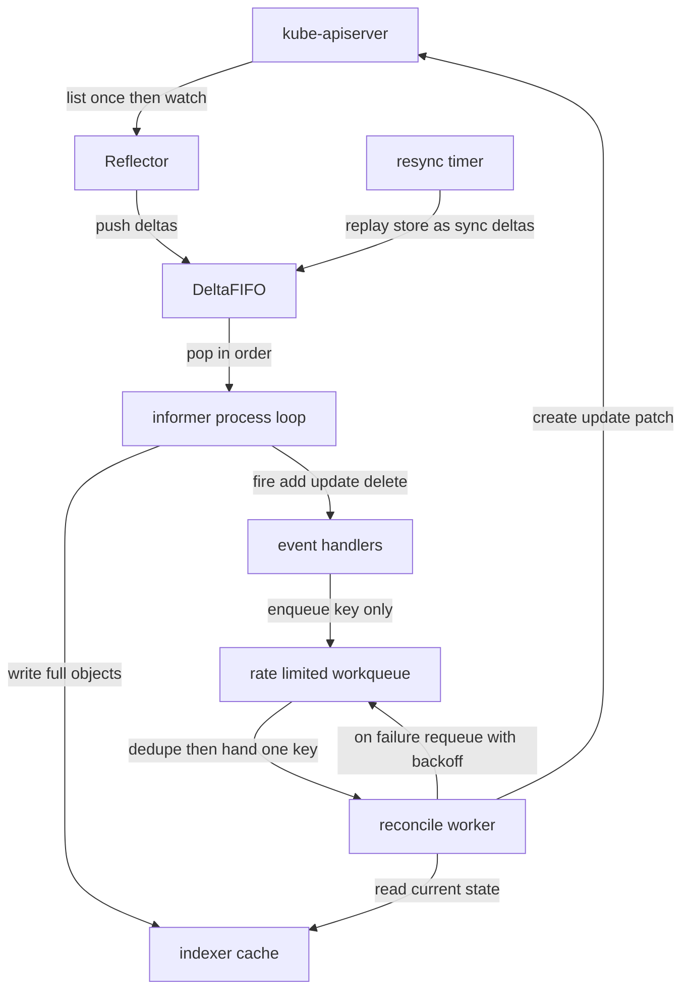
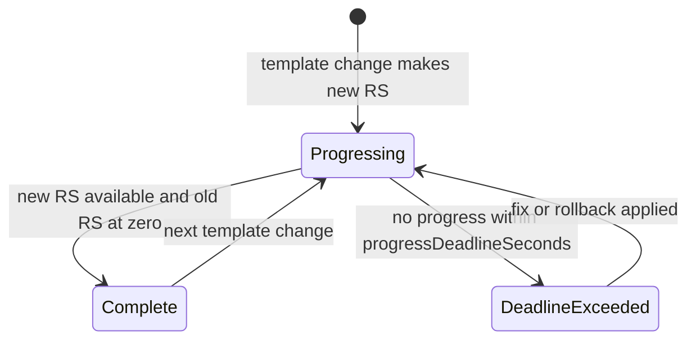
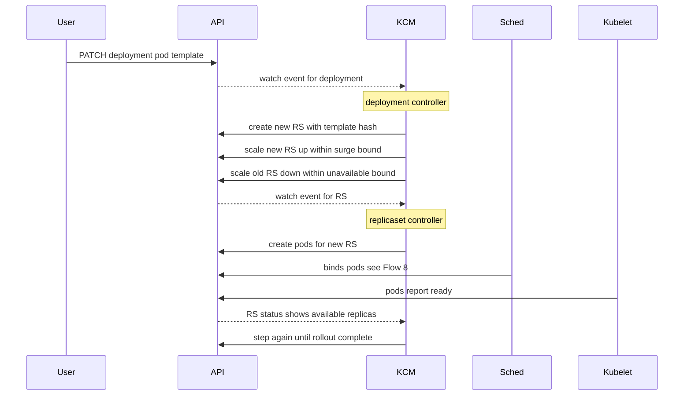
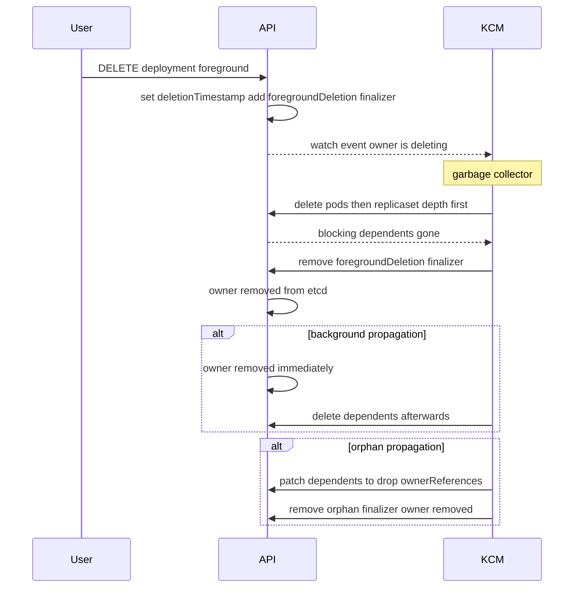

# Chapter 5 — Controller Fundamentals

## Why this chapter

Interviewers use controllers to separate people who *use* Kubernetes from people who understand it. Every control-plane component is a controller, so one mental model powers half this book: a controller is a loop that drives actual state toward desired state, using cached reads and idempotent writes. Events never carry instructions; they only say "look at this object again". Hold that model and the machinery below falls into place. Chapter 6 builds on it to cover writing your own.

## The reconcile pattern

A controller repeats three steps. **Observe:** read desired state (usually `.spec`) and actual state (children, external resources). **Diff:** compute what is missing, extra, or wrong. **Act:** make the smallest safe change, record observations in `.status`, stop. The next run starts from scratch — no memory of the last one. Two consequences: reconciles must be idempotent (running twice must not create two of anything), and complete (each run must handle any starting state, because the controller never knows what happened while it was not looking).

## Level-triggered by design

An edge-triggered system reacts to transitions: "pod died". Miss one edge — a crash, a dropped watch — and you diverge forever. A level-triggered system reacts to state: an event means only "reconcile this object now", and the reconcile re-reads everything. Missed, merged, or reordered events are harmless; the next reconcile sees the current level anyway.

Kubernetes chooses level-triggered because components crash, watches break (Flow 3), and caches lag. The cost: a reconcile cannot know *what* changed, so it must be cheap to re-run and must diff the whole object.

## Informer machinery

If every controller polled the API server, the control plane would melt. client-go's answer is the informer (a client-side caching machine that mirrors one resource type):

- **Reflector** — one LIST to seed state, then a WATCH from that resourceVersion; pushes changes into the DeltaFIFO.
- **DeltaFIFO** — a queue of per-object deltas (Added/Updated/Deleted/Sync), ordered per object, duplicates merged.
- **Indexer (store)** — the in-memory cache of full objects, with indexes (namespace by default). This is what reconcilers read.
- **Event handlers** — callbacks fired after the store updates. Good handlers do one thing: enqueue the object's key (`namespace/name`) into a workqueue.
- **Workqueue** — a rate-limited queue of keys. It dedupes (a key added twice is processed once; a key re-added mid-processing runs again after), serializes per key, and backs off failing keys exponentially.

A **shared informer** is one informer per type per process, shared by all controllers in the binary — one watch instead of dozens. A **lister** is the read-only, index-backed view of the store; reconcilers read through listers and almost never GET the API server.

**Resync vs relist** — a classic confusion. *Resync* replays the store to the handlers every `resyncPeriod` as synthetic Update events. No API traffic; it is a safety net that re-runs reconciles in case something was dropped. *Relist* is the reflector re-LISTing because its watch broke and its resourceVersion is gone ("410 Gone", Flow 3). Relist hits the API server and is expensive; watch bookmarks exist to make it rare.

*Figure 5.1 — only keys travel through the workqueue; reads come from cache, writes go to the API server, and resync loops inside the client without touching the server.*

Keep Figure 5.1 in your head: it is the engine inside kube-controller-manager, the scheduler, and every operator you will ever read.

## Owner references and garbage collection

`metadata.ownerReferences` records who owns an object — a ReplicaSet lists its Deployment; a Pod, its ReplicaSet. At most one reference has `controller: true`, marking the managing controller. References never cross namespaces.

The garbage collector (a controller in kube-controller-manager) watches every resource type via metadata-only watches, builds an owner graph, and deletes orphaned dependents. Deletion offers three propagation policies — background (the kubectl and apps/v1 default), foreground, orphan — walked in Flow 16.

## Built-in controllers as case studies

**Deployment → ReplicaSet → Pod.** The Deployment controller never touches pods. It manages ReplicaSets — one per template revision, identified by a `pod-template-hash` label — and rolls out by scaling the new RS up and old ones down. The ReplicaSet controller does one dumb thing well: keep N pods matching a template alive. The split buys free rollback (old RSs are kept; `revisionHistoryLimit` default 10) and separates rollout policy from replica repair.

*Figure 5.2 — rollout is a state machine on Deployment conditions; DeadlineExceeded is a signal, not an automatic rollback.*

**StatefulSet.** Pods get stable ordinal identities (`web-0`, `web-1`) and per-ordinal PVCs from `volumeClaimTemplates`. Default `OrderedReady` policy: create 0→N−1, each pod Ready before the next; scale-down and rolling updates run in reverse ordinal order. `partition` holds back updates below an ordinal — the built-in canary knob. PVCs survive pod deletion by default; the opt-in `persistentVolumeClaimRetentionPolicy` (GA since v1.32) can remove them on scale-down or deletion.

**Job.** The Job controller runs pods to completion: `completions` and `parallelism` shape the run, `backoffLimit` (default 6) caps retries, Indexed mode gives each pod a completion index. It tracks finished pods with a per-pod finalizer, so completions count exactly once even if pods vanish.

## Flows

### Flow 15: What happens when you edit or scale a Deployment

You run `kubectl set image deployment/web app=web:v2` on a 10-replica Deployment with default `maxSurge: 25%`, `maxUnavailable: 25%`.

1. **kubectl** sends a PATCH updating the pod template (Flow 1 covers the write path).
2. **API** validates, bumps `metadata.generation`, persists, and fans out watch events.
   - `kubectl scale` changes only `.spec.replicas`: no new ReplicaSet, no rollout — a favorite interview trap.
3. **KCM** (Deployment controller) hashes the new template, finds no RS with that `pod-template-hash`, and creates one at 0 replicas.
4. **KCM** computes bounds: `maxSurge` 25% of 10 rounds *up* to 3 (at most 13 pods); `maxUnavailable` rounds *down* to 2 (at least 8 available).
5. **KCM** scales the new RS up and old down within those bounds — e.g. new to 3, old to 8.
6. **KCM** (ReplicaSet controller, a separate loop) sees new-RS spec 3 vs actual 0 and creates 3 pods, using expectations to avoid over-creating while its cache lags (Chapter 6).
7. **Sched** and **Kubelet** take the pods to Ready — the master flow, Flow 8.
8. **KCM** (Deployment controller) sees `availableReplicas` rise on the new RS and steps again, always inside the bounds.
   - Scaling mid-rollout scales both ReplicaSets proportionally, preserving the rollout ratio.
9. **KCM** repeats until new RS = 10 available, old = 0. The old RS is kept at 0 as rollout history.
10. **kubectl** `rollout status` just reads Deployment status and conditions. No progress for `progressDeadlineSeconds` (default 600s) sets `Progressing=False`, reason `ProgressDeadlineExceeded` — and nothing rolls back automatically.
11. **User** runs `kubectl rollout undo`: kubectl copies the previous revision's template back into the spec. The forward machinery reruns; the hash matches the old RS, which is reused and scaled back up. Rollback is a rollout whose target already exists.

*Figure 5.3 — two independent controllers in KCM cooperate only through API objects; neither calls the other.*

**Where this can fail**

- **Symptom:** rollout stuck at 8/10. **Cause:** new pods unschedulable or failing readiness; with `maxUnavailable` spent, no more old pods die. **Where to look:** `kubectl rollout status`, new-RS pod events.
- **Symptom:** `ProgressDeadlineExceeded` after an image typo. **Cause:** ImagePullBackOff on every new pod. **Where to look:** Deployment conditions, pod statuses; fix or `rollout undo`.
- **Symptom:** 13 pods for 10 replicas mid-rollout. **Cause:** expected — surge. **Where to look:** the maxSurge math, both RSs' `.spec.replicas`.
- **Symptom:** rollout cannot start despite `maxSurge > 0`. **Cause:** ResourceQuota exhausted — surge pods need headroom. **Where to look:** quota events.
- **Symptom:** rollback "loses" a change. **Cause:** `undo` restores the template from the retained RS, not etcd history; with `revisionHistoryLimit: 0` there is nothing to restore. **Where to look:** `kubectl rollout history`.

### Flow 16: What happens when you delete an object that owns others

You run `kubectl delete deployment web`; the Deployment owns a ReplicaSet, which owns 10 pods.

1. **kubectl** sends a DELETE with propagation `Background` (its default; `--cascade` changes it).
2. **API** — background — removes the Deployment from etcd immediately and emits a deletion event. The children remain, owner reference now dangling.
3. **KCM** (garbage collector) sees the deletion in its owner graph and deletes the RS; the same logic cascades to the pods.
4. **User** — foreground — passes `--cascade=foreground`. **API** does not delete: it sets `deletionTimestamp` and adds the `foregroundDeletion` finalizer. The Deployment stays visible, deleting.
5. **KCM** (GC) deletes dependents first, depth-first: pods, then RS. Only dependents with `blockOwnerDeletion: true` block the owner.
6. **KCM** (GC) removes the finalizer once blocking dependents are gone; **API** removes the owner. Foreground = children before parent; background = parent first, children soon after.
7. **User** — orphan — passes `--cascade=orphan`. **API** adds the `orphan` finalizer; **KCM** (GC) patches every dependent to strip its ownerReferences, removes the finalizer, and the owner goes. RS and pods keep running, unowned.
8. **KCM** (ReplicaSet controller) can later *adopt* orphans whose labels match a selector and that lack a controller reference — how recreate flows reattach pods, and how a careless selector grabs pods you did not mean to own.

*Figure 5.4 — propagation policy decides only ordering and whether children die; the GC does the work in every case.*

**Where this can fail**

- **Symptom:** object stuck `Terminating`. **Cause:** a finalizer nobody removes — its controller is down, or foreground deletion blocked by an undeletable dependent. **Where to look:** `metadata.finalizers`, then the controller owning each finalizer.
- **Symptom:** GC stops deleting cluster-wide. **Cause:** GC needs discovery of all types; a broken aggregated APIService stalls its graph. **Where to look:** `kubectl get apiservices` for `False` conditions, KCM logs.
- **Symptom:** pods survive a deployment deletion. **Cause:** orphan propagation, or ownerReferences stripped by a tool. **Where to look:** pod `ownerReferences`, audit log for the DELETE's policy.
- **Symptom:** dependent never collected across namespaces. **Cause:** cross-namespace ownerReferences are invalid. **Where to look:** events mentioning `OwnerRefInvalidNamespace`.

## Questions

### Tier 1 — Explain

**Q 5.1 — Walk me through the path from a watch event arriving at a controller to the reconcile running.**

**Answer.** The reflector appends a delta to the DeltaFIFO. The informer loop pops it, updates the indexer, then calls the event handlers. A handler extracts the key — `namespace/name` — and adds it to the workqueue, which dedupes if the key is already waiting. A worker pops the key, reads the *current* object through a lister (cache read, not an API GET), and reconciles. Errors requeue with exponential backoff; success resets it.

*Strong answers also mention:* only keys travel through the queue — reconciles always act on the latest state, and event bursts collapse into one run.

**Q 5.2 — What is the difference between resync and relist?**

**Answer.** Resync is local: on a timer, the informer replays its store to handlers as synthetic updates — no API traffic; a safety net so periodic reconciles catch dropped work. Relist is remote: the reflector re-LISTs because its watch broke and its resourceVersion is too old to resume ("410 Gone"). Relist transfers and decodes full objects — expensive at scale — which is why watch bookmarks exist.

*Strong answers also mention:* resync fires UpdateFunc with old and new equal — handlers that diff resourceVersions skip them, sometimes a bug, sometimes the point.

**Q 5.3 — What do ownerReferences do, and what are the three deletion propagations?**

**Answer.** An ownerReference names an object's owner; the garbage collector builds a graph from them and deletes dependents when owners go. One reference may be `controller: true`, marking the managing controller — used for adoption and for mapping child events to owners. *Background* (default) deletes the owner immediately, children asynchronously after. *Foreground* holds the owner Terminating via the `foregroundDeletion` finalizer until `blockOwnerDeletion` dependents are gone. *Orphan* strips ownerReferences so children survive.

*Strong answers also mention:* references cannot cross namespaces, and namespaced objects cannot own cluster-scoped ones.

### Tier 2 — Reason

**Q 5.4 — Why is Kubernetes level-triggered? What breaks otherwise?**

**Answer.** Every link is unreliable: controllers restart, watches drop, etcd compaction erases history so a resumed watch may never see intermediate states. An edge-triggered controller that misses "pod died" is wrong forever. Level-triggered reconciles re-read full current state on every trigger, so a missed event costs latency, not correctness. The price: reconciles must be idempotent, and "what changed" is unknowable, pushing work into diffing.

*Strong answers also mention:* Kubernetes still delivers edges (watch events) as an optimization — but correctness never depends on seeing them all.

**Q 5.5 — Why do handlers enqueue only keys, and why is dedup safe?**

**Answer.** Enqueuing objects would freeze stale snapshots; enqueuing keys forces workers to read the newest cached state. That is also why dedup is safe: one reconcile against the final state equals five against intermediate ones — level-triggering makes intermediate states irrelevant. Dedup plus one-worker-per-key also serializes reconciles per object.

*Strong answers also mention:* a key re-added mid-reconcile is deferred and re-run after — no update is lost even in flight.

**Q 5.6 — Why does Deployment manage ReplicaSets instead of pods directly?**

**Answer.** Separation of concerns with real payoffs. The RS controller solves one problem — keep N pods alive — and stays simple. The Deployment controller does rollouts as arithmetic over RS replica counts: surge the new, drain the old. Each template revision being its own RS makes history "old RSs at zero" and rollback a re-scale, not a restore. Mid-rollout there are two well-defined pod sets, which makes pause, resume, and proportional scaling tractable.

*Strong answers also mention:* the `pod-template-hash` label injected into each RS's selector is what partitions pods between ReplicaSets.

### Tier 3 — Design & Debug

**Q 5.7 — A rollout is stuck at 8/10 for 30 minutes. Walk me through debugging it.**

**Answer.** Establish which side is stuck: `kubectl get rs` — new RS not gaining available pods, or old not shrinking? Usually the new side: the controller spent its `maxUnavailable` budget and waits on new pods. Check them: Pending → scheduling (resources, taints, affinity); ImagePullBackOff → registry/tag; Running-not-Ready → readiness probe and logs; CrashLoopBackOff → app or config. Check ResourceQuota — surge pods need headroom. After 600s the Deployment shows `ProgressDeadlineExceeded`, but nothing auto-rolls-back: decide fix-forward or `rollout undo`.

*Strong answers also mention:* PodDisruptionBudgets do *not* block rollouts — the controller deletes pods directly, not via the eviction API; reaching for PDBs here is pattern-matching, not reasoning.

**Q 5.8 — A CR you deleted an hour ago still shows Terminating, and cluster-wide garbage collection seems stopped. Diagnose.**

**Answer.** Two causes. The stuck object: read `metadata.finalizers`. A finalizer is a contract — the API server keeps the object until its controller strips it; if that operator is down, the object hangs. Fix the operator; patching the finalizer away is break-glass only. The GC stall points elsewhere: the collector must discover every resource type, and a broken aggregated APIService fails discovery and wedges the graph. `kubectl get apiservices`, find the `False` one, repair or delete it, and GC resumes.

*Strong answers also mention:* force-removing finalizers skips the cleanup they represented — leaked external resources are the usual price.

**Q 5.9 — Your CR provisions a namespaced Deployment plus an external DNS record. Design the cleanup: owner references, finalizers, or both?**

**Answer.** Both, split by reach. The Deployment shares the CR's namespace: set a controller ownerReference and GC deletes it for free, even with your controller down. The DNS record has no Kubernetes object, so no ownerReference can cover it: put a finalizer on the CR; on `deletionTimestamp`, delete the record, then remove the finalizer. Order matters — persist the finalizer *before* creating the record, or a crash between the two leaks it (see Figure 6.2).

*Strong answers also mention:* ownerReferences cannot cross namespaces or point from cluster-scoped owners to namespaced dependents — for those shapes finalizers are the only correct tool.

## Common mistakes & red flags

- **"The event tells the controller what changed."** Correct controllers ignore the "what" and re-derive everything from current state. Core logic keyed on event types is an edge-triggered smell.
- **"Resync re-fetches from the API server."** Resync is a local cache replay; relist is the API-hitting operation.
- **"`kubectl scale` starts a rolling update."** It changes only `.spec.replicas`; no new ReplicaSet, no surge math. Only template changes roll.
- **"The Deployment controller creates pods."** It manages only ReplicaSets. Getting the actor wrong suggests memorized, not understood, architecture.
- **"Rollback restores the old version from etcd history."** Rollback copies the template from the retained old ReplicaSet. With `revisionHistoryLimit: 0`, there is no rollback.
- **"Foreground deletion deletes the parent first."** Reversed: foreground holds the parent until blocking children are gone; background is parent-first.
- **"Kubernetes guarantees delivery of every event."** It guarantees the opposite discipline: correctness even when events are missed.
