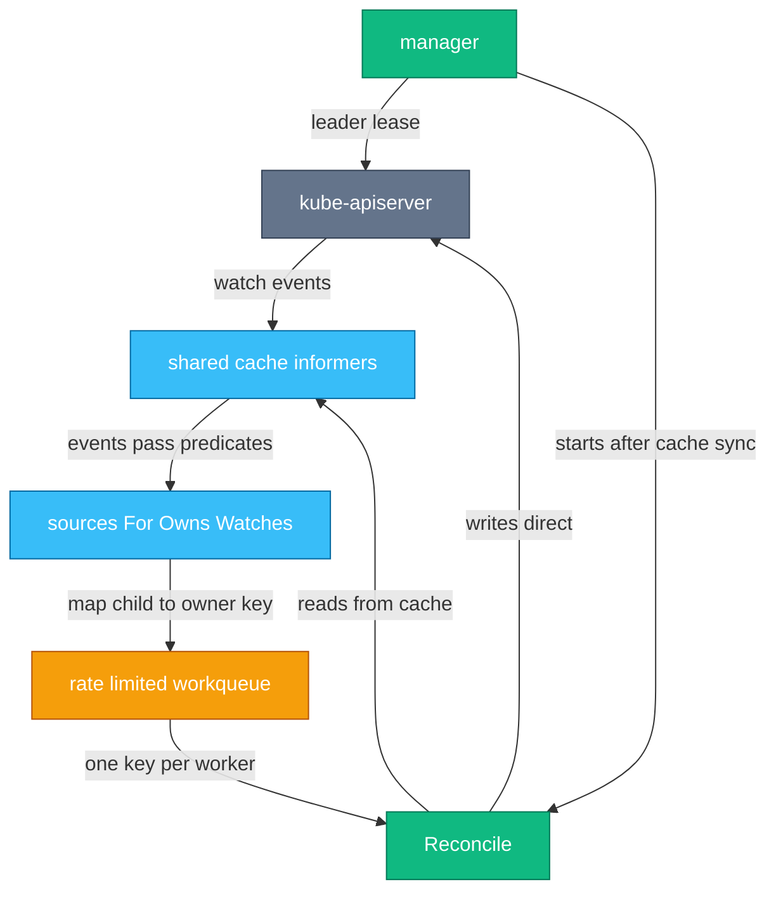
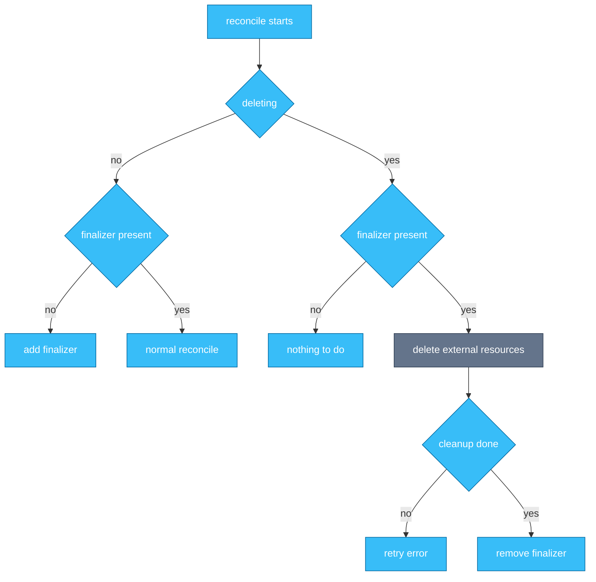
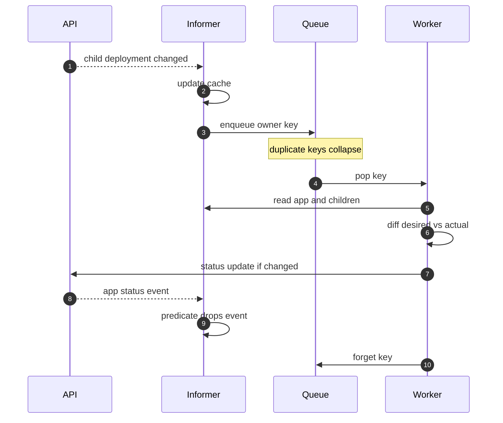
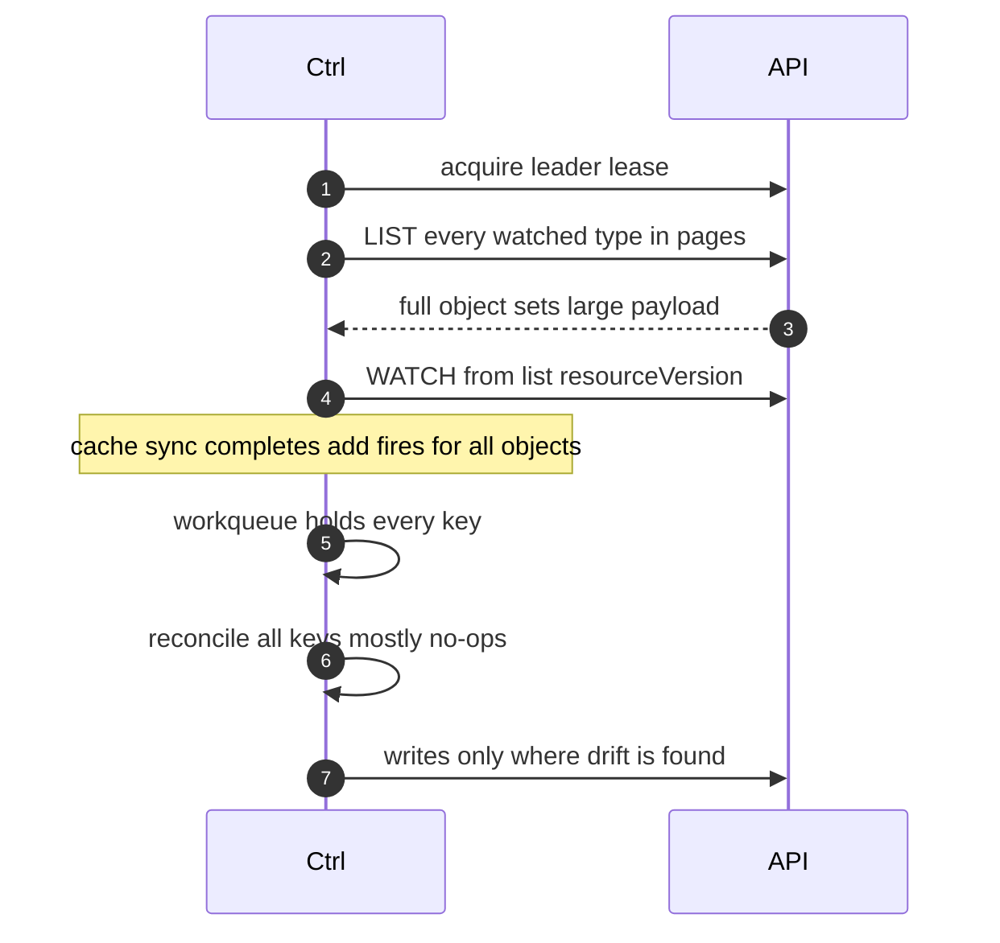
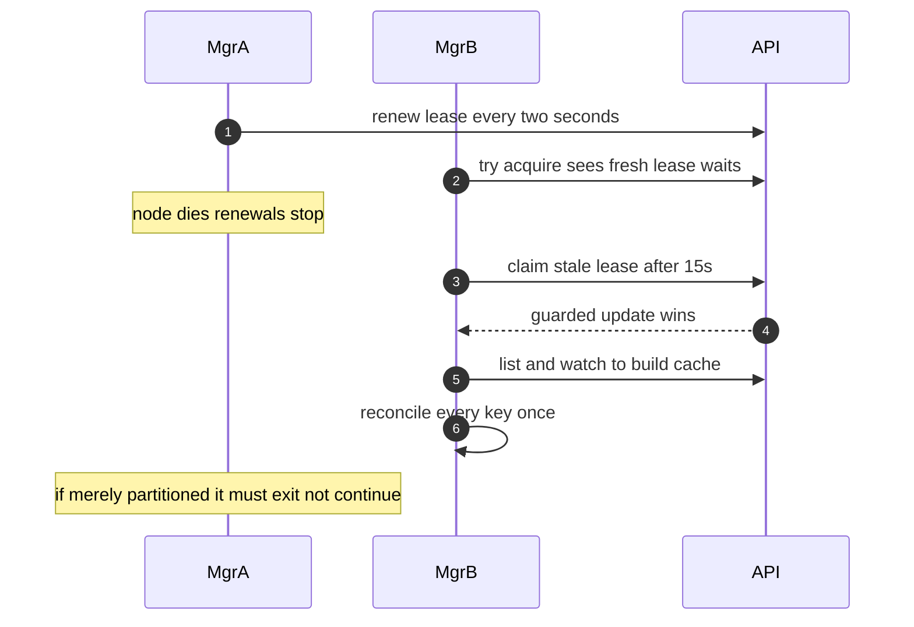

# Chapter 6 — Writing Controllers Well

## Why this chapter

For controller-heavy roles, this is the chapter interviews are decided on. Chapter 5 gave the machinery; here the question becomes "can you build one that survives production". The mental model: a reconcile is a function from (request key, cluster state) to (writes, requeue decision), and every practice below exists to keep it that way. The code-reading exercises at the end are the kind of snippet a staff interview puts in front of you.

## CRD design

**Spec/status split.** `.spec` is desired state, owned by users; `.status` is observed state, owned by the controller. Enable the status subresource: `/status` becomes a separate endpoint with separate RBAC, spec writes cannot touch status (and vice versa), and `metadata.generation` increments only on spec changes. That generation is your change detector.

**Conditions.** Use `metav1.Condition`: `Type` (CamelCase, positive polarity — `Available`, `Ready`), `Status` (True/False/Unknown), `Reason`, `Message`, `LastTransitionTime`, `ObservedGeneration`. Set them with `meta.SetStatusCondition`, which moves `LastTransitionTime` only on a real flip — hand-rolled code that stamps the time every reconcile is a classic hot-loop source (Flow 18). Publish `status.observedGeneration` so clients can tell "controller has seen my change" from "stale status".

**Versioning.** A CRD serves multiple versions but stores one (`storage: true`). Conversion runs through a conversion webhook; controller-runtime's pattern is hub-and-spoke — one Hub version, each spoke converts to and from it. Conversion must round-trip losslessly (annotations carry fields old versions cannot express). Before removing an old version, rewrite stored objects and clear it from `status.storedVersions`.

## controller-runtime architecture

The **manager** owns one shared **cache** (informers for every watched type), builds the default **client** (reads served from cache, writes sent to the API; `r.Status()` targets the status subresource), runs leader election, and starts controllers as runnables. The **builder** wires events to your reconciler:

```go
ctrl.NewControllerManagedBy(mgr).
    For(&appsv1alpha1.App{}).
    Owns(&appsv1.Deployment{}).
    Watches(&corev1.ConfigMap{},
        handler.EnqueueRequestsFromMapFunc(r.configMapToApps)).
    WithEventFilter(predicate.GenerationChangedPredicate{}).
    Complete(r)
```

- **For** — the primary type; its events enqueue its own key.
- **Owns** — a child type; events map to the owner's key via the `controller: true` ownerReference. Without `SetControllerReference` on the child, the mapping finds nothing and the owner is never requeued.
- **Watches** plus a map function handles the rest — e.g. one ConfigMap referenced by many CRs maps to many CR keys.
- **Predicates** filter events *before* enqueue. `GenerationChangedPredicate` drops status-only updates. Caveat: label and annotation changes do not bump generation either, so it drops those too.

The cache is the memory hog. Two levers: per-type label/field selectors (`cache.Options.ByObject`) to cache only what you manage, and metadata-only watches (`PartialObjectMetadata`) when you never read spec — the GC runs this way.



*Figure 6.1 — reads and writes take different paths: the reconciler reads its own cache but writes to the API server, which is why read-your-writes is not guaranteed.*

## Practices that keep controllers correct and cheap

**Idempotent, stateless reconciles.** Three forces replay your reconcile: dedup collapses N events into one run at an arbitrary time; restarts replay every object (Flow 19); errors requeue. A reconcile must be safe at any time, any number of times, and must not depend on reconciler-struct fields — that state dies with the pod and lies after failover.

**Write status, not spec.** Your controller owns its CR's status. Writing its own spec fights the user; if reconcile output looks like spec, the API is misfactored (defaulting belongs in a webhook or CEL defaults).

**Requeue strategy.** Return `err` → per-item exponential backoff (controller-runtime default 5ms doubling to a 1000s cap; the legacy default workqueue adds a global 10 qps / burst 100 bucket). The limiter gates only these requeues — watch-event enqueues bypass it entirely. Return `RequeueAfter: d` only for *time-based* recheck of state no watch covers — external systems, certificate expiry. Never requeue "just in case" after a write: the write itself produces the next event. Returning both an error and a result, the error wins.

**Finalizers done right.** Persist the finalizer *before* creating anything external; clean up on `deletionTimestamp`; remove the finalizer only after cleanup fully succeeds; on conflict, return the error and run again. Figure 6.2 is the skeleton — deviate and you leak resources or wedge deletions.



*Figure 6.2 — the finalizer state machine: persist the finalizer before side effects, remove it only after cleanup proves done.*

**Leader election.** Replicas run active-passive: the manager holds a coordination.k8s.io Lease (defaults 15s duration, 10s renew deadline, 2s retry). Only the leader runs controllers; on lost leadership the manager *exits* — Flow 20 shows why.

**The expectations pattern.** Your cache lags your own writes: create a pod, reconcile again before the watch event lands, and the cache still shows it missing — naive logic creates a duplicate. kube-controller-manager's ReplicaSet controller records in-memory *expectations* ("I created 3; don't act on this key until I observe 3"). Custom controllers usually get the same safety from deterministic child names plus treating `AlreadyExists` as success.

**Avoid self-triggering hot loops.** A status write is an update event on a watched type; if every reconcile writes status, every reconcile schedules the next. Guard three ways: DeepEqual the status you would write; filter with `GenerationChangedPredicate`; never stamp always-changing fields unconditionally. Flow 18 and Exercise 3 dissect this.

**Server-side apply from controllers.** Instead of get-modify-update, `Patch` with `client.Apply`, a stable `FieldOwner`, and an object containing *only the fields you own*. SSA (GA since v1.22) merges per-field ownership server-side, so your controller and users co-own an object without clobbering each other; controllers should use `client.ForceOwnership` for their own fields. Never apply a fully-populated cache read — you would claim every field.

## Flows

### Flow 18: What happens when one reconcile runs, end to end

A Deployment owned by your `App` CR becomes available; your controller reconciles once and goes quiet.

1. **API** persists the Deployment status change and emits a watch event.
2. **Ctrl** (reflector) receives it; the informer updates the shared cache, then fires handlers.
3. **Ctrl** (Owns handler) follows the Deployment's `controller: true` ownerReference to the App and enqueues `default/my-app`.
4. **Ctrl** (workqueue) dedupes: the key was already queued from an earlier event; the two collapse.
5. **Ctrl** (worker) pops the key and calls `Reconcile(ctx, req)` — one worker per key, always.
6. **Ctrl** (reconciler) `Get`s the App from cache. `IsNotFound` → object gone, GC owns the children, return cleanly.
7. **Ctrl** (reconciler) reads the Deployment via the cached client and diffs desired vs actual: nothing to change in the child.
8. **Ctrl** (reconciler) computes the status it *would* write — `Available=True`, `observedGeneration` = generation — and DeepEquals against live status. Different, so:
9. **Ctrl** (reconciler) calls `r.Status().Update(ctx, &app)`. A conflict (stale resourceVersion) is returned as an error — backoff reruns against fresher cache.
10. **API** persists; generation does not bump (status subresource). The App update event comes back, but `GenerationChangedPredicate` drops it — no re-enqueue.
    - Without the predicate, step 8 still saves you: the echo reconcile finds equal status, skips the write, and the loop dies in one lap instead of never.
11. **Ctrl** (worker) returns `ctrl.Result{}, nil`; the queue calls `Forget` (resets backoff) and `Done`. Silence until the next real change.



*Figure 6.3 — the loop terminates because the status write is conditional and its echo event is filtered; remove either guard and you rely on the other.*

**Where this can fail**

- **Symptom:** hand-editing the child Deployment does nothing. **Cause:** missing `SetControllerReference`, so Owns cannot map the event. **Where to look:** the child's `ownerReferences`.
- **Symptom:** constant "object has been modified" conflicts. **Cause:** writing from a stale cached object, or two writers racing; retry via requeue, never swallow. **Where to look:** controller logs, audit-log field managers.
- **Symptom:** label changes on the CR never reconcile. **Cause:** `GenerationChangedPredicate` drops them — labels do not bump generation. **Where to look:** predicate wiring; `predicate.Or` with a label predicate.
- **Symptom:** workqueue depth grows without bound. **Cause:** reconcile latency exceeds event rate — often an unindexed List per run. **Where to look:** `workqueue_depth`, `workqueue_queue_duration_seconds`.

### Flow 19: What happens when a controller pod restarts

Your operator's pod is rescheduled; it manages 20,000 CRs.

1. **Kubelet** starts the new pod; the manager campaigns for the leader lease (Flow 20) and wins.
2. **Ctrl** (cache) starts informers. Each reflector LISTs its full type — the CRs plus every cached child type — in pages, before watching.
   - The list storm: full payloads decoded into memory at once. Startup is the memory high-water mark; scoped caches shrink it, and server-side sharded list/watch (beta in v1.36) targets this load.
3. **API** serves the lists; **Ctrl** (reflector) opens WATCHes from the returned resourceVersions.
4. **Ctrl** (informer) reports `HasSynced`; the manager blocks workers until every cache syncs — reconciling a half-filled cache would look like mass deletion.
5. **Ctrl** (handlers) fire Add for *every* object; the workqueue now holds every key.
6. **Ctrl** (workers; raise `MaxConcurrentReconciles` from the default 1) drain the queue under the shared rate limiter.
7. **Ctrl** (reconciler) finds most objects already correct: read, diff, write nothing. This replay is why idempotency is non-negotiable — 20,000 reconciles must produce zero duplicate side effects.
8. **Ctrl** writes only where the world drifted while it was down; the level catches up and steady state resumes.



*Figure 6.4 — restart replays the whole world through your reconciler; the cost is bounded only by cache scope and reconcile idempotency.*

**Where this can fail**

- **Symptom:** OOMKilled in a startup crash loop. **Cause:** LIST decode spike exceeds the memory limit — often caching all Pods cluster-wide unfiltered. **Where to look:** startup memory profile; add selectors or metadata-only watches.
- **Symptom:** API server latency spikes when many controllers restart together. **Cause:** synchronized list storms. **Where to look:** apiserver metrics, APF queuing (Chapter 2); stagger restarts, scope caches.
- **Symptom:** duplicate external side effects after each restart. **Cause:** non-idempotent reconcile exposed by the Add replay. **Where to look:** Exercise 1 below; check-then-act on deterministic identity.
- **Symptom:** controller "does nothing" for minutes after start. **Cause:** normal queue drain — or `WaitForCacheSync` hung on one type (missing list/watch RBAC). **Where to look:** logs for "failed to list" errors, `workqueue_depth`.

### Flow 20: What happens when leader election hands over

Two replicas of an operator run; the leader's node dies.

1. **MgrA** (leader) renews the Lease's `renewTime` every 2s; `holderIdentity` is A, lease duration 15s.
2. **MgrB** retries acquisition every 2s, sees a fresh lease, waits — its controllers and informers are not running.
3. **MgrA**'s node dies. Renewals stop. Nothing reacts yet — the Lease is just data.
4. **MgrB** observes the lease age exceed 15s and updates `holderIdentity` to B. The update is resourceVersion-guarded (Flow 2): if two candidates race, exactly one wins.
5. **MgrB** starts leader-scoped runnables: informers list and watch (a Flow 19 cold start), caches sync, every key reconciles once. Failover latency ≈ lease expiry + cache sync + queue drain.
6. **MgrA**, if partitioned rather than dead, hits its 10s renew deadline and must stop leading; controller-runtime exits the process rather than racing in-flight work.
   - Fencing is cooperative: a leader paused mid-reconcile (VM freeze, GC pause) can wake and write *after* B took over. Only optimistic concurrency and idempotency block that write — leases prevent sustained dual leadership, not brief overlap.
7. **KCM** and **Kubelet** eventually restart A's pod; it returns as standby.
8. Events between A's last reconcile and B's first are "missed" harmlessly: B's cold-start replay reconciles every object anyway.



*Figure 6.5 — the lease is advisory: safety comes from the old leader exiting, resourceVersion guards, and idempotent reconciles — not from the lock itself.*

**Where this can fail**

- **Symptom:** no leader for minutes; nothing reconciles. **Cause:** candidates cannot update the Lease — missing RBAC on `leases`, or API server down. **Where to look:** manager logs, "error retrieving resource lock".
- **Symptom:** leadership flaps. **Cause:** API latency near the renew deadline, or a CPU-starved leader missing renewals. **Where to look:** apiserver latency metrics, leader pod throttling; widen durations.
- **Symptom:** brief double-writes during failover; resources momentarily reverted. **Cause:** the cooperative-fencing gap in step 6 — the old leader wrote from its stale pre-partition cache. **Where to look:** audit log for two field managers; harden writes (guarded updates, SSA field ownership) rather than tune the lease to zero.
- **Symptom:** slow failover on clean rollouts. **Cause:** old leader exits without releasing, so the new one waits out the full lease. **Where to look:** `LeaderElectionReleaseOnCancel` for instant handover.

## Code-reading exercises

The `Get` + `IgnoreNotFound` boilerplate is correct in all three snippets; the bugs are elsewhere.

### Exercise 1 — the eager creator

```go
func (r *AppReconciler) Reconcile(ctx context.Context, req ctrl.Request) (ctrl.Result, error) {
    var app appsv1alpha1.App
    if err := r.Get(ctx, req.NamespacedName, &app); err != nil {
        return ctrl.Result{}, client.IgnoreNotFound(err)
    }

    dep := appsv1.Deployment{
        ObjectMeta: metav1.ObjectMeta{
            GenerateName: app.Name + "-",
            Namespace:    app.Namespace,
        },
        Spec: r.desiredDeploymentSpec(&app),
    }
    if err := r.Create(ctx, &dep); err != nil {
        return ctrl.Result{}, err
    }

    app.Status.Phase = "Provisioning"
    if err := r.Status().Update(ctx, &app); err != nil {
        return ctrl.Result{}, err
    }
    return ctrl.Result{Requeue: true}, nil
}
```

**What's wrong?**

Three bugs. (1) `GenerateName` plus unconditional `Create` is non-idempotent: *every* reconcile mints a new Deployment with a fresh suffix. Dedup, resync, and restart replay (Flow 19) all rerun Reconcile — one restart of a 1,000-CR controller yields 1,000 extra Deployments, and counting. (2) No `controllerutil.SetControllerReference(&app, &dep, r.Scheme)`: children are never garbage-collected, and `Owns` cannot map their events back — the controller is blind to them. (3) The tail is a hot loop: status written unconditionally, then `Requeue: true` on success — and the status write's own echo event re-enqueues immediately anyway, so the controller spins forever.

**Fix.** Deterministic name (`app.Name`), then get-or-create: on `IsNotFound`, set the controller reference and `Create`, treating `AlreadyExists` as success (the cache may lag your own write — the expectations problem); otherwise diff and update. Write status only on change; return `ctrl.Result{}, nil` — the create's watch event drives the next reconcile.

### Exercise 2 — the finalizer that never lets go

```go
const cleanupFinalizer = "apps.example.com/cleanup"

func (r *AppReconciler) Reconcile(ctx context.Context, req ctrl.Request) (ctrl.Result, error) {
    var app appsv1alpha1.App
    if err := r.Get(ctx, req.NamespacedName, &app); err != nil {
        return ctrl.Result{}, client.IgnoreNotFound(err)
    }

    if !app.DeletionTimestamp.IsZero() {
        if controllerutil.ContainsFinalizer(&app, cleanupFinalizer) {
            if err := r.deleteExternalDatabase(ctx, &app); err != nil {
                return ctrl.Result{}, err
            }
        }
        return ctrl.Result{}, nil
    }

    if err := r.provisionExternalDatabase(ctx, &app); err != nil {
        return ctrl.Result{}, err
    }
    if !controllerutil.ContainsFinalizer(&app, cleanupFinalizer) {
        controllerutil.AddFinalizer(&app, cleanupFinalizer)
        if err := r.Update(ctx, &app); err != nil {
            return ctrl.Result{}, err
        }
    }

    app.Status.Ready = true
    if err := r.Status().Update(ctx, &app); err != nil {
        if apierrors.IsConflict(err) {
            return ctrl.Result{}, nil
        }
        return ctrl.Result{}, err
    }
    return ctrl.Result{}, nil
}
```

**What's wrong?**

Three bugs. (1) The deletion branch cleans up but never calls `controllerutil.RemoveFinalizer` + `Update` — the App stays `Terminating` forever, and namespace deletion wedges behind it (compare Figure 6.2). (2) Ordering: the database is provisioned *before* the finalizer is persisted. Crash between the two, then delete the object, and the database leaks with no cleanup hook. (3) The status conflict is swallowed with a clean return. Conflict means "your copy is stale"; dropping it silently loses the write with no requeue, so status stays wrong until some unrelated event. In production: "the controller randomly forgets to mark things Ready".

**Fix.** In the deletion branch, after cleanup succeeds: `RemoveFinalizer`, then `r.Update`, returning any error. Persist the finalizer *before* provisioning. Return conflicts like any other error — backoff reruns against a fresher read (Flow 2).

### Exercise 3 — the requeue storm

```go
func (r *AppReconciler) Reconcile(ctx context.Context, req ctrl.Request) (ctrl.Result, error) {
    var app appsv1alpha1.App
    if err := r.Get(ctx, req.NamespacedName, &app); err != nil {
        return ctrl.Result{}, client.IgnoreNotFound(err)
    }

    var dep appsv1.Deployment
    if err := r.Get(ctx, req.NamespacedName, &dep); err != nil {
        if apierrors.IsNotFound(err) {
            return ctrl.Result{Requeue: true}, r.createDeployment(ctx, &app)
        }
        return ctrl.Result{}, err
    }

    app.Status.ReadyReplicas = dep.Status.ReadyReplicas
    app.Status.LastSyncTime = metav1.Now()
    if err := r.Status().Update(ctx, &app); err != nil {
        return ctrl.Result{}, err
    }
    return ctrl.Result{RequeueAfter: time.Second}, nil
}
```

**What's wrong?**

Two compounding bugs and a smell. (1) `LastSyncTime = metav1.Now()` makes status differ on every run, so the update always writes — and that write is an event on the watched App, which enqueues the next reconcile: a self-triggering hot loop. (2) `RequeueAfter: time.Second` polls on top, and successful runs call `Forget`, so per-item backoff never engages — and the event-driven enqueues never touch the rate limiter at all, so the loop runs at write→event→reconcile round-trip speed. Multiply by every App: pinned CPU, a stream of no-op status PATCHes, etcd and watch-fan-out churn. (3) The smell: `Requeue: true` after `createDeployment` (deprecated in current controller-runtime — return an error or use `RequeueAfter`) — with `Owns` wired, the create's watch event already triggers the next run; and if the create errored, the error supersedes the result.

**Fix.** Drop `LastSyncTime` (or update it only on real transitions, per the `LastTransitionTime` convention). DeepEqual desired status against current; skip equal writes. Delete both requeue directives: watches cover everything here — nothing in this function qualifies for `RequeueAfter`.

## Questions

### Tier 1 — Explain

**Q 6.1 — Why split spec and status, and what does the status subresource change mechanically?**

**Answer.** Different writers: spec belongs to users, status to the controller. With the subresource enabled, `/status` is a separate endpoint — a normal update cannot change status and vice versa, RBAC splits, and `metadata.generation` bumps only on spec changes. That last point is load-bearing: controllers publish `status.observedGeneration` so clients can check whether the latest spec was processed, and predicates use generation to ignore status echo events.

*Strong answers also mention:* spec and status writes cannot clobber each other's fields — but the object still has one resourceVersion, so a stale write conflicts either way.

**Q 6.2 — What does the controller-runtime manager give you over raw client-go?**

**Answer.** One shared cache for all controllers in the process; a client that reads from that cache and writes to the API; the builder's event wiring (`For`/`Owns`/`Watches`, predicates); workqueues with default rate limiting; leader election; and lifecycle — cache-sync gating, health probes, graceful shutdown. With raw client-go you assemble Figure 5.1 by hand; controller-runtime packages it and leaves you the Reconcile function.

*Strong answers also mention:* the cached read path means read-your-writes is not guaranteed — the root of the expectations problem.

**Q 6.3 — How does `Owns` deliver a child's event to the parent's reconciler?**

**Answer.** `Owns` registers an informer on the child type with a handler that reads each event's object, finds the `controller: true` ownerReference, checks its GroupKind matches the `For` type, and enqueues the owner's namespace/name. The reconciler never sees the child event — it gets its own key and re-reads everything. So a missing `SetControllerReference` silently breaks drift correction, and a Request says *which* object, never *what happened*.

*Strong answers also mention:* `Owns` is just a prebuilt `Watches` + map-through-ownerReference.

### Tier 2 — Reason

**Q 6.4 — When is `RequeueAfter` correct, and when is it a smell?**

**Answer.** Correct when the awaited state emits no watch event: external databases, certificate expiry, rate-limited third-party APIs. Smell when it polls Kubernetes objects you could watch — recheck-my-own-Deployment loops mean missing `Owns`/`Watches` wiring. Also a smell right after your own successful write: the write generates the event. Chronic requeues multiply by object count — 10,000 CRs on a 30s requeue is 333 reconciles/s of noise.

*Strong answers also mention:* errors get exponential backoff and show in metrics; `RequeueAfter` is flat and silent, so it can mask persistent failures.

**Q 6.5 — Why must reconciles be idempotent? Name the mechanisms that replay them.**

**Answer.** The system's own machinery re-runs reconciles routinely. (1) Workqueue dedup: N events become one run — or N runs of identical state. (2) Resync: the informer periodically replays its whole store. (3) Restart and failover: cold start fires Add for every object (Flow 19); leader handover replays the world on the new leader (Flow 20). (4) Error backoff reruns half-finished work from the top. Any non-idempotent step — unconditional create, external call without an idempotency key — turns these routine mechanisms into incidents.

*Strong answers also mention:* idempotency is the fencing backstop — briefly-overlapping leaders must converge on the same state.

**Q 6.6 — Why prefer server-side apply over get-modify-update in a controller?**

**Answer.** Get-modify-update sends the whole object: writers clobber each other's fields and conflict on resourceVersion even for disjoint changes. With SSA the controller submits only the fields it owns under a stable field manager; the server merges per-field, tracks ownership in `managedFields`, and only true co-ownership of one field conflicts — resolved by controllers forcing ownership of their own fields. A controller can manage one annotation on user-owned objects without ever overwriting the rest.

*Strong answers also mention:* SSA prunes fields you stop applying if you were their sole owner — removal semantics get-modify-update routinely botches.

### Tier 3 — Design & Debug

**Q 6.7 — A controller pins a CPU core; the audit log shows it PATCHing the same objects' status several times a second with no user activity. Diagnose and fix.**

**Answer.** The self-triggering hot loop. Confirm: status-only PATCHes whose bodies differ trivially — a timestamp, reordered conditions. Mechanism: unconditional status write → update event on the watched type → enqueue → write again; success clears backoff each lap, and event enqueues skip the rate limiter, so nothing throttles it but reconcile latency. Find the always-changing field: a hand-set `LastTransitionTime`, a "lastChecked" stamp, or non-deterministic serialization defeating DeepEqual. Fix in layers: deterministic status, DeepEqual before writing, `GenerationChangedPredicate`, `meta.SetStatusCondition` so transition times move only on real flips.

*Strong answers also mention:* the wider blast radius — etcd write amplification, watch fan-out to every consumer of the type — and near-zero `workqueue_depth` as the tell that the controller chases its tail, not a backlog.

**Q 6.8 — Design a controller for a `Tenant` CR where one shared ConfigMap change must re-evaluate all 10,000 Tenants — without melting anything.**

**Answer.** Wire `Watches(&corev1.ConfigMap{}, handler.EnqueueRequestsFromMapFunc(...))` with a predicate narrowed to that one object; the map function lists Tenants *from the cache* and returns all 10,000 keys. The flood is fine: dedup collapses repeats, and the queue drains at workers ÷ per-reconcile latency — size `MaxConcurrentReconciles` for your convergence target (10,000 keys at 50/s ≈ 3–4 minutes). Keep reconciles cheap and idempotent so the replay is mostly no-ops. Scope the ConfigMap cache with a field selector to the single name.

*Strong answers also mention:* the map function must not hit the API server (10,000 cache reads are free; 10,000 GETs are an outage), and ConfigMap edit storms collapse via dedup.

## Common mistakes & red flags

- **State in the reconciler struct.** `r.provisioned[name] = true` dies on restart and lies after failover. State lives in the API or is re-derived each run.
- **`Requeue: true` after every successful write.** The write's own event triggers the next reconcile; blanket requeues signal distrust of the machinery.
- **Unconditional status writes.** Identical status still burns an API call and, unfiltered, feeds a hot loop. Compare first; write on change.
- **Adding the finalizer during deletion.** Once `deletionTimestamp` is set, the API server rejects new finalizers. Persist it before the first side effect.
- **Bypassing the cache with direct API reads "for freshness".** Wholesale direct GETs defeat the informer design. Handle staleness with conflict retries and expectations.
- **Removing the finalizer before cleanup is confirmed.** The reverse order leaks external resources on any crash between the two.
- **Treating leader election as mutual exclusion.** It is single-writer *intent*, cooperatively enforced. Overlap happens; correctness comes from idempotency and guarded writes.
- **Conversion webhooks that drop fields.** Round-trips through old versions must be lossless, or mixed-version readers fight; stash unrepresentable fields in annotations.
