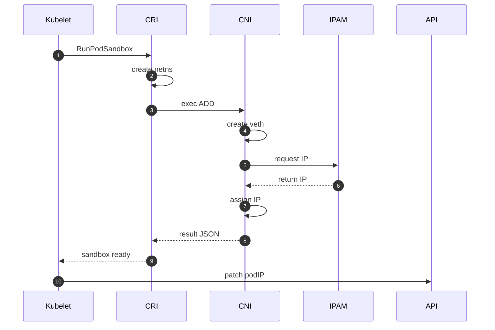
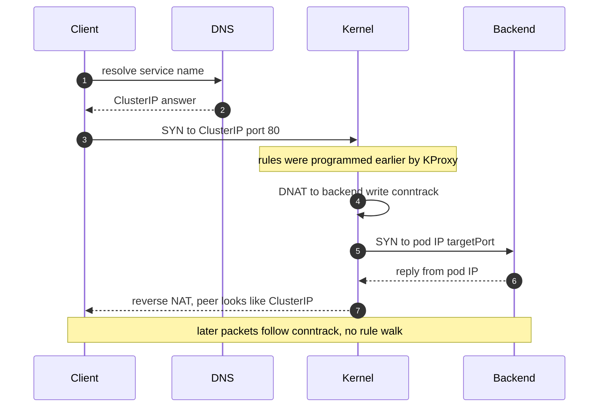
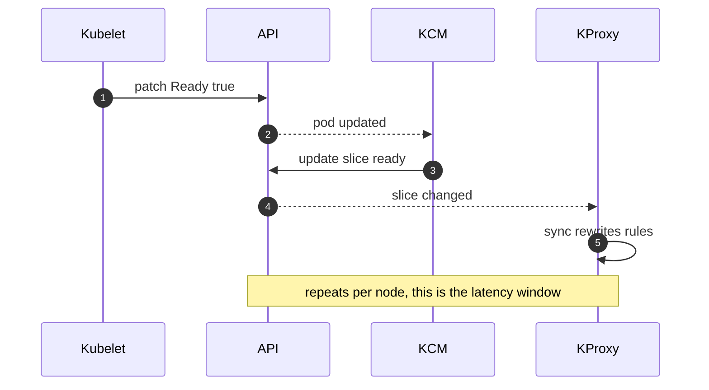

# Chapter 7 — Networking & CNI

## Why this chapter

Interviewers use networking to test whether you know what actually moves packets. Kubernetes itself moves none: it defines interfaces and desired state; the CNI plugin and the node kernel do the work. The mental model: every pod has a real, routable IP, and a Service is not a proxy process — it is a set of NAT rules in the kernel. Candidates who say "kube-proxy forwards the traffic" or "kubelet sets up the network" fail here. This chapter zooms into the networking segments of Flow 8 (Chapter 4).

## Concepts

### CNI is a binary contract, not a daemon API

The Container Network Interface (CNI) is a specification for command-line executables. The container runtime (containerd or CRI-O) — not the kubelet — execs a plugin binary when a pod sandbox is created or deleted. The contract: commands `ADD`, `DEL`, `CHECK`, `VERSION` in the `CNI_COMMAND` environment variable, network config JSON on stdin, result JSON (IPs, routes, interfaces) on stdout.

Config lives in `/etc/cni/net.d/` (the runtime picks the lexicographically first file); binaries in `/opt/cni/bin/`. A `.conflist` defines a **chain**: the main plugin (`bridge`, `calico`, `cilium-cni`) runs first; later plugins (`bandwidth`, `portmap`) receive its result and augment it. Address assignment is delegated to an **IPAM plugin** (`host-local` allocates from the node's pod CIDR; Calico and Cilium bring their own).

So what are the Calico or Cilium DaemonSets? They install the binaries and config, and run the agent that programs the dataplane — BGP routes and iptables for Calico's Felix, eBPF for Cilium. The CNI binary is often a thin shim that asks the local agent to do the work.

### Pod networking models: overlay vs routed

Kubernetes requires every pod IP to be reachable from every other pod without NAT. Two implementation families:

| | Overlay | Routed (native) |
|---|---|---|
| Mechanism | Encapsulate pod traffic (VXLAN/Geneve) between nodes | Pod CIDRs are real routes in the network |
| Examples | Flannel VXLAN, Calico VXLAN/IPIP, Cilium VXLAN | Calico BGP, cloud route tables, AWS VPC CNI |
| Pros | Works on any underlying network | No encap overhead; pods visible to the network |
| Cons | Encap CPU cost; MTU shrinkage; harder to debug | Needs a cooperative network (BGP, route limits) |

### Services under the hood: kube-proxy and conntrack

A ClusterIP is a virtual IP: no interface owns it and it usually does not answer pings. It exists only as packet-rewrite rules that kube-proxy programs into each node's kernel. kube-proxy watches Services and EndpointSlices and syncs the rules; it is never on the data path.

Three modes:

- **iptables** (default) — linear rule chains, backend chosen by random-probability match; slows down at thousands of services.
- **IPVS** — in-kernel L4 balancer with hash-table lookup and real scheduling algorithms; better at scale.
- **nftables** — GA since v1.33, incremental updates and faster evaluation, the performance-oriented successor but **not the default**.

Cilium can replace kube-proxy entirely with eBPF.

**conntrack** is the piece candidates forget. DNAT is decided only on a connection's first packet; the kernel's connection-tracking table pins all later packets and replies to that backend. Consequences: long-lived connections never rebalance, and stale UDP entries can black-hole DNS after backend churn.

### EndpointSlices

The EndpointSlice controller (in kube-controller-manager) writes EndpointSlice objects — up to 100 endpoints per slice by default. Slices replaced the monolithic Endpoints object (deprecated ~v1.33) because one giant object was rewritten in full on every pod change and fanned out to every node — O(nodes × endpoints) write amplification. Slices also carry `ready`/`serving`/`terminating` conditions and topology hints.

### DNS: CoreDNS, search paths, ndots

CoreDNS runs as a Deployment behind the `kube-dns` ClusterIP, answering from its informer cache (`my-svc.my-ns.svc.cluster.local` → ClusterIP; headless Services return pod IPs). The kubelet writes each pod's `/etc/resolv.conf` with cluster search domains and `ndots:5`: any name with fewer than five dots is tried against every search domain first, so `api.example.com` triggers several failing cluster lookups before the real query. Fixes: trailing-dot FQDNs, lower `ndots`, or NodeLocal DNSCache.

### Ingress vs Gateway API

Ingress is HTTP-only, frozen (not removed), and forced vendors into annotation sprawl. Gateway API is the successor: role-separated resources (`GatewayClass`, `Gateway`, `HTTPRoute`) with expressive, typed routing. Gateway API v1.5 (2026) moved `TCPRoute` and `UDPRoute` to the Standard channel. Both are just desired state: a controller watches the objects and programs a real proxy.

### NetworkPolicy: who enforces it

The API is in-tree; enforcement is not. The **CNI plugin** enforces it (Calico via iptables/eBPF, Cilium via eBPF). kube-proxy cannot: it only rewrites Service destinations, while NetworkPolicy filters pod-to-pod traffic by label identity, enforced on pod interfaces after DNAT has resolved real pod IPs. With a CNI that lacks policy support, policy objects are stored and silently do nothing — a favorite interview trap.

## Flows

### Flow 21: What happens when a pod gets its network (CNI ADD)

Kubelet asks the runtime to create a sandbox for a scheduled pod (Flow 8, sandbox step).

1. **Kubelet** calls `RunPodSandbox` on the container runtime over CRI.
2. **CRI** (containerd/CRI-O) creates the pause container and a fresh network namespace.
3. **CRI** loads the first config file from `/etc/cni/net.d/` and locates binaries in `/opt/cni/bin/`.
4. **CRI** execs the main plugin with `CNI_COMMAND=ADD`, `CNI_NETNS=<netns path>`, `CNI_CONTAINERID`, config on stdin.
5. **CNI** (main plugin) creates a veth pair, moves one end into the pod netns as `eth0`, and wires the host end to a bridge or as a bare host interface.
   - Calico uses no bridge: a host-side veth plus a per-pod host route; Felix and BGP distribute reachability.
6. **CNI** calls its IPAM plugin, which allocates an IP and returns IP, gateway, and routes.
   - Cilium's binary is a thin client: cilium-agent allocates the IP and attaches eBPF programs to the veth instead of using iptables.
7. **CNI** assigns the IP to `eth0` and installs the default route inside the netns.
8. **CRI** invokes each chained plugin (`bandwidth`, `portmap`), passing the accumulated result.
9. **CNI** (last plugin) prints the final result JSON; the runtime records the pod IP.
10. **Kubelet** reads the IP via `PodSandboxStatus` and patches `pod.status.podIP`; containers created next join this netns.

*Figure 7.1 — the runtime, not the kubelet, execs the CNI binary; IP assignment is a delegated IPAM step.*

**Where this can fail**

- **Symptom:** pods stuck `ContainerCreating`, "failed to find plugin".
    - **Cause:** CNI binaries/config not installed (network DaemonSet absent on the node).
    - **Where to look:** `/opt/cni/bin`, `/etc/cni/net.d`, the CNI pod on that node.
- **Symptom:** node `NotReady`, "network plugin not ready".
    - **Cause:** runtime reports no CNI config to the kubelet.
    - **Where to look:** kubelet and runtime logs.
- **Symptom:** "no IP addresses available in range".
    - **Cause:** IPAM exhaustion — pod CIDR too small, or IPs leaked because `DEL` never ran after crashes.
    - **Where to look:** `/var/lib/cni/networks/` (host-local) or the plugin's IPAM store.
- **Symptom:** pod has an IP but no connectivity.
    - **Cause:** ADD succeeded but the dataplane agent is down, so routes/eBPF were never programmed.
    - **Where to look:** Felix / cilium-agent health on the node.

### Flow 22: What happens when a pod sends a request to a ClusterIP Service

A client pod calls `http://my-svc.prod:80`; the Service has ClusterIP `10.96.0.17` and two backends.

1. **Client** resolves `my-svc.prod`: `resolv.conf` points at the `kube-dns` ClusterIP; `ndots:5` expands the name through search domains until `my-svc.prod.svc.cluster.local` matches.
2. **CoreDNS** answers `10.96.0.17` from its informer cache (the DNS query itself already traversed a Service DNAT).
3. **Client** opens TCP to `10.96.0.17:80`; the packet enters the node kernel via the veth.
4. **Kernel** netfilter matches kube-proxy's rules: in iptables mode, `KUBE-SERVICES` → per-service `KUBE-SVC-*` chain.
5. **Kernel** picks one backend — random-probability rule (iptables) or IPVS scheduler — and DNATs to `podIP:targetPort`.
6. **Kernel** writes a conntrack entry; later packets are rewritten by conntrack without walking rules again.
7. **Kernel** forwards to the backend node per the CNI dataplane — encapsulated or natively routed.
8. **Backend** pod accepts on `targetPort`, seeing the real client pod IP as source (no SNAT in-cluster).
9. **Kernel** reverse-translates replies via conntrack, so the client sees the ClusterIP as peer.
10. **Kernel** treats NodePort the same after entry: `nodeIP:nodePort` matches, then the same DNAT — but under the default `externalTrafficPolicy: Cluster` the client IP is lost to SNAT; `Local` preserves it and uses only local backends. A LoadBalancer is a cloud LB (created via the cloud controller manager) in front of NodePorts.

*Figure 7.2 — kube-proxy appears nowhere on the data path; the kernel DNATs once, conntrack does the rest.*

**Where this can fail**

- **Symptom:** instant "connection refused".
    - **Cause:** zero ready endpoints — kube-proxy installs a REJECT rule.
    - **Where to look:** EndpointSlices for the Service; pod readiness.
- **Symptom:** intermittent 5-second DNS stalls.
    - **Cause:** conntrack race on parallel UDP A/AAAA queries.
    - **Where to look:** conntrack `insert_failed`; mitigate with NodeLocal DNSCache.
- **Symptom:** hangs after a backend was deleted.
    - **Cause:** stale conntrack entries (mainly UDP) pointing at the dead IP.
    - **Where to look:** `conntrack -L` on the node.
- **Symptom:** external traffic dropped with `externalTrafficPolicy: Local`.
    - **Cause:** LB sends to nodes without local backends; health-check port misconfigured.
    - **Where to look:** `healthCheckNodePort`, backend spread.
- **Symptom:** node-wide random drops under load.
    - **Cause:** conntrack table full.
    - **Where to look:** kernel log ("nf_conntrack: table full"), `nf_conntrack_max`.

### Flow 23: What happens when a pod becomes Ready (endpoint propagation)

A rolling update starts a new pod; its readiness probe begins to pass.

1. **Kubelet** observes the passing probe and PATCHes pod status: condition `Ready=True`.
2. **API** persists the update and fans out watch events.
3. **KCM** (EndpointSlice controller) matches the pod to the Service selector and updates a slice, marking the endpoint `ready: true`.
4. **API** fans the slice update out to every kube-proxy — and to CoreDNS (headless Services) and Gateway/ingress controllers.
5. **KProxy** on each node receives the event and, on its next sync, rewrites the kernel rules.
6. **Kernel** now includes the new backend for *new* connections; existing ones stay pinned by conntrack (Flow 22).
   - The end-to-end window is a sum: probe period + kubelet PATCH + controller processing + watch fan-out + per-node sync. Usually under a second; seconds on large clusters — and it completes at different times on different nodes.
7. **Kubelet** and **KCM** race in reverse during scale-down: SIGTERM (kubelet) proceeds *in parallel with* endpoint removal (KCM → every kube-proxy), so traffic keeps arriving after SIGTERM until the slowest node syncs.
   - This is why apps must keep serving briefly after SIGTERM, or use a `preStop` sleep — see Flow 9 (Chapter 4).

*Figure 7.3 — readiness travels four hops before traffic shifts; the reverse race explains rollout 502s.*

**Where this can fail**

- **Symptom:** 502s/resets on every rollout.
    - **Cause:** app exits immediately on SIGTERM while endpoints still propagate.
    - **Where to look:** signal handling, `preStop` hook, grace period.
- **Symptom:** new pod errors under warm-up traffic.
    - **Cause:** readiness probe passes before the app is truly ready.
    - **Where to look:** probe definition; consider a startup probe.
- **Symptom:** traffic shifts seconds late on some nodes.
    - **Cause:** slow kube-proxy syncs (huge iptables rulesets).
    - **Where to look:** `sync_proxy_rules_duration_seconds`; consider IPVS/nftables.
- **Symptom:** Service never gets endpoints.
    - **Cause:** selector mismatch, or pods `Running` but never `Ready`.
    - **Where to look:** labels, probe events.

## Questions

### Tier 1 — Explain

**Q 7.1 — What is CNI, and which component invokes it?**

**Answer.** CNI is a specification for executables, not a daemon API. The container runtime (containerd/CRI-O) execs the plugin with `ADD`/`DEL`/`CHECK` during sandbox create/delete — config JSON on stdin, result on stdout. Config comes from `/etc/cni/net.d`, binaries from `/opt/cni/bin`. Plugins chain; IP assignment is delegated to an IPAM plugin. The kubelet triggers this only indirectly, via CRI `RunPodSandbox`.

*Strong answers also mention:* Calico/Cilium DaemonSets install the binaries and program the dataplane; the binary is often a shim to the local agent.

**Q 7.2 — What is a ClusterIP, really?**

**Answer.** A virtual IP that exists only as rewrite state in each node's kernel. No interface holds it, nothing listens on it, and it typically doesn't answer pings. kube-proxy watches Services and EndpointSlices and programs DNAT rules; the kernel picks a backend on a connection's first packet and conntrack pins the rest. kube-proxy is a control-plane-to-kernel translator, never a data-path hop.

*Strong answers also mention:* zero ready endpoints yields a REJECT rule — so "connection refused" vs "timeout" point to different failures.

**Q 7.3 — Who enforces NetworkPolicy, and why not kube-proxy?**

**Answer.** The CNI plugin — Calico via Felix (iptables/eBPF), Cilium via eBPF. kube-proxy can't: it only programs Service DNAT, while NetworkPolicy filters pod-to-pod traffic by label identity, including traffic that never touches a Service. Enforcement happens on pod interfaces, after DNAT has resolved real pod IPs. With a CNI lacking policy support, the objects are stored and silently ignored.

*Strong answers also mention:* policies are additive allow-lists; selecting a pod in a direction implies default-deny for that direction.

### Tier 2 — Reason

**Q 7.4 — Why did EndpointSlices replace Endpoints?**

**Answer.** Endpoints was one object per Service holding every backend. Each pod change rewrote the whole object and pushed it to every watching node — O(nodes × endpoints) amplification, with etcd's object-size cap limiting big Services. EndpointSlices shard endpoints into ~100-endpoint chunks, so an update touches one small object. Endpoints is deprecated (~v1.33); kube-proxy consumes slices.

*Strong answers also mention:* slices carry `terminating`/`serving` conditions and topology hints, enabling graceful drain and topology-aware routing.

**Q 7.5 — iptables vs IPVS vs nftables mode: when does the choice matter?**

**Answer.** All three only change how rules are represented; the data path stays in-kernel.

- iptables (default) evaluates chains linearly and rewrites large blocks on change — fine to a few thousand services, then sync time and latency degrade.
- IPVS uses hash tables with O(1) lookup and real balancing algorithms.
- nftables (GA v1.33) brings incremental updates and faster evaluation — the successor, but not yet default.

Below a few thousand services the difference is mostly negligible.

*Strong answers also mention:* eBPF replacements (Cilium) drop kube-proxy entirely; sync speed also shrinks the endpoint-propagation window (Flow 23).

**Q 7.6 — Why can traffic still hit a pod after it was told to terminate?**

**Answer.** Because endpoint removal is propagation, not a barrier — the deletion ordering itself is Flow 9. The EndpointSlice controller updates the slice, then every kube-proxy independently reprograms its own node on its own sync; until the slowest node catches up, connections still arrive at a pod that already got SIGTERM. Kubernetes has no "drained, now stop" handshake — the grace period is the contract, so apps must keep serving after SIGTERM or buy time with a `preStop` sleep.

*Strong answers also mention:* conntrack keeps established connections pinned regardless; Flow 9 gives the full deletion ordering.

### Tier 3 — Design & Debug

**Q 7.7 — Symptom: after scaling a Deployment down, ~1 in 10 requests to its Service time out for about a minute. Diagnose.**

**Answer.** The ratio suggests one dead backend of ten still receiving traffic. Check in order:

1. EndpointSlices — does the dead pod linger `ready`? Then it's controller/readiness lag.
2. Per-node rules — a kube-proxy not synced; check `sync_proxy_rules_*` metrics per node.
3. conntrack — entries pinned to the dead IP.

Timeouts rather than refusals mean packets go to an IP that no longer answers — typical of stale rules or conntrack. A minute-long window points at slow iptables full syncs; mitigate with nftables/IPVS and graceful termination handling.

*Strong answers also mention:* long-lived connections never rebalance by design; clients need retry with re-connection.

**Q 7.8 — Symptom: in-cluster calls to an external API intermittently take 5+ extra seconds — but only from pods, not nodes. Diagnose.**

**Answer.** "Only from pods" implicates pod DNS config. Two culprits compound: (1) `ndots:5` — the name expands through cluster search domains, producing serial NXDOMAIN round-trips through CoreDNS first; (2) the conntrack race — parallel A/AAAA UDP queries on one socket, a kernel insert race drops one, and the resolver waits 5 seconds. Confirm by timing the lookup with a trailing-dot FQDN inside a pod, and by checking conntrack `insert_failed`. Fixes: FQDN or lower ndots; NodeLocal DNSCache. Nodes are immune because their resolv.conf has no cluster search domains.

*Strong answers also mention:* NodeLocal DNSCache also upgrades the upstream path to TCP, removing the UDP race class entirely.

## Common mistakes & red flags

- **"kube-proxy proxies the packets."** In all three kernel modes it only programs rules; the kernel forwards. (Only the long-dead userspace mode proxied.)
- **"The kubelet calls CNI."** The container runtime does, during `RunPodSandbox`.
- **"NetworkPolicy is enforced by kube-proxy or the API server."** The CNI plugin enforces it; an incapable CNI ignores policies silently.
- **"CNI is a gRPC daemon API like CSI."** It's an exec'd binary contract with stdin/stdout JSON — a deliberate contrast worth stating.
- **"Ingress is deprecated and being removed."** Frozen, not removed; Gateway API is the successor (v1.5 moved TCPRoute/UDPRoute to Standard).
- **"Removing a pod from a Service instantly stops its traffic."** Propagation is eventually consistent per node, and conntrack pins existing connections (Flows 21–22).
