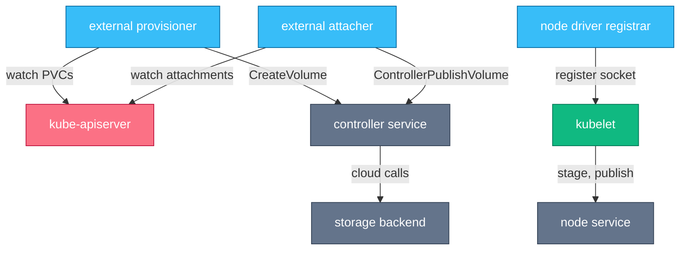
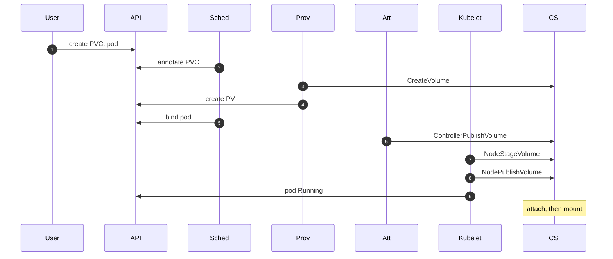
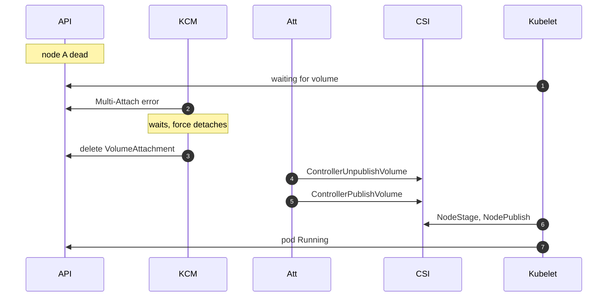

# Chapter 8 — Storage & CSI

## Why this chapter

Storage interviews probe whether you can name who does what: five sidecars, two plugin halves, and three control loops — the PV controller, the attach-detach controller, and the scheduler's volume-binding plugin — turn a PVC into a mounted filesystem. The mental model: CSI is a gRPC contract split into cluster-scoped operations (create, attach) and node-scoped operations (stage, publish), with sidecars translating API objects into gRPC so the driver never needs to know Kubernetes. This chapter zooms into the volume segment of Flow 8 (Chapter 4).

## Concepts

### Why CSI exists

Early volume drivers were "in-tree": vendor code compiled into Kubernetes itself. A driver bug meant patching Kubernetes; a new feature waited for a Kubernetes release. CSI (Container Storage Interface) moved drivers out-of-tree behind a versioned gRPC contract, shared with other orchestrators. In-tree cloud drivers have been migrated to CSI equivalents.

### Architecture: two halves plus sidecars

A CSI driver implements three gRPC services:

- **Identity** — `GetPluginInfo`, `Probe`, capabilities. Served by both halves.
- **Controller** — cluster-scoped calls against the storage backend: `CreateVolume`/`DeleteVolume`, `ControllerPublishVolume`/`ControllerUnpublishVolume` (attach/detach), `ControllerExpandVolume`, `CreateSnapshot`.
- **Node** — node-local calls: `NodeStageVolume` (format and mount the device once per node, to a staging path), `NodePublishVolume` (bind-mount the staged volume into a specific pod's directory), and their inverses.

The **controller plugin** (a Deployment/StatefulSet, runs anywhere) serves Identity+Controller. The **node plugin** (a DaemonSet on every node) serves Identity+Node and talks to kubelet over a Unix socket.

The driver never watches the Kubernetes API. **Sidecar containers**, maintained by the community and deployed next to the driver, do that translation:

| Sidecar | Watches | Calls on the driver |
|---|---|---|
| external-provisioner | PVCs needing a volume | `CreateVolume` / `DeleteVolume` |
| external-attacher | VolumeAttachment objects | `ControllerPublishVolume` / `Unpublish` |
| external-resizer | PVC size increases | `ControllerExpandVolume` |
| external-snapshotter | VolumeSnapshot objects | `CreateSnapshot` / `DeleteSnapshot` |
| node-driver-registrar | — | registers the node plugin's socket with the kubelet |

*Figure 8.1 — sidecars watch the API and translate to gRPC; kubelet calls the node plugin directly.*

### Binding, modes, topology

- **PV/PVC binding**: the PV controller (in kube-controller-manager) pairs claims with volumes; each references the other, phase `Bound`. Binding is exclusive and permanent.
- **StorageClass** names a provisioner plus parameters; `volumeBindingMode` is its key field. **Immediate** provisions/binds as soon as the PVC exists — possibly in the wrong zone. **WaitForFirstConsumer (WFFC)** delays until a pod uses the claim, so the scheduler picks the node first.
- **Access modes**: RWO (one node), ROX (many nodes, read-only), RWX (many nodes), RWOP (single pod, enforced at scheduling). RWO is per-*node*: two pods on one node can share it.
- **Topology**: `CreateVolume` receives the selected node's topology; the PV carries `nodeAffinity` so consumers are never scheduled where the volume can't attach.
- **Expansion**: resizer calls `ControllerExpandVolume`, then kubelet finishes with `NodeExpandVolume` (filesystem grow).
- **Snapshots**: `VolumeSnapshot`/`VolumeSnapshotClass`; a new PVC restores via `dataSource`.

## Flows

### Flow 24: What happens when a PVC is created and a pod uses it

You create a PVC with a WFFC StorageClass, then a pod that mounts it.

1. **User** creates the PVC referencing StorageClass `fast` (`volumeBindingMode: WaitForFirstConsumer`).
2. **KCM** (PV controller) finds no matching PV and, because of WFFC, waits — the PVC stays `Pending` with event "waiting for first consumer".
3. **User** creates a pod mounting the PVC.
4. **Sched** runs its volume-binding plugin: filters nodes by StorageClass topology, picks one, and annotates the PVC with the selected node.
5. **Prov** (external-provisioner, watching PVCs) sees the annotation and calls `CreateVolume` on the controller plugin, passing capacity, parameters, and the node's topology.
6. **CSI** controller service creates the disk in the backend; the provisioner then creates a PV object carrying `nodeAffinity` for that topology.
7. **KCM** (PV controller) binds PVC and PV; both go `Bound`, and the scheduler completes the pod binding to the chosen node.
8. **KCM** (attach-detach controller) sees a scheduled pod using the volume and creates a **VolumeAttachment** object for (volume, node).
9. **Att** (external-attacher) sees it and calls `ControllerPublishVolume`; the backend attaches the disk to the node; the attacher sets `attached: true`.
10. **Kubelet** (volume manager) has been waiting for that status; it now calls `NodeStageVolume` on the node plugin: format if empty, mount the device at a per-volume staging path.
11. **Kubelet** calls `NodePublishVolume`: bind-mount the staging path into the pod's volumes directory.
12. **CRI** starts containers with that directory bind-mounted at the declared `mountPath`.
13. **Kubelet** begins teardown in exact reverse once containers stop: `NodeUnpublishVolume`, then `NodeUnstageVolume`. The attach-detach controller then deletes the VolumeAttachment (`ControllerUnpublishVolume` detaches), and PVC deletion applies the reclaim policy (`Delete` triggers `DeleteVolume`; `Retain` keeps the PV as `Released`).

*Figure 8.2 — provision, attach, stage, publish: four distinct actors, and teardown runs the exact reverse.*

**Where this can fail**

- **Symptom:** PVC `Pending` forever, no events. **Cause:** WFFC and no pod uses the claim yet — working as designed. **Where to look:** `kubectl describe pvc`; create the consumer.
- **Symptom:** PVC `Pending`, "no volume plugin matched" or no provisioner activity. **Cause:** StorageClass names a provisioner that isn't running. **Where to look:** controller plugin pod, StorageClass `provisioner` field.
- **Symptom:** pod stuck `ContainerCreating`, "failed to attach". **Cause:** `ControllerPublishVolume` failing — backend limits (max disks per node), permissions, or wrong zone. **Where to look:** VolumeAttachment status, attacher logs.
- **Symptom:** attach succeeded but mount fails, "waiting for device". **Cause:** `NodeStageVolume` failing — device not visible, filesystem corrupt, fsck errors. **Where to look:** node plugin logs, kubelet log on that node.

### Flow 25: What happens when a pod with a volume moves to another node

A node fails; a StatefulSet pod using an RWO volume must start on node B.

1. **KCM** (node lifecycle controller) marks node A `NotReady`; after the eviction timeout its pods get deletion timestamps — but the dead kubelet cannot confirm termination.
2. **KCM** (StatefulSet controller) will not create a replacement until the old pod object is fully gone — RWO safety by refusing to run two instances.
3. **User** (or a fencing mechanism) force-deletes the pod; the replacement is created and **Sched** places it on node B.
4. **Kubelet** on B waits for the volume, but the attach-detach controller still records it attached to A and refuses to detach while it might be in use.
5. **KCM** (attach-detach controller) emits the classic event: **"Multi-Attach error for volume"**.
6. **KCM** proceeds once safe: the old pod is gone, and unmount confirmation is skipped after the force-detach timeout (`maxWaitForUnmountDuration`, 6 minutes), since node A cannot answer.
7. **Att** calls `ControllerUnpublishVolume` (detach from A), then a new VolumeAttachment for B triggers `ControllerPublishVolume`.
8. **Kubelet** on B runs `NodeStageVolume` and `NodePublishVolume`; the pod starts. Total delay: commonly 6–8+ minutes without intervention.

*Figure 8.3 — detach must be proven safe before attach; the 6-minute force-detach timeout dominates failover time.*

**Where this can fail**

- **Symptom:** replacement pod `Pending`/`ContainerCreating` with Multi-Attach errors for 6+ minutes. **Cause:** normal force-detach wait for an unreachable node. **Where to look:** VolumeAttachment objects; consider node fencing or `NonGracefulNodeShutdown` taint (`out-of-service`) to skip the wait safely.
- **Symptom:** StatefulSet never creates the replacement. **Cause:** old pod stuck `Terminating` on the dead node; the controller deliberately waits. **Where to look:** pod deletion timestamp; force-delete only when the node is confirmed dead.
- **Symptom:** filesystem corruption after failover. **Cause:** someone force-detached while node A was actually alive and writing. **Where to look:** fencing discipline — this is why the safeguards exist.
- **Symptom:** attach to B fails after successful detach. **Cause:** backend attach limits on B, or topology mismatch. **Where to look:** attacher logs, node's allocatable attachments.

## Questions

### Tier 1 — Explain

**Q 8.1 — Why does CSI exist, and what did it replace?**

**Answer.** It decouples storage drivers from the Kubernetes release cycle. In-tree drivers were vendor code compiled into core Kubernetes: bugs required Kubernetes patches, features waited on releases, and the core repo carried every vendor's dependencies. CSI defines a versioned gRPC contract (Identity/Controller/Node) that drivers implement out-of-tree; sidecars bridge the Kubernetes API to the contract. In-tree cloud drivers were migrated to CSI equivalents.

*Strong answers also mention:* the same decoupling pattern as CNI and CRI — Kubernetes standardizes interfaces, not implementations; CSI is orchestrator-neutral.

**Q 8.2 — What is the difference between NodeStageVolume and NodePublishVolume?**

**Answer.** Stage happens once per volume per node: the node plugin formats (if needed) and mounts the device at a global staging path. Publish happens once per pod: a bind-mount from the staging path into that pod's volume directory. The split lets multiple pods on one node share a single device mount, and makes teardown ordering explicit — unpublish per pod, unstage when the last pod leaves.

*Strong answers also mention:* kubelet's volume manager drives both calls and reconciles actual vs desired mounts; block-mode volumes skip the filesystem and publish the raw device.

**Q 8.3 — Walk through the sidecars and what each one does.**

**Answer.** external-provisioner: watches PVCs, calls `CreateVolume`/`DeleteVolume`. external-attacher: watches VolumeAttachments, calls `ControllerPublishVolume`/`Unpublish`. external-resizer: PVC size changes → `ControllerExpandVolume`. external-snapshotter: VolumeSnapshots → `CreateSnapshot`. node-driver-registrar: registers the node plugin's socket with the kubelet. The point: the driver stays Kubernetes-ignorant; sidecars own all API-server interaction.

*Strong answers also mention:* VolumeAttachment objects are created by the attach-detach controller in kube-controller-manager — the attacher only consumes them.

### Tier 2 — Reason

**Q 8.4 — Why does WaitForFirstConsumer exist? What breaks with Immediate binding?**

**Answer.** Immediate provisions the moment the PVC appears — before any pod exists, so the provisioner must guess placement. In a multi-zone cluster it can create the disk in zone A while the pod's other constraints force zone B: the pod is then unschedulable, since the PV's nodeAffinity pins it to zone A. WFFC inverts the order: the scheduler picks the node first, and `CreateVolume` receives that node's topology. It also avoids paying for volumes no pod ever uses.

*Strong answers also mention:* WFFC makes the scheduler and provisioner cooperate through the selected-node annotation on the PVC — scheduling and provisioning are otherwise independent loops.

**Q 8.5 — Why are attach and mount separate steps with separate components?**

**Answer.** They act on different scopes. Attach (`ControllerPublishVolume`) is a *backend control-plane* operation — "connect disk X to VM Y" — done centrally by the controller plugin, which can serialize safely and needs no node access. Mount (`NodeStage`/`NodePublish`) manipulates the *node's* devices, which only that node's plugin can do. The VolumeAttachment object is the handoff: the attacher records success, kubelet waits for it before mounting. Central attach also enables multi-attach prevention.

*Strong answers also mention:* some storage (NFS-style) needs no attach at all — the driver simply doesn't declare the `PUBLISH_UNPUBLISH` capability and kubelet skips the wait.

**Q 8.6 — A colleague says "ReadWriteOnce means only one pod can use the volume." Correct them.**

**Answer.** RWO is per-node, not per-pod: any number of pods on the *same* node can mount an RWO volume — stage once, publish per pod. The per-pod guarantee is RWOP, enforced at scheduling time. The distinction bites in incidents: two replicas that landed on one node "work", then break when one reschedules elsewhere — a latent misconfiguration becomes a Multi-Attach outage.

*Strong answers also mention:* access modes are declared capabilities checked at bind/attach time, not I/O enforcement — the filesystem doesn't know about them.

### Tier 3 — Design & Debug

**Q 8.7 — Symptom: a node died; its StatefulSet pod is stuck ContainerCreating on a new node with "Multi-Attach error". Explain and fix.**

**Answer.** The volume is RWO and still recorded as attached to the dead node. The attach-detach controller refuses to detach until it's safe: the old pod gone, unmount confirmed — impossible with a dead kubelet, so it waits the 6-minute force-detach timeout. Fix: confirm the node is truly dead; force-delete the stale pod; if the node won't return, delete the Node object or apply the `out-of-service` taint (non-graceful shutdown handling), which lets the controller skip the wait safely. Then detach → attach → stage → publish proceeds (Flow 25). Prevention: automated fencing — and never force-detach a possibly-alive writer; that's how filesystems get corrupted.

*Strong answers also mention:* the delay is a correctness feature — Kubernetes chooses potential unavailability over split-brain writes to one disk.

**Q 8.8 — Design: your PVC is Pending. Enumerate the distinct causes and how you'd distinguish them in minutes.**

**Answer.** `kubectl describe pvc` events distinguish nearly all: (1) WFFC waiting for a consumer — create/schedule the pod. (2) No provisioner — the StorageClass names a driver that isn't running; check the controller plugin Deployment. (3) Provisioning failing — `CreateVolume` errors in events/provisioner logs: quota, credentials, bad parameters. (4) No StorageClass and no default class — the claim waits for static PVs. (5) Static binding mismatch — a PV exists but capacity/access mode don't match. (6) Topology unsatisfiable under WFFC — no schedulable node can host the volume; the pod's scheduler events show it.

*Strong answers also mention:* the pod's events matter as much as the PVC's under WFFC, because the scheduler drives the first step.

## Common mistakes & red flags

- **"The kubelet provisions and attaches volumes."** Kubelet only stages and publishes on its node; the external-provisioner provisions, the attach-detach controller plus external-attacher attach.
- **"The CSI driver watches PVCs."** Drivers implement gRPC only; sidecars watch the API. That separation is the design.
- **"RWO = one pod."** Per-node, not per-pod; RWOP is the per-pod mode.
- **"Attach and mount are the same step."** Different scope, component, and failure modes — VolumeAttachment status is the boundary to check.
- **"Kubernetes is just slow to fail over StatefulSets."** The 6-minute force-detach wait is deliberate split-brain protection; the fix is fencing, not blind force-deletes.
- **"Expansion is instant once the PVC is edited."** Controller expand first, then the node filesystem grow — often only when a pod (re)mounts.
