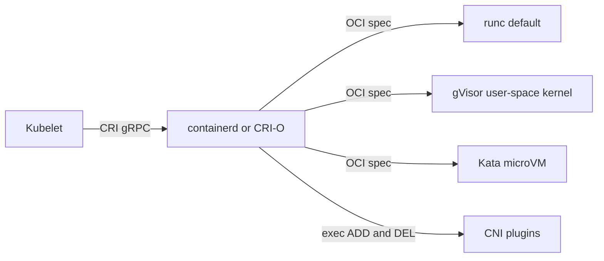
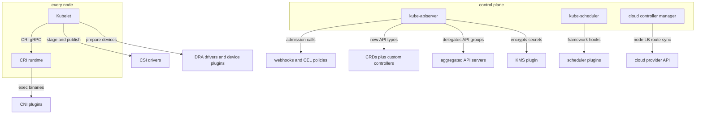
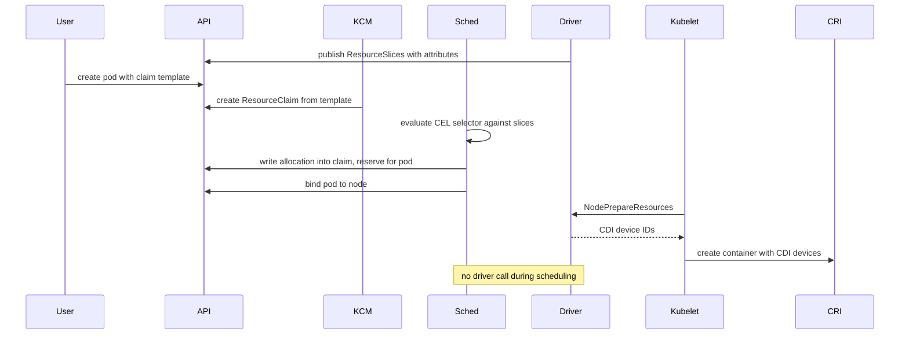

# Chapter 9 — Runtime & Device Standards: CRI, Device Plugins, DRA

## Why this chapter

This chapter closes the standards story: how the kubelet drives containers (CRI), how hardware reaches pods (device plugins, and their successor DRA), and the map of every extension interface — the diagram to reproduce on a whiteboard when asked "how would you extend Kubernetes?". The mental model: Kubernetes is a kernel with well-defined syscall-like interfaces; everything vendor-specific lives behind one of them.

## Concepts

### CRI: what the kubelet asks of the runtime

The Container Runtime Interface (CRI) is a gRPC API served by the runtime over a local Unix socket; the kubelet is the client. Two services:

- **RuntimeService** — sandbox and container lifecycle: `RunPodSandbox`, `CreateContainer`, `StartContainer`, `StopContainer`, `ExecSync`, plus streaming endpoints for `exec`/`attach`/`port-forward`.
- **ImageService** — `PullImage`, `ListImages`, `RemoveImage`.

The **PodSandbox** is CRI's key concept: the pod's shared environment, created before any container. In practice it is the `pause` container — a tiny process that holds the pod's network and IPC namespaces so containers can restart without losing the pod's identity or IP. `RunPodSandbox` is also where the runtime execs the CNI plugins (Flow 20).

Implementations: **containerd** (with its CRI plugin) and **CRI-O** are the mainstream runtimes; dockershim was removed in v1.24. Below them sits the OCI layer: the runtime shells out to an OCI runtime to actually create the Linux process — **runc** (namespaces + cgroups, the default), **gVisor** (`runsc`, a user-space kernel intercepting syscalls), or **Kata** (a lightweight VM per pod). A pod selects among them with `runtimeClassName`; RuntimeClass maps to a configured runtime handler.

*Figure 9.1 — CRI is kubelet-to-runtime; OCI is runtime-to-kernel. RuntimeClass picks the bottom row.*

### Device plugins: the old way and its limits

A device plugin is a vendor DaemonSet that registers with the kubelet over a Unix socket and advertises a countable extended resource, e.g. `nvidia.com/gpu: 8`. Pods request it in `resources.limits`; the scheduler treats it as an opaque integer; at pod admission the kubelet calls the plugin's `Allocate` to get device files and env vars for the container.

The limits are structural:

- **No expressiveness.** The scheduler sees only a count. You cannot ask for "a GPU with 80 GB" or "two GPUs with an NVLink between them" — workarounds pile up as node labels and selectors.
- **No sharing or partitioning.** A device is allocated whole to one container; MIG-style partitioning needs vendor hacks.
- **Late topology decisions.** Alignment (Topology Manager) happens at kubelet admission on the already-chosen node — a pod can be scheduled, then rejected on the node.
- **No claims or lifecycle.** Nothing like a PVC exists; you cannot allocate a device, share it between pods, or parameterize it.

### DRA: devices become schedulable objects (GA since v1.34)

Dynamic Resource Allocation applies the PVC/StorageClass pattern to devices:

- **ResourceSlice** — the driver publishes inventory: devices per node (or pool) with structured attributes (memory, model, links).
- **DeviceClass** — admin-defined selection defaults, the StorageClass analog.
- **ResourceClaim / ResourceClaimTemplate** — a request for devices, written with CEL selectors over device attributes; a template stamps a claim per pod.
- **Structured parameters** — the load-bearing idea: because attributes and requests use a common schema, the **scheduler itself** evaluates claims against ResourceSlices — no driver round-trip at scheduling time (the removed "classic DRA" needed one, which killed scheduling throughput).

The scheduler's dynamicresources plugin allocates devices during scheduling, records the allocation in the claim's status, and reserves it for the pod. On the node, the kubelet calls the driver's `NodePrepareResources`; the driver readies the device and returns **CDI** (Container Device Interface) IDs, which the kubelet passes to the runtime via CRI. DRA supersedes device plugins for GPUs/accelerators: attribute-based selection, sharing between pods/containers, partitionable devices, and no late admission failures. Device plugins still work for simple countable devices.

## The extension map

One picture of where every standard plugs in. Left of each arrow: the core component that calls out. Right: what you implement or install.

*Figure 9.2 — every vendor integration hangs off one of ten interfaces; know which component owns each arrow.*

Top to bottom: the API server extends by **admission** (webhooks, CEL ValidatingAdmissionPolicy — in-process, GA v1.30), by **new types** (CRDs plus your controllers, or full **aggregated API servers** like metrics-server), and by **KMS** for secrets encryption at rest. The scheduler extends via **framework plugins** (Chapter 3). The **cloud controller manager** isolates provider code (nodes, load balancers, routes). On the node: kubelet speaks **CRI** to the runtime, which execs **CNI**; kubelet speaks **CSI** for volumes and **DRA/device plugins** for hardware. Adjacent but niche: NRI (hooks inside containerd/CRI-O) and the kubelet's CPU/Topology/Memory managers — policies, not plug-in points.

## Flows

### Flow 25: What happens when a pod requests a GPU via DRA

A pod references a ResourceClaimTemplate asking for one GPU with at least 40 GB of memory.

1. **User** deploys the DRA driver: a control-plane part and a node DaemonSet that discovers local GPUs.
2. **Driver** publishes ResourceSlices listing each node's devices with attributes (`memory: 80Gi`, `model: h100`).
3. **User** creates the pod referencing the template; the claim requests devices via a CEL selector over those attributes and names a DeviceClass.
4. **KCM** (resourceclaim controller) stamps a ResourceClaim for the pod from the template.
5. **Sched** (dynamicresources plugin) filters nodes by evaluating the claim's CEL selector against ResourceSlices — pure API-object math, no driver call.
6. **Sched** picks a node, writes the chosen device(s) into the claim's `status.allocation`, and adds the pod to `status.reservedFor`.
7. **Sched** binds the pod to the node (Flow 5 machinery).
8. **Kubelet** sees the pod, sees it references an allocated claim, and calls `NodePrepareResources` on the driver's node plugin (gRPC over a registered socket).
9. **Driver** prepares the device — loads modules, configures partitions — and returns CDI device IDs.
10. **Kubelet** passes the CDI devices in the container config over CRI; **CRI** injects the device nodes and env into the OCI spec.
11. **CRI** starts the container; the process sees `/dev/nvidia*` and vendor libraries.
12. Teardown: pod deletion → kubelet calls `NodeUnprepareResources` → the claim's reservation is cleared; a claim from a template is deleted with its pod, freeing the device for reallocation.

*Figure 9.3 — structured parameters let the scheduler allocate from published inventory; the driver acts only on the node.*

**Where this can fail**

- **Symptom:** pod `Pending`, "no nodes satisfy the claim". **Cause:** CEL selector matches no published device, or all matching devices are allocated. **Where to look:** ResourceSlices (`kubectl get resourceslices`), claim status, other claims' reservations.
- **Symptom:** pod `Pending` and ResourceSlices are empty. **Cause:** driver DaemonSet not running or failing discovery. **Where to look:** driver node pods, their registration logs.
- **Symptom:** pod scheduled but stuck before start. **Cause:** `NodePrepareResources` failing — driver socket unregistered, kernel modules missing. **Where to look:** kubelet log, driver node plugin log.
- **Symptom:** container starts but the app sees no GPU. **Cause:** CDI spec incomplete (device nodes present, libraries missing) or runtime lacks CDI support. **Where to look:** CDI spec files on the node, runtime config.

## Questions

### Tier 1 — Explain

**Q 9.1 — What is CRI, and what are its two services?**

**Answer.** The gRPC contract between the kubelet (client) and the container runtime (server) over a Unix socket. RuntimeService manages pod sandboxes and containers (`RunPodSandbox`, `CreateContainer`, `StartContainer`, exec/attach streaming); ImageService manages images (`PullImage`, `ListImages`). It exists so the kubelet needs no runtime-specific code — containerd and CRI-O both serve it; dockershim was removed in v1.24.

*Strong answers also mention:* CRI is kubelet↔runtime; OCI is runtime↔kernel — runc/gVisor/Kata sit below CRI, selected via RuntimeClass.

**Q 9.2 — What is a PodSandbox, and why does the pause container exist?**

**Answer.** The sandbox is the pod's shared environment, created by `RunPodSandbox` before any user container. Concretely it's the pause container: a near-empty process whose only job is to hold the pod's network and IPC namespaces open. Containers join those namespaces, so an app container can crash and restart without the pod losing its IP or netns — the CNI ADD ran against the sandbox, not the app container.

*Strong answers also mention:* sandbox creation is where CNI is invoked (Flow 20); in Kata, the "sandbox" is a VM, showing the abstraction earns its keep.

**Q 9.3 — Name the DRA API objects and their storage analogs.**

**Answer.** ResourceClaim ≈ PVC (a request for a device, with a lifecycle and exclusivity); ResourceClaimTemplate stamps a claim per pod; DeviceClass ≈ StorageClass (admin-curated selection defaults); ResourceSlice ≈ the driver's published inventory — this one has no storage analog, and it's the piece that lets the scheduler allocate without calling the driver. GA since v1.34 with structured parameters.

*Strong answers also mention:* claims can be shared by multiple pods (`reservedFor` list) — unlike RWO-style exclusivity being the only option.

### Tier 2 — Reason

**Q 9.4 — Why weren't device plugins good enough for GPUs?**

**Answer.** Because the scheduler only ever saw an integer. `nvidia.com/gpu: 8` collapses every attribute — memory, model, interconnect — into a count, forcing selection through node labels. No sharing or partitioning: one device, one container. Topology alignment happens at kubelet admission, after scheduling, so pods can fail late on the node. And there is no claim object, so no lifecycle: nothing to allocate ahead of time, share between pods, or parameterize. DRA fixes exactly these: attributes in ResourceSlices, CEL selection, scheduler-time allocation, shareable claims.

*Strong answers also mention:* device plugins remain fine for simple countable devices where none of this expressiveness is needed.

**Q 9.5 — Why were "structured parameters" the thing that made DRA GA-able?**

**Answer.** The removed classic DRA treated parameters as opaque: only the vendor driver could interpret a claim, so the scheduler had to round-trip with the driver per pod per node. That made scheduling slow, hard to backtrack, and broke tools that simulate capacity (cluster autoscaler had no way to predict allocation). Structured parameters publish device attributes in a schema the scheduler evaluates itself with CEL — allocation becomes deterministic API-object math, driver-free at scheduling time, simulable by autoscalers. The driver's job shrinks to inventory publishing and node-side preparation.

*Strong answers also mention:* this mirrors the general design rule — keep the scheduler's hot path free of external calls (compare scheduler extenders vs framework plugins).

**Q 9.6 — Where do gVisor and Kata fit, and what actually changes when a pod sets runtimeClassName?**

**Answer.** They are OCI-level runtimes, not CRI implementations: containerd/CRI-O still serve CRI, but hand the OCI spec to a different handler. RuntimeClass maps a name to a handler configured in the runtime; the kubelet passes the handler in `RunPodSandbox`. With runc you get namespaces+cgroups on the shared kernel; gVisor interposes a user-space kernel (syscall filtering, some incompatibility and overhead); Kata boots a micro-VM per pod (hardware isolation, more memory, slower start). Scheduling is unaffected except for RuntimeClass `overhead` accounting and node selection for nodes that have the handler.

*Strong answers also mention:* the sandbox concept maps cleanly onto Kata — one VM per PodSandbox — which is why CRI modeled sandboxes explicitly.

### Tier 3 — Design & Debug

**Q 9.7 — Symptom: GPU pods schedule fine but some fail on the node with admission errors; with DRA-style claims a colleague says this can't happen. Explain both behaviors.**

**Answer.** With device plugins the scheduler checks only the count; per-device constraints surface later. At kubelet admission, Allocate or Topology Manager alignment can fail — e.g. NUMA alignment impossible on the chosen node — producing `UnexpectedAdmissionError` and a rescheduling loop. With DRA the scheduler allocates *specific devices* against ResourceSlices during filtering; unsatisfiable constraints leave the pod `Pending` with a clear reason, and no node is chosen. Failure moves from the node (late, opaque) to the scheduler (early, explainable). Residual node failures under DRA are preparation errors (driver down, modules missing), not selection errors.

*Strong answers also mention:* late admission failures also waste scheduling work and can thrash; DRA's allocation is also visible in the claim status for debugging.

**Q 9.8 — Design: you must expose a new accelerator (partitionable, per-partition memory sizes) to Kubernetes. Sketch the integration.**

**Answer.** Choose DRA — partitioning and attribute selection are exactly its gaps over device plugins. Build: (1) a node agent publishing ResourceSlices with per-device and per-partition attributes (memory, generation, links), modeling partitions as allocatable devices; (2) a DeviceClass per common request shape; (3) the node gRPC service implementing `NodePrepareResources`/`NodeUnprepareResources`, creating partitions on demand and emitting CDI specs; (4) optionally CEL admission validation for claim sanity. Test with overconstrained claims, and verify autoscaler simulation sees your slices. No scheduler or kubelet changes — that's the point of the interface.

*Strong answers also mention:* CDI as the runtime-facing contract (device nodes, mounts, env) and driver upgrade behavior — slices must be republished consistently to avoid double-allocation.

## Common mistakes & red flags

- **"The kubelet shells out to docker/containerd CLI."** It's a gRPC client of CRI; dockershim is long gone (v1.24).
- **"gVisor and Kata implement CRI."** They're OCI runtimes below containerd/CRI-O, selected via RuntimeClass handlers.
- **"The scheduler picks which GPU a pod gets with device plugins."** It only counts; the kubelet's Allocate picks devices node-side. Scheduler-time device selection is precisely what DRA adds.
- **"DRA is experimental."** GA since v1.34 (structured parameters); it's the modern answer for accelerators.
- **"CNI/CSI/CRI are all daemon APIs."** CRI and CSI are gRPC services; CNI is an exec'd binary contract — interviewers probe this contrast.
- **"Admission webhooks are the only way to extend the API server."** CEL ValidatingAdmissionPolicy runs in-process (GA v1.30), and aggregation/CRDs add whole APIs — pick by trust, latency, and expressiveness.
