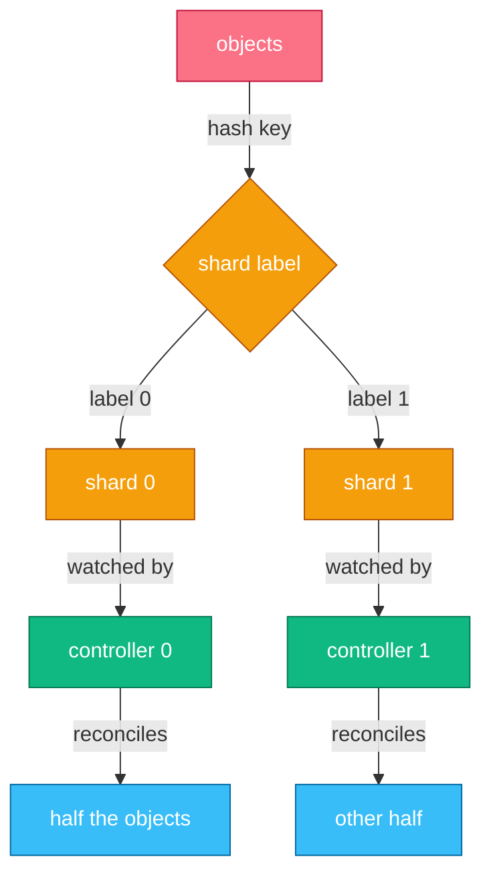
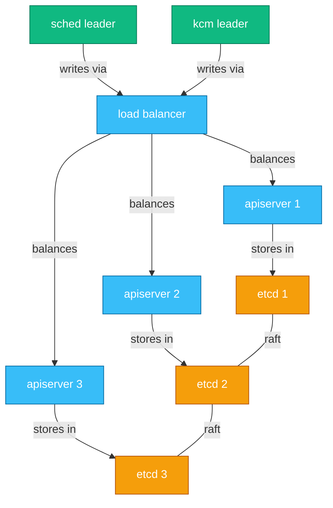
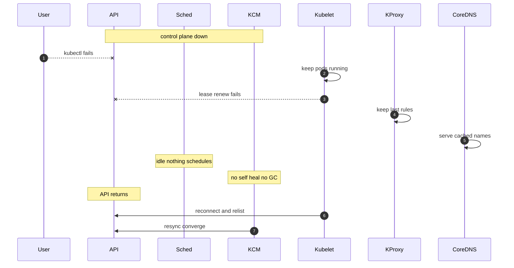
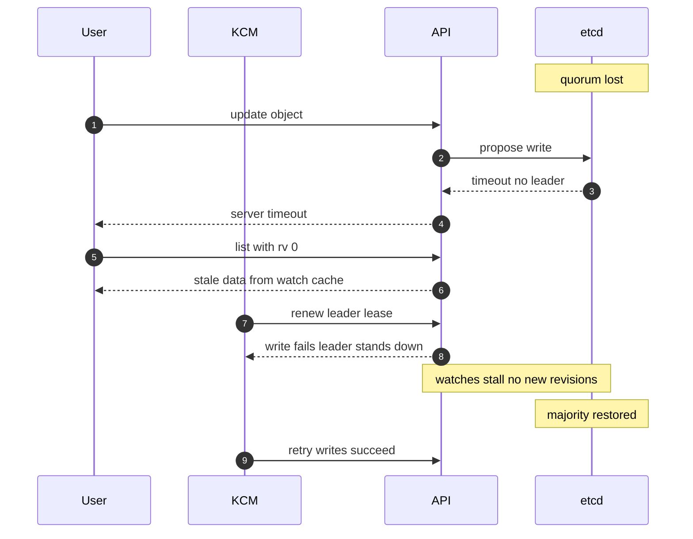

# Chapter 10 — Scalability, Resiliency & System Design

## Why this chapter

Senior interviews end here: not "what does the scheduler do" but "what breaks first at 5,000 nodes" and "what still works when etcd is gone". The interviewer is probing whether you think in limits, blast radius, and failure modes. The one mental model to hold: Kubernetes is a state store (etcd) with a fan-out of watchers. Almost every scale limit is a cost of reading, storing, or fanning out that state; almost every resiliency property comes from components caching state locally and reconciling later (Chapter 5). If you can say what each component does when its neighbors disappear, you pass this chapter.

## What actually limits cluster size

The official scalability envelope: no more than 110 pods per node (the kubelet default), 5,000 nodes, 150,000 total pods, 300,000 total containers. These are not hard limits. They are the tested envelope inside which SIG Scalability guarantees the SLOs (99% of single-object API calls under 1 s — LISTs get looser bounds — and pod startup under 5 s), and the dimensions interact — you can exceed one if you stay well under the others.

What actually runs out:

- **etcd database size.** The default backend quota is 2 GiB; the practical recommended maximum is about 8 GiB. Every object and every revision until compaction lives here — large clusters die by object count and size, not node count. A single etcd request is capped at about 1.5 MiB by default, which is why huge ConfigMaps and fat CRD objects are an anti-pattern.
- **Watch fan-out.** Every informer in every controller, kubelet, and kube-proxy holds watches; one pod update fans out to all of them. The API server's watch cache absorbs the etcd side (each event read once, re-served many times), but per-watcher serialization still costs API server CPU and memory. EndpointSlices exist for exactly this reason: slicing endpoint data caps the size of each fanned-out update (Flow 23).
- **API server memory and LIST cost.** A LIST materializes, converts, and serializes the whole collection per request. An unpaginated LIST of 100k pods can transiently allocate gigabytes; a few concurrent ones OOM the API server. LISTs are the classic self-inflicted outage.
- **Pod density per node.** Above ~110 pods, the kubelet sync loop, stats collection, and per-pod CNI/kube-proxy programming become the bottleneck — a node problem, not a control-plane problem.

## Scaling controllers

Controllers stress the same limits from the client side. The costs to name:

- **Informer cache memory.** An informer (Chapter 5) keeps every watched object in memory. Watching all pods in a 150k-pod cluster costs gigabytes per controller replica. Cut it with label/field selectors on the watch (filtered server-side) and metadata-only informers when you don't need spec.
- **LIST storms on restart.** Every informer starts with a LIST (Flow 19). A controller-manager restart in a big cluster is a coordinated LIST storm. Mitigations: paginated LIST (`limit` + `continue`), and the WatchList streaming-list mechanism (beta, not yet GA), where initial state arrives as a watch stream from the API server's cache instead of one giant LIST response. On the server, watch-cache initialization is resilient (GA in v1.37): bounded requests are served and the rest get 429 while the cache warms, and the cache fills from etcd as a stream (etcd RangeStream, beta, needs etcd 3.7) instead of one buffered read.
- **Resync cost.** Resync replays the local cache into handlers — it does not re-LIST — but it still queues every object for reconcile. A 10-minute resync over 100k objects is a self-inflicted load spike; long resyncs (hours) or none are normal at scale.
- **API Priority and Fairness (APF, GA since v1.29)** protects the API server from all of the above: requests are classified into priority levels and queued fairly per flow, so a greedy controller exhausts its own concurrency shares, not the whole server, and gets 429s with Retry-After.
- **Server-side sharded list/watch (alpha since v1.36)** is the direction of travel for sharded controllers: a replica passes a `shardSelector` — a hash range over object uid or namespace — and the API server filters list and watch at the source, so each replica pays only for its slice. It is the server-side complement of the label sharding in Figure 10.1; name it as recent work, not something to depend on.

**Sharding controllers.** Leader election (Flow 20) gives you HA, not scale — one replica does all the work. To scale, partition the object space (Figure 10.1): run N instances, each watching a disjoint slice — by namespace set, by resource type, or by a shard label assigned by hashing the object key. Each shard's informer uses a label selector, so cache memory and reconcile work divide by N. The hard parts: rebalancing when a shard dies, and never letting two shards own one object.

*Figure 10.1 — sharding by label: each controller's watch, cache, and workqueue shrink to its slice.*

## Resiliency building blocks

**HA control plane layout (Figure 10.2).** Run 3 (or 5) control-plane nodes.

- **API servers:** stateless and active-active behind a load balancer.
- **Scheduler and controller-manager:** run everywhere but are active-passive via leader election on a Lease.
- **etcd:** runs 3 or 5 members — quorum is a majority (2 of 3, 3 of 5) — stacked on the control-plane nodes (simpler, coupled failure) or external (more isolation, more machines). Adding members does not add write throughput: every write goes through one raft leader, and more members mean more replication.

*Figure 10.2 — HA layout: API servers active-active; scheduler and KCM active-passive; etcd needs majority quorum.*

**Upgrades and version skew.** Upgrades roll one minor at a time, in dependency order: etcd first, then API servers, then KCM and scheduler, then kubelets. The skew rules make that order safe: HA API servers may differ by one minor, KCM and scheduler must not be newer than the API server, and a kubelet may lag by up to three minors (never lead) — so node pools upgrade slowly behind the control plane. For CRDs, migrate stored objects and trim `status.storedVersions` before dropping a served version (Chapter 6). The classic trap is skipping a minor: compatibility is tested only across adjacent versions.

Resiliency patterns:

- **PodDisruptionBudgets (PDBs):** limit *voluntary* disruptions only: the eviction API (drain, Flow 11; autoscaler scale-down) refuses to evict below `minAvailable`. PDBs do nothing for crashes or OOM kills.
- **Topology spread constraints:** place replicas across zones/nodes so one failure domain takes out only a slice.
- **Graceful degradation:** a dead dependency degrades service instead of breaking it — the pattern behind the whole failure matrix below.

**Blast-radius thinking.** Ask "if this misbehaves, who else is down?" A cluster-wide webhook with `failurePolicy: Fail` can block all pod creation (Flow 4). A hot-looping controller can starve the API server — APF and quotas bound the damage. Shared clusters concentrate blast radius; many small clusters trade efficiency for isolation. Staff-level answers name this trade-off explicitly.

## Failure-mode matrix

| Component down | What breaks | What keeps working |
|---|---|---|
| All API servers | kubectl, all controllers, scheduling, self-healing, HPA, new config | Running pods, existing Service routing, DNS from cache, container restarts by kubelet |
| etcd quorum | All writes, consistent reads, watch progress, leader-election renewals | API reads served from watch cache (stale), everything on the data plane |
| Scheduler | New pods stay Pending | Everything already scheduled; controllers still create pods |
| Controller-manager | Self-healing, GC, endpoints updates, node lifecycle, Job/Deployment progress | Scheduling of already-created pods, running workloads |
| CoreDNS (all replicas) | New name lookups in pods | Connections already established; clients with cached records |
| kube-proxy (one node) | Service rule updates on that node | Existing conntrack flows and current rules on that node |
| Kubelet (one node) | Pod status, probes, restarts, new pods on that node | Running containers keep running; after ~6 min (50 s detection + 300 s toleration), eviction moves pods elsewhere (Flow 12) |
| CNI daemon (one node) | New pod networking on that node | Networking of already-wired pods (their netns is programmed) |

## Flows

### Flow 27: What happens when the control plane is down

Every API server (or the network to them) is down; the data plane is healthy. This is the classic resiliency question — walk it component by component.

1. **User** runs `kubectl`; every request fails — no reads, no writes, no logs/exec (those proxy through the API server).
2. **Kubelet** keeps every running pod running. Its desired state is cached locally; it needs no API server to run containers.
   - It also restarts crashed containers per `restartPolicy` and keeps running static pods — which is why the control plane itself (as static pods) can come back.
3. **Kubelet** fails to renew its node Lease and post status. Nothing acts on this: the node lifecycle controller (in KCM) that would mark nodes NotReady is also down.
4. **Kubelet** keeps running probes. Liveness restarts still happen locally; readiness results can't reach the API, so endpoints stop updating cluster-wide.
5. **KProxy** keeps the last-programmed rules. Existing Services route to pre-outage endpoints. Pods that die mid-outage leave dead endpoints no one removes.
6. **CoreDNS** keeps serving from its informer's in-memory state, so existing names resolve. If CoreDNS itself restarts mid-outage, it cannot sync and comes up unready.
7. **Sched** is down or idle: nothing new is scheduled. No one can create pods anyway.
8. **KCM** is down: no self-healing (a dead pod is not replaced), no GC, no HPA, no Job progress, no taint-based eviction.
9. **API** comes back. Kubelets, proxies, and controllers reconnect; informers relist (a LIST storm — Flow 19, APF above); controllers reconcile the accumulated drift and converge.

*Figure 10.3 — the data plane runs on cached state; only change and repair stop.*

**Where this can fail**

- **Symptom:** apps break during the outage even though pods run.
    - **Cause:** a pod crashed and its Service now has a dead endpoint no one removes.
    - **Where to look:** app-side connection errors; compare pod uptimes to outage window after recovery.
- **Symptom:** DNS dies mid-outage.
    - **Cause:** CoreDNS pods restarted (node reboot, OOM) and cannot list Services.
    - **Where to look:** CoreDNS pod restarts and readiness after recovery.
- **Symptom:** on recovery, the API server crashes repeatedly.
    - **Cause:** reconnect LIST storm from thousands of kubelets and controllers.
    - **Where to look:** APF rejected-request metrics, apiserver memory; recovery may need staged restarts.
- **Symptom:** certificates expired during a long outage; kubelets can't reconnect.
    - **Cause:** cert rotation needs the API.
    - **Where to look:** kubelet logs TLS errors; requires manual re-bootstrap.

### Flow 28: What happens when etcd loses quorum

Two of three etcd members go down. API servers are up but their storage has no majority.

1. **etcd** cannot elect a leader; raft requires a majority. The surviving member keeps its data but can commit nothing new.
2. **API** write requests (create, update, patch, delete) block on etcd proposals and fail with timeouts or 500s.
3. **API** consistent reads fail too: a plain GET is a quorum (linearizable) read by default.
4. **API** reads served from the watch cache still succeed: LIST/GET with `resourceVersion: "0"` and informer relists get the last cached state — stale but available (see the resourceVersion table in Appendix A).
5. **API** watches stay open but stall: etcd produces no new revisions, so no events flow. Informers everywhere see a frozen world and no errors — a silent failure mode.
6. **KCM** and **Sched** leaders fail to renew their Lease (a write). Past the renew deadline they stand down and exit; the restarted candidates wait, retrying lease acquisition until writes work — controllers stop acting even though their processes were healthy.
7. **Kubelet** and the data plane behave as in Flow 27: pods keep running; status writes fail.
8. **etcd** recovers when a member rejoins and a majority forms: the leader commits, watches resume, controller writes retry and succeed.
9. **User** in the disaster case (majority permanently lost) restores from backup: `etcdctl snapshot restore` from a survivor, rebuild the cluster, restart API servers. Writes since the snapshot are lost and resourceVersion can go backwards — controllers relist to heal.

*Figure 10.4 — quorum loss splits the API: cached reads limp along, writes and watch progress stop.*

**Where this can fail**

- **Symptom:** dashboards look normal but nothing changes.
    - **Cause:** stale watch-cache reads mask the outage.
    - **Where to look:** etcd leader/quorum metrics, apiserver etcd request error rate — alert on these, not on GETs succeeding.
- **Symptom:** scheduler and KCM exited and sit leaderless.
    - **Cause:** leader-election writes failing — they fail-stop and wait for the lease, by design.
    - **Where to look:** their logs show lease renewal errors; fix etcd, not the controllers.
- **Symptom:** etcd rejects writes even with quorum.
    - **Cause:** database hit its quota (`NOSPACE` alarm) — looks similar but is a size problem.
    - **Where to look:** etcd alarms, DB size metrics; fix with compact + defrag + alarm disarm.
- **Symptom:** after restore-from-snapshot, controllers act on resurrected objects.
    - **Cause:** the restore rewound state; deletes after the snapshot came back.
    - **Where to look:** audit the diff; expect controllers to re-delete/re-create as they reconcile.

## Questions

### Tier 1 — Explain

**Q 10.1 — What actually limits how big a Kubernetes cluster can get?**

**Answer.** Not node count itself. The real limits: etcd database size (~8 GiB practical max — object count times object size times revision history), watch fan-out (every update serialized to every watcher), API server memory under LIST load, and per-node pod density (~110 default). The published envelope — 5,000 nodes, 150,000 pods, 300,000 containers — is the tested range where SLOs hold, and the dimensions interact: you can have 5,000 nodes or very fat objects, rarely both.

*Strong answers also mention:* which limit bites first depends on workload shape — many small objects hurt etcd and fan-out; few huge objects hurt request size and LIST cost.

**Q 10.2 — The whole control plane goes down. What happens to running applications?**

**Answer.** Mostly nothing, immediately. Kubelets keep containers running from local state and restart crashes; kube-proxy keeps routing on last-programmed rules; CoreDNS answers from memory. What stops: scheduling, self-healing (dead pods aren't replaced), HPA, endpoint updates, GC, and all kubectl access. Risk grows with outage length: endpoints go stale as pods die, and restarted CoreDNS can't sync. Walk it component by component — that's Flow 27.

*Strong answers also mention:* the recovery LIST storm when everything reconnects, and that the control plane's own static pods let kubelet resurrect it.

**Q 10.3 — What does a PodDisruptionBudget actually guarantee?**

**Answer.** It bounds *voluntary* disruptions only. The eviction API (used by `kubectl drain` and cluster autoscaler) checks the PDB and refuses evictions that would drop ready pods below `minAvailable` (or above `maxUnavailable`). It guarantees nothing for involuntary failures — node crashes, OOM kills, kernel panics — and it does not create replicas; it only blocks evictions. A PDB with `minAvailable` equal to replica count makes drain hang forever, a common self-inflicted incident (Flow 11).

*Strong answers also mention:* pairing PDBs with topology spread, since a PDB can't help if all replicas share one node.

### Tier 2 — Reason

**Q 10.4 — Why are LIST requests so much more expensive than watches, and what reduces the cost?**

**Answer.** A watch streams small deltas from the watch cache — near-zero marginal cost. A LIST materializes the whole collection: read, decode, convert, serialize per client, all held in API server memory for the duration. Concurrent big LISTs cause the classic API server OOM.

**Client-side fixes:**

- Pagination (`limit`/`continue`).
- Selectors.
- Metadata-only informers.
- Streaming lists (WatchList) that deliver initial state as watch events from the cache.

**Server side:**

- Watch-cache serving for `resourceVersion: "0"`.
- APF pricing LISTs by their real width.
- Sharded list/watch (alpha) filtering each controller replica's hash range at the source.
- etcd RangeStream (beta in v1.37) streaming large reads out of etcd instead of buffering them.

*Strong answers also mention:* the consistency trade — `resourceVersion: "0"` lists are stale-tolerant cache reads; a quorum-read LIST of everything is the worst case.

**Q 10.5 — Why do the scheduler and controller-manager deliberately crash when etcd is only *degraded*?**

**Answer.** Their leader election lives in the same store. Renewing leadership is a Lease write; if etcd can't commit, renewal fails, and after the renew deadline the leader must assume another replica may take over — so it stands down and exits. This is correct: acting on a frozen watch cache without provable leadership risks two actors, or decisions on stale state. It converts "silently wrong" into "loudly stopped", the safer failure mode for a reconciler.

*Strong answers also mention:* the general principle — fail-stop plus level-triggered reconciliation means recovery is just "relist and converge" (Flow 19), so stopping is cheap.

**Q 10.6 — Leader election gives me multiple controller replicas. Why doesn't that scale my controller?**

**Answer.** Because it's active-passive: one leader does 100% of the work; standbys hold a warm cache at best. It shortens failover, nothing else. To scale work you must partition state: disjoint watch selectors per shard (namespace sets or a hash-assigned shard label, Figure 10.1) so each instance's cache, watch stream, and workqueue shrink proportionally. The hard problems are reassignment when a shard dies and single ownership per object — which is why most operators first optimize (filtering, batching, concurrency) and shard only when one process truly can't keep up.

*Strong answers also mention:* increasing `MaxConcurrentReconciles` scales CPU within one process but not cache memory or watch bandwidth.

**Q 10.7 — You must take a cluster from 1.36 to 1.37 with zero downtime. What order do you upgrade, and what makes that order safe?**

**Answer.** Control plane before data plane, one minor at a time. Order: etcd, then API servers one by one — HA peers may differ by one minor, so a mixed fleet mid-upgrade is supported; then KCM and scheduler, which must never be newer than the API server they talk to; then kubelets, which may lag by up to three minors, so node pools drain and upgrade at leisure (Flow 11) behind PDBs and surge capacity. The order is safe because skew rules are directional: every component is tested as an equal-or-older client of the API server, never the reverse. Before touching anything: read the release notes for removed APIs and migrate CRD storage versions.

*Strong answers also mention:* kubelet's three-minor lag allowance is what lets big node fleets upgrade on their own cadence; node declared features (GA in v1.37) let the control plane read `.status.declaredFeatures` instead of guessing what a mixed-version node supports; and skew testing covers only adjacent minors — never skip one.

### Tier 3 — Design & Debug

**Q 10.8 — Design an operator that manages 10,000 custom objects with a 30-second reconcile SLO.**

**Answer.** Start from the costs.

- **Cache:** watch only what's needed — label-selector-filtered informers, metadata-only for secondary resources; estimate bytes per object times count.
- **Startup:** paginated/streaming initial LIST so restarts don't hammer the API server; reconciles must be idempotent because everything replays (Flow 19).
- **Throughput:** 10k objects / 30 s ≈ 330 reconciles/s worst case; set `MaxConcurrentReconciles` to match, keep each reconcile to cache reads plus at most one write.
- **Write pressure:** skip status writes when nothing changed (deep-equal first); use Server-Side Apply with a fixed field manager to avoid conflicts.
- **Protect the API server:** respect client rate limits and APF 429s; no polling — stay level-triggered.
- **Scale-out path:** if one process can't hold the cache, shard by hash label (Figure 10.1) with a small assigner and per-shard leader election. State the failure story: shard death → reassignment → relist → idempotent convergence.

*Strong answers also mention:* predicates on `generation` to stop status writes retriggering reconciles, and workqueue depth/latency metrics as the SLO signal.

**Q 10.9 — Design failover of a stateless service across two clusters.**

**Answer.** Clarify first: RTO/RPO, active-active or active-passive, is state truly external? Then layer it.

- **Traffic:** failover lives *outside* the clusters — DNS health checks or a global load balancer; nothing inside a dead cluster can help.
- **Health signal:** probe the app path end-to-end, not the API server — Flow 27 shows apps surviving control-plane death; don't fail over a serving cluster.
- **Config parity:** both clusters get identical desired state from Git/CD rather than a cross-cluster hub controller — a hub is itself a blast radius.
- **Capacity:** the standby needs real headroom; failover onto cold autoscaling breaks RTO.
- **Data:** an external replicated store with its own failover story — Kubernetes only fails over compute.
- **Test:** game-day the DNS TTLs and the split-brain case where both clusters are healthy but partitioned from each other.

*Strong answers also mention:* PDBs and topology spread *within* each cluster so zonal loss doesn't trigger cross-cluster failover — make it the last resort.

**Q 10.10 — API server p99 latency spiked 10x. Walk me through debugging.**

**Answer.** Split the request path and bisect. (1) *Which requests?* `apiserver_request_duration_seconds` by verb/resource: only LISTs slow points at expensive clients; everything slow points at storage or saturation. (2) *etcd or apiserver?* etcd fsync p99 over ~10 ms means slow disk; check DB size (needs compact/defrag) and leader flapping. If etcd is fast, check apiserver CPU/memory — LIST-driven allocation shows as GC pressure and OOM restarts. (3) *Who?* APF metrics (queued/rejected per priority level) and audit logs name the flow — typically a redeployed controller relisting the world, a polling agent, or a new webhook. (4) *Webhooks:* their latency adds directly to write latency — check webhook duration metrics (Flow 4). (5) *Mitigate, then fix:* an APF FlowSchema to cage the offender, pagination/selectors in the client, compact/defrag etcd, events to separate storage. State the order out loud: measure, bisect, identify, cage, fix.

*Strong answers also mention:* checking for a recent object-count explosion (etcd DB growth from a new CRD or events churn) as a silent cause.

## Common mistakes & red flags

- **"If the control plane is down, the apps are down."** Wrong — the data plane serves on cached state (Flow 27). Saying this instantly signals no production experience.
- **"5,000 nodes is a hard limit."** It's a tested SLO envelope; dimensions interact. The real ceilings are etcd size, fan-out, and LIST cost.
- **"PDBs protect me from node failures."** PDBs gate only voluntary evictions through the eviction API. Crashes ignore them.
- **"etcd down means all reads fail."** Watch-cache reads (`resourceVersion: "0"`, informer relists) keep serving stale data; that's why quorum loss can look deceptively healthy (Flow 28).
- **"Resync re-LISTs from the API server."** Resync replays the local cache into handlers; only relist (watch failure, restart) hits the API server. Confusing these misprices the load (see Flow 3, Flow 19).
- **"Add more etcd nodes for performance."** More members mean more replication per write; throughput drops. Members buy fault tolerance only.
- **"Run two controller replicas to double throughput."** Leader election is active-passive. Only sharding the object space scales work.
