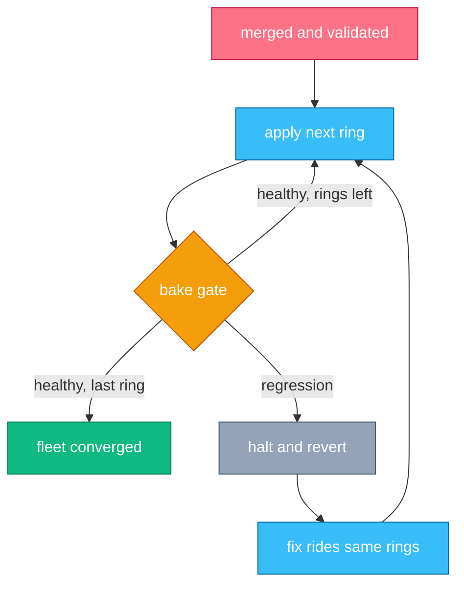
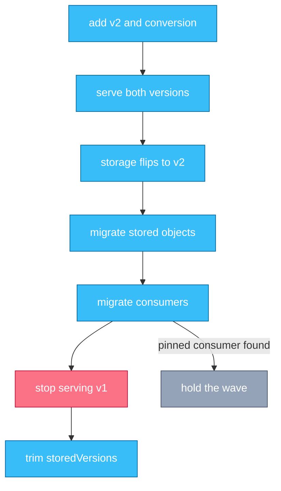

# Chapter 11 — Fleet, Platform & Economics

## Why this chapter

Principal-level interviews leave the single cluster behind. The interviewer probes whether you can run *many* clusters as one system, operate a platform as a product, and reason about money — because at fleet scale, utilization and blast radius are financial statements. The mental model: the fleet is one distributed system whose nodes are clusters, and every platform change deserves the same rollout discipline you demand from application teams. Chapters 1–10 taught what happens inside a cluster; this chapter is about what happens to twenty of them at once.

## Concepts

**Fleet architecture.** A fleet treats clusters as cattle: any cluster is rebuildable from a Git repository that holds its full desired configuration (config-as-data). The default topology is replicated-independent clusters — no runtime coordination between them; a CD system applies the same configuration N times (the trade-offs against hub-spoke and federation are tabulated in Appendix D). Changes move through **rings**: ordered groups of clusters, starting with a canary, each gated by a bake period before the next ring proceeds (Flow 29). **Drift** is any live-cluster state that differs from the repo; without continuous enforcement, ring N no longer matches what ring 0 tested.

**Capacity economics.** A cluster is "full" when requests exhaust allocatable — not when usage does (Chapter 3). Fleet-wide, the gap between the two is the single biggest cost lever: systematic over-requesting shows up as clusters that are 90% requested and 40% used. The fixes are incentives and automation, not scheduler flags: showback or chargeback per namespace, quotas priced in real money, right-sizing recommendations, and Karpenter-class node provisioning that shapes the node pool to the actual pending pods. In accelerator fleets the stakes multiply: an idle GPU burns more money than an entire idle general-purpose node (Chapter 9).

**Platform engineering.** A platform is a product whose customers are product teams. The central decision is the abstraction: raw Kubernetes with guardrails, a golden-path layer (templates and defaults over full API access), or an internal PaaS that hides Kubernetes entirely. Whichever you expose, pair the paved road with policy: admission (Chapter 2) enforces what the templates encourage. Two disciplines keep a platform honest: escape hatches — teams can drop below the abstraction, and their usage rate tells you whether the abstraction is right — and platform SLOs with error budgets, so platform changes are governed by the same reliability math as any service.

## Flows

### Flow 29: What happens when a fleet-wide config change rolls out

Your platform team merges a new admission policy intended for all forty clusters.

1. **Platform engineer** merges the change to the fleet repo — the single source of desired state for every cluster.
2. **CI** validates offline: schema checks, policy dry-runs against recorded production objects, and an ephemeral test cluster when the change warrants one.
3. **CD** (the GitOps engine — an agent per cluster pulling desired state from the repo) reconciles ring 0 only: the canary cluster.
   - A canary proves nothing beyond syntax unless it runs representative workloads — same webhook consumers, same operators, same node shapes as the fleet.
4. **Bake gate** (an automated check over SLOs and error budgets) watches ring 0 for its bake period: admission latency, error rates, controller health, rollout success of ordinary deploys.
5. **CD** proceeds ring by ring on green. Rings are ordered by blast radius — bigger and more production-critical clusters later, with longer bakes.
6. **Bake gate** halts the wave on regression anywhere and **CD** reverts the affected ring: rollback is a Git revert replayed by the same machinery, never a hand edit.
7. **Drift controller** (the CD agent's enforcement mode) continuously reverts out-of-band edits, so every ring still matches the repo when its turn comes.
8. **Platform engineer** lands fixes through the same rings on an expedited schedule. There is no kubectl fast path — the expedited ring exists precisely so bypassing is never the rational choice.
9. **CD** reports fleet convergence: every cluster at the same revision, drift-free. That report — not the merge — is when the change is "done".

*Figure 11.1 — a fleet change is a gated loop over rings; the halt-and-revert path is as designed as the happy path.*

**Where this can fail**

- **Symptom:** canary green, ring 2 bricked. **Cause:** the canary is not representative — no GPU nodes, no webhook consumers, no real operators. **Where to look:** workload census per ring vs the canary's.
- **Symptom:** waves halt on every rollout. **Cause:** bake gates keyed to noisy SLOs; the gate cries wolf. **Where to look:** gate signal precision; alert-to-regression ratio.
- **Symptom:** ring N behaves differently from ring 0 on the same commit. **Cause:** drift accumulated where enforcement was off. **Where to look:** drift reports, audit log for out-of-band writes.
- **Symptom:** a "quick emergency fix" via kubectl broke a cluster and the repo does not show it. **Cause:** bypass culture — the expedited path was slower than disobedience. **Where to look:** change records vs Git history; make the paved path the fastest path.
- **Symptom:** the config change locked the platform out of ring 0 — nothing can be applied, including the fix. **Cause:** an admission rule with `failurePolicy: Fail` matching the CD system's own writes (Flow 4 at fleet scale). **Where to look:** webhook exclusions for the CD and platform namespaces.

### Flow 30: What happens when a breaking CRD change ships across the fleet

Your platform team must move its widely-used `Widget` CRD from v1 to an incompatible v2, across forty clusters.

1. **Platform team** ships v2 alongside v1 in the CRD, with a conversion webhook (Chapter 6); the API server serves both versions, converting through the hub version.
2. **CD** rolls that CRD change through the rings (Flow 29). Conversion is now on the read and write path for every Widget in every cluster — an unavailable conversion webhook has the same failure shape as a down admission webhook (Flow 4), scoped to this API group.
3. **API server** (in each cluster) serves v1 and v2 clients; stored objects remain v1 on disk until written.
4. **Platform team** flips `storage: true` to v2: new writes persist as v2, old objects stay v1 until touched.
5. **Storage-version migrator** (a controller or batch job) rewrites every stored Widget in every cluster so etcd holds only v2.
6. **Platform team** runs the consumer migration through a deprecation window: every controller, dashboard, and script reading v1 must move. Finding them is the hard part — audit logs grouped by API version are the census.
7. **Platform team** stops serving v1, ring by ring. This is the point of no return: a consumer missed in step 6 breaks here, at whatever ring its cluster sits in.
8. **Platform team** trims `status.storedVersions` to v2 (Chapter 6); a later release can drop v1 from the CRD entirely.
9. **CD** re-verifies the whole fleet afterward: a cluster that was offline during the wave or restored from backup can resurface v1 stored objects — reconcile the fleet, not just the wave.

*Figure 11.2 — the version march is one-way after "stop serving v1"; everything before it is reversible, so spend the caution there.*

**Where this can fail**

- **Symptom:** all Widget operations fail in one cluster. **Cause:** the conversion webhook is down there — conversion sits on every read and write of the group. **Where to look:** webhook backend health; treat it with Flow 4's mitigations.
- **Symptom:** a team's controller breaks days after the rollout finished. **Cause:** a v1 consumer missed by the census, discovered only when v1 stopped being served. **Where to look:** audit logs by API version *before* step 7, not after.
- **Symptom:** `storedVersions` says v2-only, yet v1 objects exist. **Cause:** a cluster restored from a pre-migration backup. **Where to look:** re-run the migrator after any restore; fleet-wide verification, not wave-completion, is the exit criterion.
- **Symptom:** objects subtly corrupted after conversion. **Cause:** a lossy conversion webhook — round-trips must be lossless (Chapter 6's red flag). **Where to look:** conversion round-trip tests against production-shaped objects.
- **Symptom:** the fleet sits half-migrated for a year. **Cause:** no deadline and no owner — deprecation windows without teeth never close. **Where to look:** the deprecation policy; someone must own "v1 is gone".

### Scenario: The shared-platform design review

A platform team presents this architecture for your review: six production clusters, one per region. All forty product teams share them, one namespace each. A hub cluster runs controllers managing all six spokes. An org-wide validating webhook with `failurePolicy: Fail` enforces naming and labels on every object in every cluster. Fleet configuration applies to all six clusters in one step. Two infra teams hold cluster-admin.

**Critique.** Start with blast radius; there are three fleet-wide single points. The webhook: one bad rule or backend outage stops every deploy in every region simultaneously (Flow 4), and `Fail` on cosmetic policy buys enforcement with availability. The hub: its outage freezes all fleet change, and its compromise is fleet compromise — the hub-spoke row of Appendix D's table priced this. The ring-less rollout: applying to all six regions at once makes regional isolation an illusion — the regions share fate through the config pipeline. What is right: forty trusted teams on shared clusters is the cheap, defensible tenancy default, and a hub is a legitimate pattern once its risk is priced. What to ask before redesigning: do any teams face compliance regimes needing hard isolation; has the webhook ever fired an incident; who reviews its rules; what is the recovery time if the hub dies. The migration order: rings first — the largest risk cut for the least work; then scope the webhook and demote cosmetic rules to `Ignore` or CEL warnings; then shrink the hub's blast radius (per-region hubs, or pull-based agents per cluster); re-open tenancy only if compliance forces it.

## Questions

### Tier 2 — Reason

**Q 11.1 — Why is replicated-independent the default fleet topology, rather than hub-spoke or a federated API?**

**Answer.** Because coordination is the enemy of isolation. Independent clusters that each pull the same config share no runtime fate: one cluster's outage, upgrade, or compromise stays inside it, and the fleet's availability is the product of independent terms. A hub adds a component whose failure freezes change everywhere and whose compromise owns everything; a federated API adds a new single point *and* a version-skew surface on the request path. Both can be worth it — hubs for fleet-scale config logic, federation for genuine cross-cluster scheduling — but they must buy something, because they always sell isolation. Default to independence; add coordination only where a real requirement demands it.

*Strong answers also mention:* failover belongs above the fleet (DNS, global load balancing) precisely so that no in-fleet component must coordinate it.

**Q 11.2 — Why is chronic low utilization an incentive problem more than a scheduler problem?**

**Answer.** The scheduler packs what it is told (Chapter 3): requests, not usage. Teams set requests, and every incentive points up — padded requests mean fewer OOMKills, fewer noisy neighbors, easier on-call. Nobody sees the bill. So clusters run request-full and usage-empty, and buying a better bin-packer changes nothing because the inputs are inflated. The fixes act on the inputs: showback that puts a price on requests, quotas that make padding compete with the team's own roadmap, right-sizing bots that shrink requests with evidence, and node provisioning that shapes capacity to real demand. Only after the inputs are honest does scheduler tuning matter.

*Strong answers also mention:* the same logic inverted for accelerators — GPU idleness is so expensive that queueing (making workloads *wait*) beats reservation.

**Q 11.3 — Why should a platform team publish SLOs and run on error budgets?**

**Answer.** Because a platform without SLOs is accountable for everything and measurably responsible for nothing. An SLO ("namespace provisioning under a minute, 99.5% of deploys unimpeded by platform change") does three jobs: it converts "the platform feels slow" into a falsifiable claim; it gives the ring system its gate signal — a fleet rollout halts when it eats the error budget (Flow 29); and it makes the platform's reliability trade visible to leadership in the same currency as any product's. Without a budget, platform changes are governed by confidence; with one, they are governed by evidence.

*Strong answers also mention:* escape-hatch usage as a complementary metric — SLOs measure whether the platform works; hatch usage measures whether it is the right platform.

### Tier 3 — Design & Debug

**Q 11.4 — Design the ring system for a 40-cluster fleet. What makes it trustworthy?**

**Answer.** Four rings by blast radius: ring 0, one canary cluster; ring 1, two or three low-stakes production clusters; ring 2, the general population; ring 3, the crown jewels (revenue-critical, compliance-bound). Trust comes from three properties. Representativeness: the canary runs a workload census matched to the fleet — same operators, webhook consumers, node shapes, a GPU pool if the fleet has one; review the census quarterly, because fleets drift. Gate quality: bakes watch golden signals plus platform-specific ones (admission latency, deploy success rate), with bake times growing per ring — an hour at ring 0 is worthless for a change whose failure mode is slow memory growth. An expedited path: emergencies ride the same rings with compressed bakes, and its existence is what makes bypass indefensible. The failure story: any gate red halts the wave, the ring reverts via Git, and the postmortem asks why the earlier rings did not catch it.

*Strong answers also mention:* changes that cannot ring safely — CRD storage flips (Flow 30), webhook additions — get their own playbooks; the ring system must know which changes it does not fit.

**Q 11.5 — Your GPU fleet reports 30% utilization while teams complain about queue times. Walk through the diagnosis.**

**Answer.** Both symptoms together mean capacity is trapped, not absent — find where. Measure in layers. Allocation vs usage: are GPUs *allocated* but idle (notebooks held overnight, jobs that reserve eight and use two) — that is quota and idle-reclamation policy. Fragmentation: multi-GPU jobs need co-located devices (topology, Chapter 9); four singles free on four nodes serve no 4-GPU job — that is bin-packing policy and DRA-aware scheduling. Gang waits: distributed jobs holding partial allocations while waiting for the rest waste everything they hold — that is gang scheduling and queueing (Kueue-class admission) rather than raw capacity. Padding: requests set to whole GPUs for fractional workloads — that is sharing/partitioning (MIG-class, DRA structured parameters). Rank the fixes by recovered dollars: usually idle reclamation first, then queueing, then packing policy, then sharing. Buying more GPUs comes last — it scales the waste along with the capacity.

*Strong answers also mention:* the political half — idle reclamation takes something away from teams, so it ships with grace periods, preemption classes, and an SLO for queue time, or it dies in review.

### Tier 4 — Judge

**Q 11.6 — Forty teams, two under hard compliance regimes. One shared fleet, clusters per team, or something between? Commit.**

**Answer.** Assumption: the other 38 teams mutually trust to the "noisy neighbor, not hostile actor" level; the two regulated teams cannot. Commit: shared clusters for the 38 — namespaces, quotas, and policy (Appendix D's tenancy table prices this as the cost floor) — and dedicated clusters for the two regimes, because an auditor accepts a cluster boundary in a way they will never accept a namespace. The counter-position — clusters for everyone — buys uniform isolation and simpler audits, and I would take it seriously at higher trust stakes; it loses here because forty control planes cost real money and real SRE attention, and the 38 teams' risk does not justify it. Kill-criteria, stated up front: a cross-namespace security incident that quotas and policy could not have contained; a third compliance regime appearing (the "special case" is now a pattern); or shared-control-plane outages exceeding the platform error budget twice in a year. Any of those, and the tenancy decision reopens with the balance shifted.

*Strong answers also mention:* virtual clusters as the middle option worth piloting for API isolation — while noting node sharing still fails the hard-compliance test.

**Q 11.7 — Leadership asks: "Should we build an internal PaaS on top of Kubernetes?" Argue both sides, then commit.**

**Answer.** For: most product teams want "deploy my service, give me a URL and logs"; a PaaS encodes the golden path, shrinks the Kubernetes learning surface to near zero, and turns a hundred bespoke YAML stacks into one supported product. Against: a PaaS is a product with a permanent team, a roadmap, and a support queue; the org now maintains Kubernetes *and* a platform on it, and every workload that does not fit the abstraction (the GPU pipeline, the stateful legacy system) either forks the PaaS or routes around it. Commit: build the thin version — golden-path templates, defaults, and policy over the raw API — only if three things hold: a platform team you will fund indefinitely, workload homogeneity above roughly 80%, and a real escape hatch to plain Kubernetes. Kill-criterion: if escape-hatch usage grows past a fifth of workloads, the abstraction is wrong — stop investing in the wrapper and reinvest in paved roads for the raw API.

*Strong answers also mention:* the decision is reversible in one direction only — retiring a PaaS teams depend on is a multi-year migration, so under-build first.

## Common mistakes & red flags

- **"The canary was green, so the change is safe."** A canary proves what it runs. An unrepresentative canary is a syntax checker with extra steps.
- **"The hub is just another cluster."** It is the fleet's control plane: its outage freezes change everywhere, its compromise owns everything. Price it like one.
- **"Utilization is an ops metric."** At fleet scale it is a financial statement — the requests-vs-usage gap *is* the cloud bill's error term.
- **"One cluster per team ends the tenancy debate."** It converts an isolation problem into a cost and fleet-management problem. The debate moves; it does not end.
- **"GitOps means there is no drift."** GitOps without continuous enforcement is documentation. Drift is what the enforcement loop deletes, not what the methodology prevents.
- **"In an emergency we kubectl straight to prod."** The expedited ring exists so that the paved path is always the fastest path. A bypass that beats it is a process bug — fix the process.
